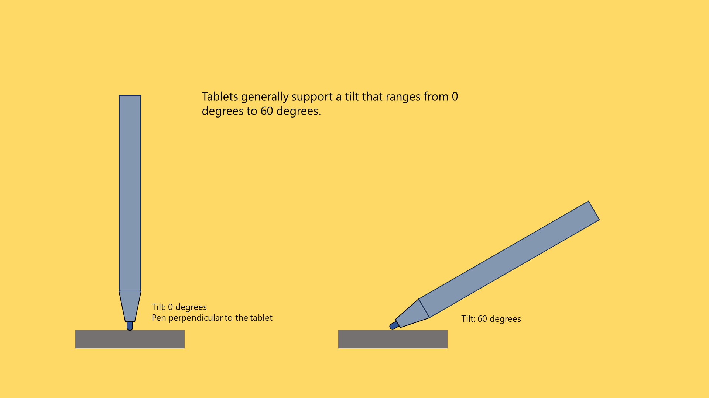
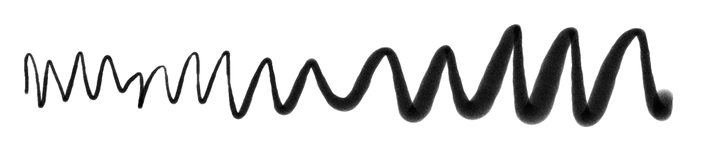
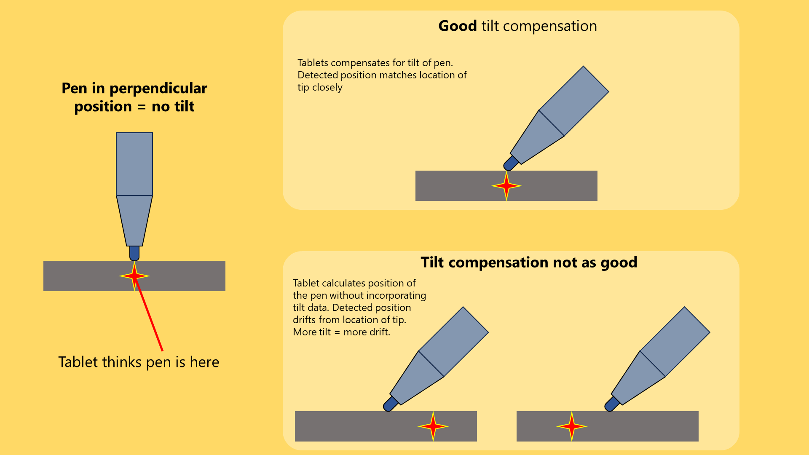

# Pen tilt

## Introduction

Almost all drawing tablets can detect the tilt of the pen. Tilt support for drawing tablets usually ranges from 0 degrees to 60 degrees.

Tilt is described by two angles: tilt elevation and tilt azimuth.

* elevation = "how much the pen leans over"
* azimuth = "The direction of the lean - like north, west, northwest, etc."

<figure><figcaption></figcaption></figure>

This video demonstrates tilt. I highly recommend you watch it.



## How tilt is used in drawing applications

Think about how you use a pencil - when you want a fine line you keep the pencil more perpendicular. However, when you want a wider line - maybe you are shading in an area - you tilt the pencil.

Many drawing applications have digital brushes that mimic that same behavior.

For example, here is a stroke I drew with Krita. I configured the brush to ignore pressure entirely, but to let the amount of tilt control the width of the brush.

As I drew from left to right, I started with the pen very perpendicular and gradually started tilting the pen.

<figure><figcaption></figcaption></figure>

Mapping tilt to brush width is just the most common way of using tilt. However, depending on the application you could have tilt control other attributes of the stroke.

## Which tablets support tilt

The vast majority of modern drawing tablets support tilt.

It's easier to list the modern tablets that don't support tilt:

* Wacom One by Wacom Small (CTL-472)
* Wacom One by Wacom Medium (CTL-672)
* Wacom Intuos Medium (CTL-6100 & CTL-6100WL)
* Wacom Intuos Small (CTL-4100 & CTL-4100WL)
* Huion Frego S (L310)

## Do you need tilt support?

The vast majority of drawing tablets have tilt support, but a few entry-level Wacom ones do not.

For some people tilt is critical and for others, it is not useful at all. It strongly depends on what they are doing.

| Scenario                                      | Is tilt useful? | Notes                                                            |
| --------------------------------------------- | --------------- | ---------------------------------------------------------------- |
| Whiteboarding                                 | Not useful      | It's rare for whiteboarding apps to even support tilt.           |
| Taking notes                                  | Not useful      | It's rare for note-taking apps to even support tilt.             |
| Educational videos                            | tilt not useful |                                                                  |
| Digital painting with natural media brushes - | can be useful   | Some artists require it.                                         |
| Line art                                      | can be useful   | But many/most people do line art without using any tilt features |

## Technical details

You don't need to know these details, but if you are curious how an EMR tablet actually detects the tilt of the pen go here: [EMR tilt detection](../../tech/emr/emr-tilt-detection.md).

## **Tilt angle range**

* The standard range is +/- 60 degrees for both X and Y directions
* I don't know of any tablets that support a wider range

## Tilt support in applications

* Even if your tablet is sending tilt data to your computer, your application may or may not be using the data.
* Some applications don't use the tilt data at all. An example would be most note taking applications like OneNote. They tend to recognize pressure but not tilt.
* Other applications do recognize tilt, but the use of the tilt data is only for specific brushes. So, for example, typically a "pencil" brush would support tilt. Other kinds of brushes may not. Even then, these brushes have settings that let you customize whether and how tilt is used for the brush.
* Here's a good example of a brush in Krita. You can see that the Rotation of the brush is set to the Drawing Angle, but it could also be set to tilt.
* 

## Tilt effect on pen tracking accuracy (tilt compensation)

To calculate the location of the pen, the tablet must take into account how much the pen is tilted. This process is called **tilt compensation**. Remember: no tablet has perfect tilt compensation, and at extreme tilt angles you might see some deviation. This is normal.

<figure><figcaption></figcaption></figure>

## Disabling tilt

You may not always want to have tilt affect your drawing. It is possible in some cases to disable it. More here: [Disabling pen tilt](disable-tilt.md)
