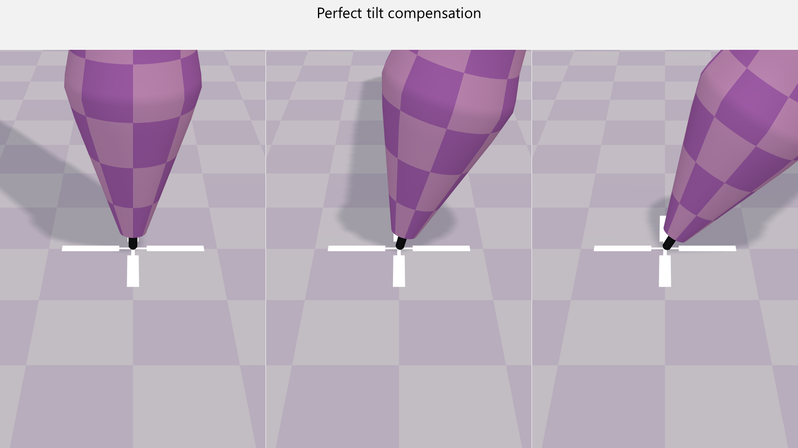
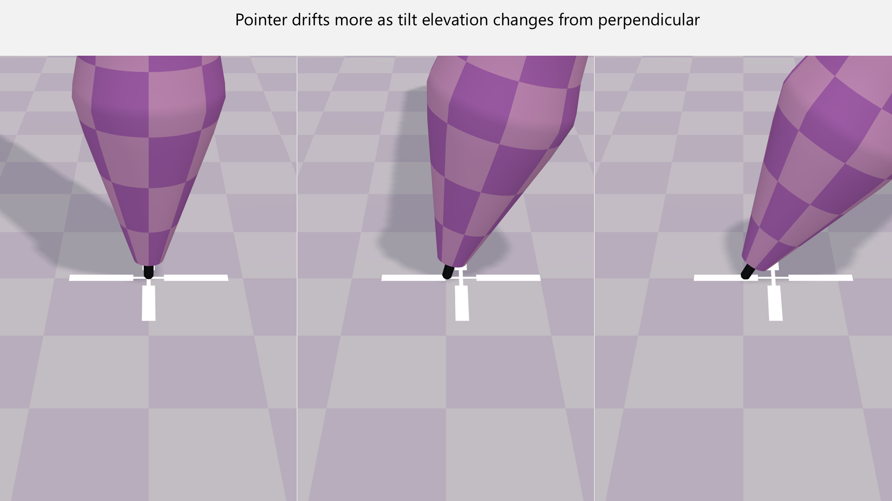
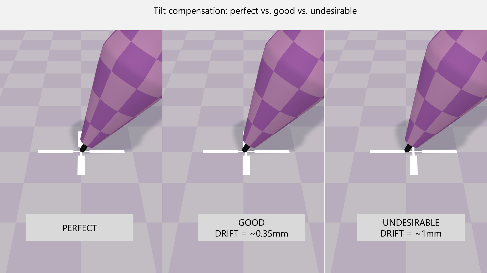
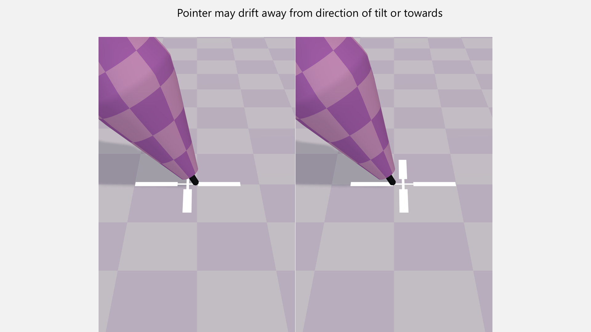
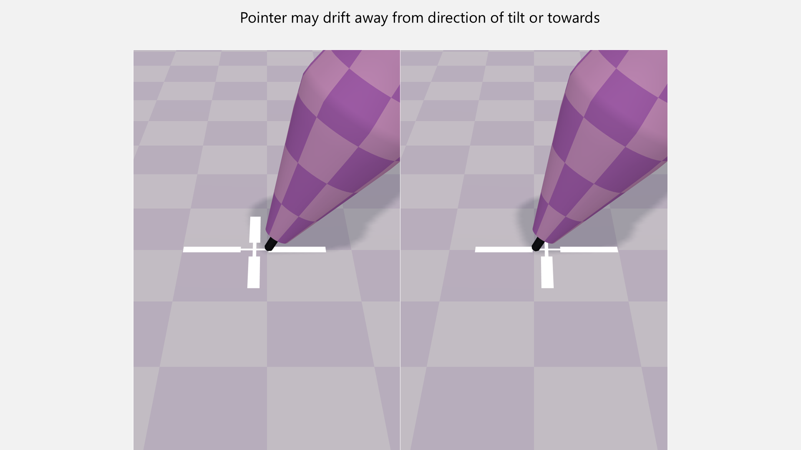
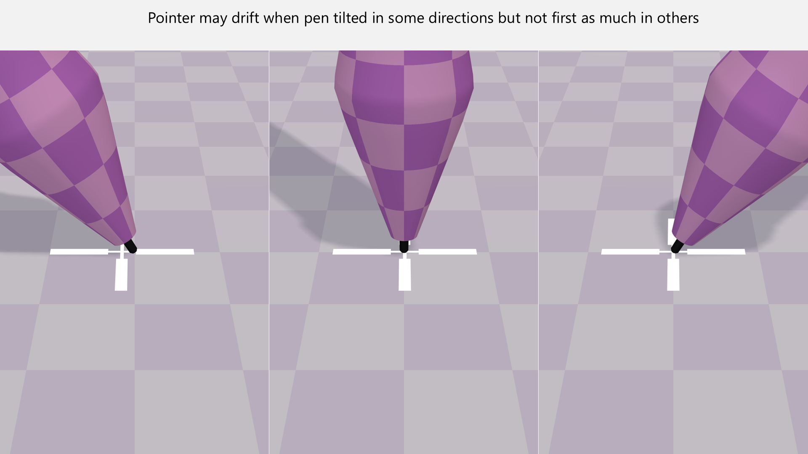
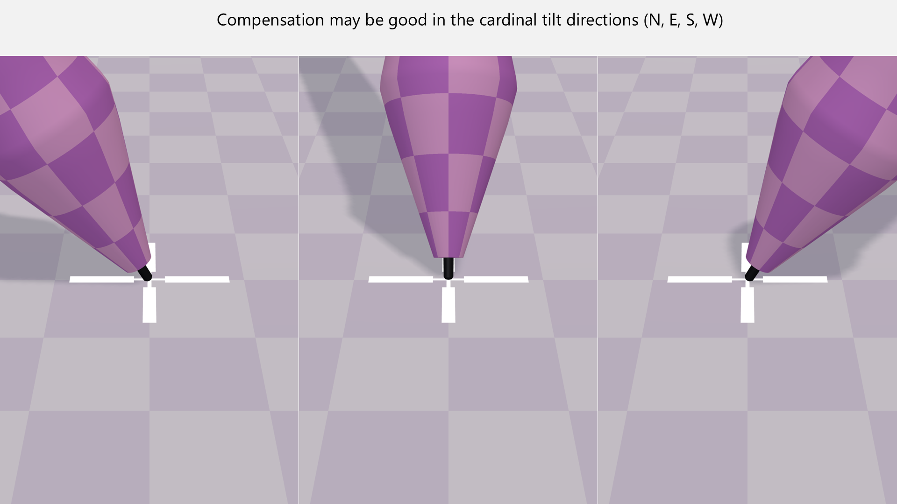
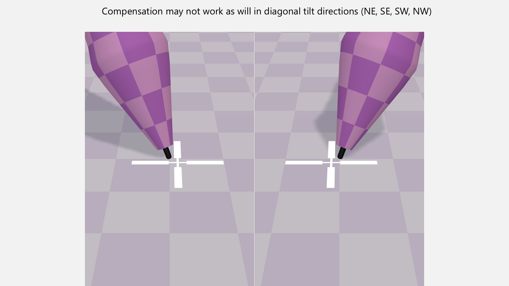

# Tilt compensation

## Overview

To correctly represent the pen's position, the tablet must perform tilt compensation. This means adjusting the pointer position based on how much the pen is tilted.

One point to stress: tilt compensation is performed by the tablet, not the pen.

Before you continue, read the section on [tilt](./). It is important that you understand **tilt altitude** and **tilt azimuth** before exploring tilt compensation in depth.

## Baseline: Perfect tilt compensation

No tablet has perfect tilt compensation. None.

That being said, some points:

* Some tablets are very good at tilt compensation.
* Some are not as good.
* Even if a tablet is bad at it, you may never notice it.
* Tilt compensation is needed for tablets with and without screens. It is much more noticeable with screens because you can clearly see the pen tip and pointer.

This is what theoretically perfect tilt compensation looks like:

<figure><figcaption></figcaption></figure>

## A simple example of imperfect tilt compensation

The diagrams below show how imperfect tilt compensation can look. The pointer "drifts" from the ideal position. Drift varies in amount and direction, but this is a good starting point for understanding the topic.

<figure><figcaption></figcaption></figure>

## Perfect vs good tilt compensation

Because no tablet has perfect tilt compensation, we should set expectations for good tilt compensation. In my experience, a good result at 45 degrees of tilt elevation is slight pointer drift while the pointer still appears to touch the nib tip. In the example below, the drift is about ⅓ of a millimeter. Your experience and preferences may vary.

<figure><figcaption></figcaption></figure>

## Pointer drift direction

The drift may occur toward the direction in which the pen is leaning or away from it.

<figure><figcaption></figcaption></figure>

<figure><figcaption></figcaption></figure>

## Pointer drift based on tilt direction (azimuth)

You may see that the pointer drifts in some orientations, but less in others.

<figure><figcaption></figcaption></figure>

I have observed a pattern in some tablets. Tilt compensation is good in all cardinal directions (N, S, E, W). It becomes inaccurate as the direction approaches diagonal directions (NE, SE, SW, NW).

<figure><figcaption></figcaption></figure>

<figure><figcaption></figcaption></figure>

## Older vs newer tablets

I have seen some very old tablets do this very badly, almost as if they do not compensate for tilt at all. Even some very old Wacom professional tablets can struggle with this. Modern drawing tablets generally handle tilt compensation very well.&#x20;

## Brands

Wacom is clearly the best across its models - both consumer and professional. I would rate every modern Wacom tablet as **excellent** for tilt compensation. Other brands are usually good or ok, but some models may exhibit more tilt compensation issues.

## Variation within tablet models

In my experience, not every tablet model from a given brand has the same tilt compensation issues. Tilt compensation appears to be model-specific. Even if Model X from a brand exhibits perfect tilt compensation, Model Y from the same brand may behave differently.

## Right-handed versus left-handed usage

With non-Wacom tablets, tilt compensation may work well when you hold the pen in your right hand. You may experience more tilt compensation issues when using your left hand. See the [Calibration](tilt-compensation.md#calibration) section.

## Considerations during calibration

Pen displays offer a pointer calibration process to help align the pen tip with the pointer you see on screen. When you perform this calibration, do **not** hold the pen vertically. Hold the pen in the natural position you use while drawing.

If you hold the pen vertically, the calibration will likely be less accurate.

## Effects of parallax on pointer drift

Remember that parallax found in tablets with screens will contribue to an apparent inaccuracy on the pointer. Thus even if you had even theoretically perfect tilt compensation, parallax would cause an apparent (but not actual) drift of the cursor. See [**parallax**](../../guides/pen-displays/parallax.md).

