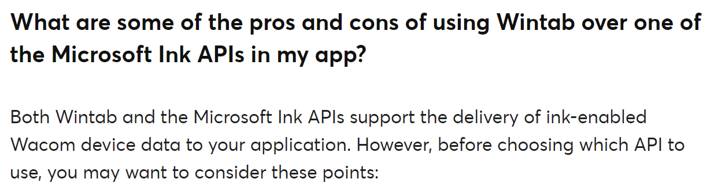

# WinTab vs Windows Ink

## Overview

On Windows, there are two ways a drawing tablet communicates with your computer and the tablet driver: WinTab and Windows Ink.

## For normal users

By default, use **Windows Ink** unless something forces you to use WinTab.

If you use WinTab, use it only for a specific application.

To learn how to configure Windows Ink, see [Windows Ink](../guides/platforms/windows/winink/).

## For developers

Wacom published a page with frequently asked questions about WinTab:

[https://developer-support.wacom.com/hc/en-us/articles/12844524637975-Wintab](https://developer-support.wacom.com/hc/en-us/articles/12844524637975-Wintab) ([archive](https://archive.is/htSEG))

Here is a small snippet from the relevant section.

<figure><figcaption></figcaption></figure>

Please read the document for the full details.

### My developer perspective

But here are a few things that stand out to me:

* It is a well-understood and stable API.
* There are wrappers for many languages, including C#, Rust, and Python, that let you work with the API.
  * I had a relatively simple time incorporating it into my test drawing app called [WinTabPainter](https://github.com/TheSevenPens/WinTabPainter).
* You can find many projects that use WinTab.
* It has been difficult for me to find clear examples of how to use the Windows Ink API. Most code focuses on inking features, which is great, but not on what I need: a way to get pen position, pressure, tilt data, and more.

So, at the moment, I intend to continue using WinTab until I find an easy way to consume the Windows Ink APIs.
