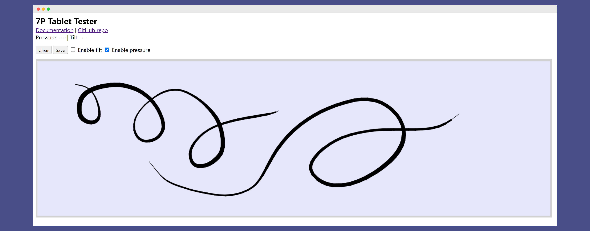

# 7P Tablet Tester

## Overview

With the 7P Tablet Tester browser-based tool you can test out the basic features of your tablet. This is useful for troubleshooting.&#x20;

Click this link to try the tool: [**7P Tablet Tester**](https://thesevenpens.github.io/HtmlTabletTester/)

<figure><figcaption></figcaption></figure>

## Safety and privacy

This tool collects no data, uses no cookies, and does not save your images. &#x20;

## Features

* Can draw with pen, mouse, and touch (if your tablet supports touch)
* Pen drawing features
  * Pressure affects size of brush
  * Tilt - Not yet implemented
* Show current numeric values for position, pressure, tilt, etc. - Not yet implemented&#x20;
* Save canvas as PNG file
* Clear canvas

## OS & Browser compatibility

**Windows**

* Pen API:
  * Needs Windows Ink to be enabled in the tablet driver.&#x20;
  * If using WinTab, no pressure is supported.
* Chrome - WORKS
* Firefox - WORKS

**MacOS**

* Safari - yet to be tested
* Chrome -  WORKS

**Linux**

* Chrome - WORKS
* Firefox
  * Wayland - WORKS
  * X11 -&#x20;
    * use `env MOZ_USE_XINPUT2=1 firefox` to make it work
    * more info on what's going on with the X11 issue:&#x20;
      * [https://stackoverflow.com/questions/78073830/pen-pointer-events-in-linux-chrome-and-firefox-not-working-as-intended/78764151#78764151](https://stackoverflow.com/questions/78073830/pen-pointer-events-in-linux-chrome-and-firefox-not-working-as-intended/78764151#78764151)
      * [https://bugzilla.mozilla.org/show\_bug.cgi?id=1207700](https://bugzilla.mozilla.org/show\_bug.cgi?id=1207700)&#x20;

**iPadOS**

* Safari - WORKS

**Android**

* Chrome - WORKS

## Open source

The entire source code is on the github repo ([https://github.com/TheSevenPens/HtmlTabletTester](https://github.com/TheSevenPens/HtmlTabletTester)). I encourage you to look through it and fork and modify it for your needs.
