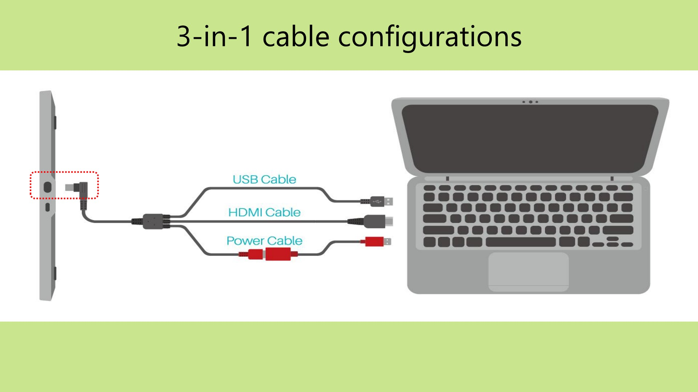

# Huion Kamvas 13 GEN3 (GS1333) notes

## Overview

The Kamvas 13 GEN3 (GS1333) is a really good 13" tablet. I recommend this tablet and think it makes an excellent choice for a entry-level tablet.&#x20;

The drawing experience is good - better than I would expect for an entry-level drawing tablet 2024.

Highlights

* Has two dials in addition to 5 buttons
* Uses the new PW600L pen that has a wide pressure range
* Big upgrade from the Huion Kamvas 13 (GS1331)

Things to be aware of

* If you want to connect via USB-C cable, need to buy that separately

## Video



## Basics

* product page: [https://huion.com/products/pen\_display/Kamvas/kamvas-13-gen-3.html](https://huion.com/products/pen_display/Kamvas/kamvas-13-gen-3.html)
* released: 2024

## Active area

* Dimensions: 11.57" x 6.5"
* Diagonal length: 13/27"
* Aspect ratio: 16x9

## Pen

It comes with the PW600L pen. It has excellent pressure range. The PWG00L does does not have an eraser like the other PW600 pen models.

More here: [**PW600 series pens**](../../../pen-links/huion-pen-models/7p-huion-pw600.md)

## Compatible pens

The PenTech 4.0 pens work with it. I tested these three:

* PW600L
* PW600
* PW600S

More here: [**PW600 series pens**](../../../pen-links/huion-pen-models/7p-huion-pw600.md)

## Drawing experience

The drawing experience was VERY GOOD.

In summary:

* Smooth pressure transition - VERY GOOD
* Artifacts at low pressure - VERY GOOD
* Diagonal Wobble - VERY GOOD
* Pressure Scan Rate - EXCELLENT
* Pointer tracking accuracy - VERY GOOD
* Tilt compensation  - VERY GOOD
* Parallax - GOOD
* Pointer lag - MODERATE (typical for a pen display)

## Pen tracking accuracy

Huion states:

* Center :±0.3mm
* Corner:  ±2mm

RATING: VERY GOOD

I found the pen tracking very accurate. The pointer follows the tip of the pen very accurately across the entire surface. And in my unit, the corners seemed even more accurate than ±2mm.&#x20;

## Tilt compensation

RATING: VERY GOOD

* At 45 degrees of tilt - I saw almost deflection of pointer away from the tip of the nib
* At 60 degrees of tilt - It was still very good - sometimes as good at 45 degrees - though sometimes I saw maybe a 1mm deflection

## Pointer lag

TYPICAL for a pen display.  The pointer lag did not interfere with my drawing in any way.

## Diagonal wobble

RATING: GOOD. Low amount of diagonal wobble.

<figure><figcaption></figcaption></figure>

## Display

* Native resolution: 1920x1080
* Refresh rate: 60Hz
* Aspect ratio: 16x9
* Lamination: YES
* Viewing angle: 178°
* Response time: 25ms
* Brightness: 220 nits
* Contrast ratio: 1000:1
* Anti-glare treatment: Etched glass
* Color depth: 8-bit

## Anti-glare treatment

The tablet is etched glass. This is a change from previous model which used an AG matte film.

## Anti-glare sparkle

&#x20;Very little visible. This is a big improvement over the previous model.

## Pressure scan rate

GOOD. I drew 50 small quick strokes as fast as I could. No strokes were lost.&#x20;

## Display sharpness

Pixels are clear and well delineated. The image does not look "soft".

## Touch

N/A. This tablet does NOT support touch.

## Surface texture

GOOD. Provides good grip for the - even if the pen is using the plastic nib. Surface texture seems comparable to the Kamvas Pro 19 - actually the Kamvas 13 GEN3 seems to have slightly more texture.

## Connections and cabling

### Ports

* 2x USB-C ports
* Upper USB-C port is recessed into the tablet. Intended for use with the Huion 3-in-1 cable
* Lower USB-C port is flush against the surface of the tablet and intended for use with a USB-C cable

## USB-C Connection

The tablet can connect to your computer with a single USB-C cable. If more power is needed you can use another USB-C cable plugged into a power adapter.

HOWEVER: The tabler DOES NOT come with these cables. You'll have to order them separately.

<figure><figcaption></figcaption></figure>

### 3-in-1 cable connection

The tablet comes with a 3-in-1 cable if you need to use an HDMI port with your computer.

<figure><figcaption></figcaption></figure>

## VESA

This tablet does NOT support VESA mounting.

## Legs

This tablet does NOT have legs.

## Heat

I set the brightness to 100% and continued to use the tablet for 1 hour.

The left 2/3rds of the tablet felt like room temperature to my hands.

The right 1/3 of the tablet got slightly  warm - most of that was closer to the USB-C port locations. The warmth did not concern me and seemed very normal for pen display.&#x20;

## Audio

This tablet does not have any audio features and does not have a headphone jack.

## Auxiliary inputs&#x20;

The tablet has:

* 2 dials
* 5 buttons

### Protcting the dials

The dials stick out a little bit from the edge of the tablet. Be aware of this when storing or transporting the tablet. I recommend avoiding having anything pressing constantly on the dials. And certainly don't store the tablet with the dials on the bottom. I don't if the dials are so fragile that they need so much protection, but I think it is wise to be careful.

### Dial issues

* **Dials** As of July 2025, that some people report that the dials have stopped working. I don't think this is a super common issue but it is an issue I see reported with a little more frequency than I would expect. I have not personally experienced any problems with the dials. It is unclear what might be the cause of the  problem.

## Compared to the Kamvas 13 (GS1331) and the Kamvas Pro 13 2.5K (GT1302)

**Summary**

The Kamvas 13 GEN3 (GS1333) is a big upgrade from the older edition Kamvas 13 (GS1331) and is even mostly an upgrade from the  Kamvas Pro 13 2.5K (GT1302).

* The GS1333 uses  PW600L pen is much better than the PW517 pen that comes with the other two tablets.&#x20;
  * The PW600L has a slightly better IAF (Huion states 2gf) and a wider pressure range. [<mark style="background-color:green;">**My notes on the PW600 series pens**</mark>](../../../pen-links/huion-pen-models/7p-huion-pw600.md).
  * The PW517 has a standard IAF (Huion states 2gf) and it's pressure range is variable - it is sometimes OK-ISH and sometimes GOOD depending on the specific unit you get. [<mark style="background-color:green;">**My notes on the PW517 pens**</mark>](../../../pen-links/huion-pen-models/7p-huion-pw517.md).
* The GS1333 has much less anti-glare sparkle than the GS1333 and GS1331.
* The GS1333 has one USB-C port that is flush with the surface of the tablet, making it possible to use 3rd party USB-C cables. (See [**Connecting a pen display with a single USB-C cable**](../../../guides/connections-and-cabling/connecting-a-pen-display-with-one-usb-c-cable.md)).
* The addition of the dials to the GS1333  makes it easier to work without having to touch the keyboard.&#x20;

**Which one to get**

If you have to choose of these three, I HIGHLY recommend picking the Kamvas 13 GEN3 (GS1333).&#x20;

If you want that higher resolution of the GT1302, then wait until Huion releases a new version that uses the PW600 pen and reduces the anti-glare sparkle.

**Key differences**

* Pen in the box
  * Kamvas 13 GEN3 (GS1333) - PW600L (VERY GOOD)
  * Kamvas 13 (GS1331) - PW517 (OK-ISH OR GOOD, depends on the specific unit you get)
  * Kamvas Pro 13 2.5K (1302) - PW517 (OK-ISH OR GOOD, depends on the specific unit you get)
* Anti-glare  treatment
  * Kamvas 13 GEN3 (GS1333) - etched glass
  * Kamvas 13 (GS1331) - AG matte film
  * Kamvas Pro 13 2.5K (1302) - etched glass
* Amount of Anti-glare sparkle
  * Kamvas 13 GEN3 (GS1333) - LOW (GOOD)
  * Kamvas 13 (GS1331) - MODERATE (OK)
  * Kamvas Pro 13 2.5K (1302) - MODERATE (OK)
* USB-C Ports
  * Kamvas 13 GEN3 (GS1333) - one flush with the surface, one recessed
  * Kamvas 13 (GS1331) - both ports recessed
  * Kamvas Pro 13 2.5K (1302) - both ports flush with the surface
* Resolution
  * Kamvas 13 GEN3 (GS1333) - Full HD (1920x1080)
  * Kamvas 13 (GS1331) - Full HD (1920x1080)
  * Kamvas Pro 13 2.5K (GT1302) - 2.5K (2560x1440)

