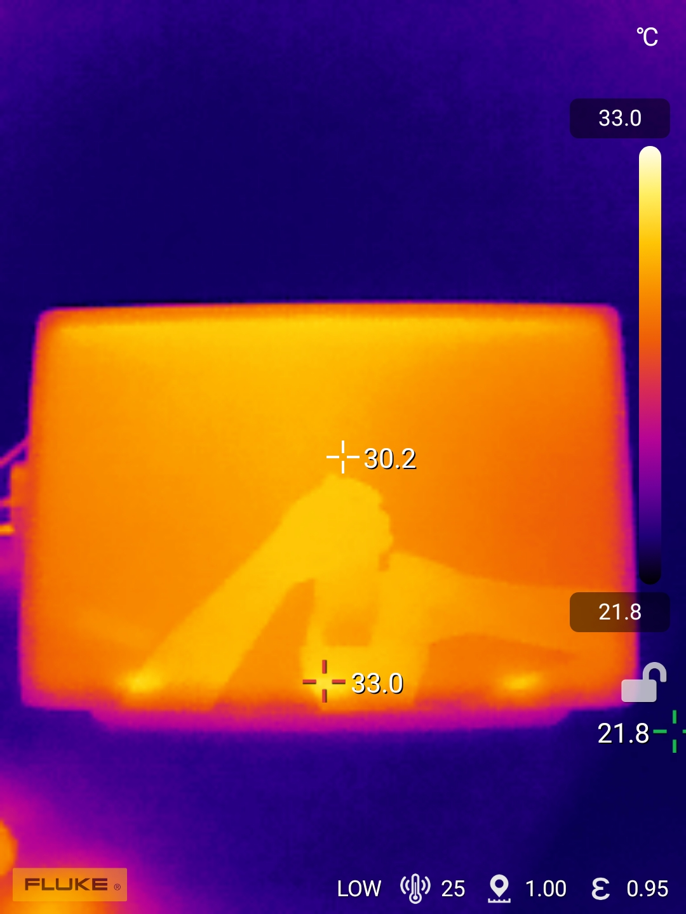

# Wacom Cintiq 16 2025 (DTK-168) notes

## Overview

Wacom released three new Cintiq 2025 models in mid 2025. One of them is the Wacom Cintiq 16 (2025) (DTK-168).&#x20;

This is a EXCELLENT tablet with an excellent drawing experience and very good display. It does miss some "Cintiq Pro" features but has the same great drawing experience as it relates to pressure, tilt, etc.

## Compared to the Cintiq 16 2019 (DTK-1660)

Summary: The Cintiq 16 2025 is a significant upgrade in many ways

* Native resolution: Cintiq 16 2025 has 2560x1600 compared the 1920x1080 of the older model
* Aspect ratio: Cintiq 16 2025 screen is 16x10, the Cintiq 16 2019 has a 16x9 aspect ratio. Many people feel that the 16x10 aspect ratio make the Cintiq 16 2025 feel a little larger than it actually is.
* Included pen: Cintiq 16 2025 comes with the Wacom Pro Pen 3 (ACP-500). The Cintiq 16 2019 comes with the Wacom Pro Pen 2. Opinions are divided on which pen is better. Note that the Pro Pen 2 works with the Cintiq 16 2025
* Colors: Cintiq 16 2025 has much brighter and more vivid colors. The Cinti16 2019 is know for a more washed out look.
* Parallax: Cintiq 16 2025 has low parallax which is better. Cintiq 16 2019 known to have more noticable parallax.
* Cabling: Cintiq 16 2025 has a simpler and more flexible cabling that can use standard cables. The Cintiq 16 2019 must be connected with a proprietary Wacom 3-in-1 cable.

## Basics

* Product page: [https://www.wacom.com/en-us/products/wacom-cintiq](https://www.wacom.com/en-us/products/wacom-cintiq)

## Specs

### Device weight&#x20;

Slightly heavier than other pen displays at this size

* Wacom Cintiq 16 (2025): 1.5kg&#x20;
* Xencelabs Pen Display 16: 1.3 kg&#x20;
* Huion Kamvas 16 gen 3: 1.2kg&#x20;
* Wacom Movink 13: 0.420kg&#x20;

### Display specs

* Display panel tech: IPS
* Native resolution: 2560 x 1600&#x20;
* Aspect ratio: 16:10
* Anti-glare treatment: AG glass
* Laminated: YES - Wacom uses the term "bonded"
* Response time: 12ms

## Display experience

### Color

* Color gamut (Wacom specified)
  * DCI-P3 99% (CIE1931) (typ)&#x20;
  * sRGB 100% (CIE1931) (typ)&#x20;
* I was satisfied with color.&#x20;
* This is not a "wide-gamut" display
* It colors are pleasing and a big improvement over older Cintiq (non Pro) models that had washed-out colors.

### Antiglare sparkle&#x20;

* RATING: GOOD. Very low. .
* Comparisons:
  * Similar to Wacom Cintiq Pro 22
  * Similar to Huion Kamvas Pro 19
  * Similar to Wacom Cintiq 24 (2025)

### Pixel sharpness

* Rating: GOOD
* Pixels were clear and well-delineated
* In comparison
  * Pixels looks sharper than Huion Kamvas Pro 19 which has a slight softness that many people notice and some do not like
  * How does it compare to a 4K at the same size? I would have a hard time telling this apart from 4K&#x20;

### PWM flicker

* No PWM flicker detected at any brightness level
* Comparisons:
  * Movink 13 has obvious PWM flicker
* NOTE: Link to flicker testing methodology

## Drawing experience

### Surface texture

* Surface texture is very typical for a pen display.
* Pen does not feel slippery on the surface when drawing
* Cintiq 16 (2025) has a surface texture that is
  * the same as Cintiq 24 (2025)
  * a bit more than Huion Kamvas 13 GEN3&#x20;
  * about the same as Movink 13 (but has a different sensation - Movink feels "softer")&#x20;
  * a bit more than Xencelabs Pen Display 16&#x20;
  * somewhat less than the Cintiq Pro 22&#x20;

## Connections and cabling

### Included cables

* USB-C cable #1 supports power, data, and video (5Gbps and 60W)
* USB-C cable #2 power only

### Ports

* USB-C for power
* USB-C for power, video, data
* mini-HDMI&#x20;
  * it does NOT come with a mini-HDMI adapter.

### Connection options

* TBD add screenshots from Wacom doc

### Connecting with a single USB-C cable

* YES. This is supported. But your computer will need a USB-C port that must meet the requirements for power, data, and video signal.
* Cabling notes
  *   The included USB-C cable will work for this purpose.

      The included cable is 5Gbps and 60W
  * I also tested with a CableMatters Thunderbolt 3 cable.
* Brightness when connected with a single USB-C cable
  * Was able to achieve 100% brightness in my scenarios
* Connection scenario 1 (worked)
  * Tablet –> CableMatters TB3 -> CalDigit TS4 dock -> M1 MAX Mac Studio&#x20;
* Connection scenario2 (worked)
  * Tablet -> CableMatters TB3 ->  M3 MacBook Pro&#x20;
  * &#x20;M3 Macbook Pro was not attached to power and was able to power the tablet
* Notes
  * When using a single USB-C connection, if you attach a power cable the tablet will turn itelf off and then back
  * Can be a little tricky to put the cable in because of that 'thing' on the back&#x20;
    * Some people consider using an USB-C L-type adapter &#x20;

## Other inputs

### Buttons, dials, etc

NONE

### Touch

NO. This tablet does not support touch.

## On-Screen Display Menu (OSD)

* Button above the power button on the right side of the tablet
* Because there is no touch support, to use OSD must use then pen&#x20;
* Will have to pick language the first time to open the USD, before you can use OSD

## Ergonomics

### VESA

The tablet does support VESA Mounting

### Stand

No stand is included in the box

### Fans

No fans

### Noise

No noise. Completely silent.

### Heat

* I measured with the tablet on 100% brightness for several days.
* Heat is well managed - only a very slight warms toward the top
* temperature range
  * MIN: 30.2C (86.36F)
  * MAX: 33.0C (91.4F)
* NOTE: My IR reflection is visible in the IR photo&#x20;

<figure><figcaption></figcaption></figure>

*
