# Wacom Intuos Pro 2025 (PTK-x70) notes

## Summary

This is an EXCELLENT tablet, but may not be the right one for you if:

* You do not like the new ExpressKeys placement
* The lack of multi-touch support
* You are already happy with an Intuos Pro 2017 model

## Companion video

If you would rather watch:  [https://www.youtube.com/watch?v=Q2rH32pBpq0](https://www.youtube.com/watch?v=Q2rH32pBpq0)

But do check this document for any updates since the original video was published.



## Changes to key features from 2017 edition

* No improvement to drawing performance
* ExpressKeys and dials moved to the top
* Multitouch support dropped
* Bezels are significantly smaller
* Comes with Pro Pen 3 instead of Pro Pen 2

## Important Quality-of-life improvements

* Size & weight
* 16x9 aspect ratio
* Larger native active area
* Big increase in active area when using Force Proportions on 16:9 monitors
* Pen compatibility
* Pro Pen 3 is very customizable
* Wireless connectivity

## Should you buy the Intuos Pro 2025

* Your first pro tablet? → YES
* Want the best? → YES
* Upgrade from 2017 edition? → MAYBE
* Need multitouch support? → NO

## Should you buy the Intuos Pro 2017 or the Intuos Pro 2025

Complex topic. Will address in May 2025.

## Historical context

From 2009 to 2025, there have been 4 editions of profesional pen tablets from Wacom and all have maintain a consistent layout with expresskeys on the left. Therefore the new layout of this tablet was quite surprising for many of us.

<figure><figcaption></figcaption></figure>

## Model numbers

It's always helpful to be clear on the model numbers so that you don't buy the wrong version of the tablet.

<figure><figcaption></figcaption></figure>

## Design

Although not everyone shares this opinion, I find it a very beautiful and professional-looking tablet.

<figure><figcaption></figcaption></figure>

<figure><figcaption></figcaption></figure>

<figure><figcaption></figcaption></figure>

One of the interesting design touches, is a slight texture on the non-drawing surface os the tablet.

<figure><figcaption></figcaption></figure>

## What's in the box

Nothing too surprising, you get the tablet, pen, pen stands, and nibs.

<figure><figcaption></figcaption></figure>

## Included pen

The tablet comes with the Pro Pen 3 (ACP-500). [**My detailed notes on this pen**](../../../pen-links/wacom-pens/7p-wacom-acp-500.md)

## The tablet only comes with 1 pen

This is a little bit of a disappointment. Some other brands are starting to include 2 pens with some of their professional models.

For example, as of April 2025, here is a **partial** list of tablets that come with two pens

* Xencelabs Pen Tablet Medium
* Huion Kamvas Pro 19
* Huion Kamvas Pro 27
* XP-Pen Artist Pro 19 GEN2

## Core specs

* Pressure levels - 8192
* Digitizer resolution - 5080 LPI (200 LPmm)
* Tilt - Yes
* Tilt range - ± 60°
* Report rate - Unknown – will investigate&#x20;

## Barrel rotation

Although the included Pro Pen 3 does not support barrel rotation. You can use the Wacom Art Pen (KP-701E) that does support rotation with the tablet.&#x20;

## Drawing performance

**Summary:** The drawing performance is excellent and keeps the same quality as the previous Intuis Pro 2017 edition.

### Moving between high and low pressure worked well

<figure><figcaption></figcaption></figure>

### Diagonal wobble

EVALUATION: Very good. Low amount of diagonal wobble. Similar to Intuos Pro 2017 edition.

<figure><figcaption></figcaption></figure>

## Tilt compensation

EVALUATION: VERY GOOD

Even as I tilted the pen at different angles, the pointer did not deflect much from the tip of the pen.

## Pointer lag

EVALUATION: VERY GOOD (VERY LOW)

As expected, the pointer trailed the physical tip of the only by a little bit. It was about the same as the pointer lag of the Intuos Pro 2017 model. In general, Wacom has excellent, low pointer lag in their pen tablets.

## Artifacts at low pressure

EVALUATION: TYPICAL. When using large brushes and drawing at very light pressure you may notice a lot of instability in the pressure. This is normal for Wacom Intuos Pro (and many other tablets and pens). You can use pressure curves and pressure smoothing to minimize these issues if you encounter them.

Keep in mind this is a very extreme test. Normally you should not notice these issues.&#x20;

<figure>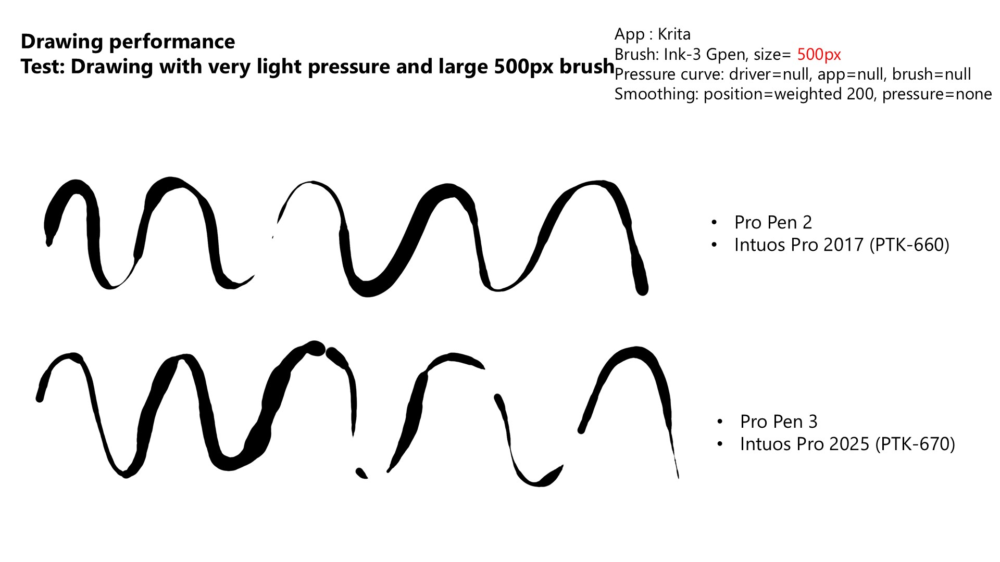<figcaption></figcaption></figure>

<figure>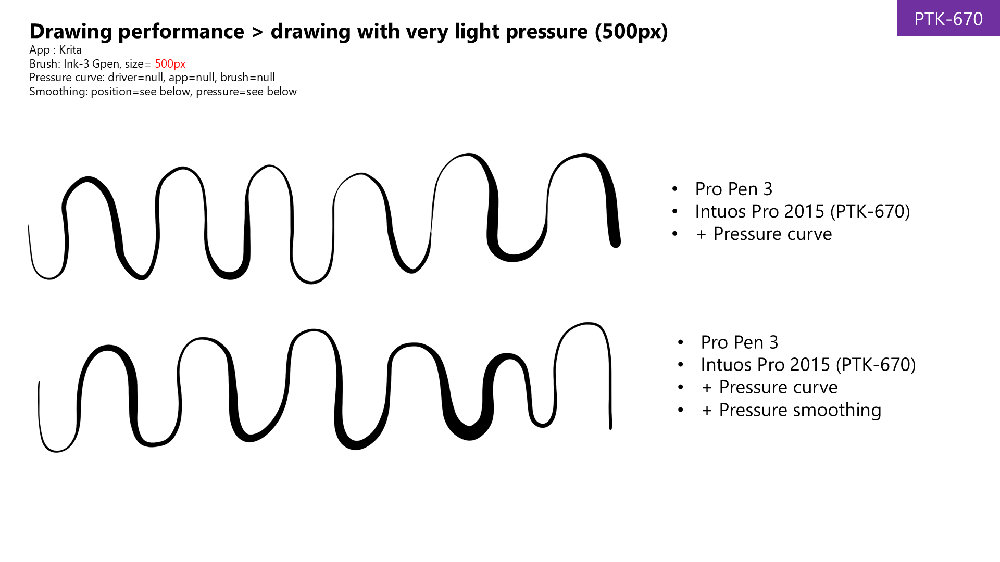<figcaption></figcaption></figure>

These were the pressure curves and pressure smoothign amounts (in Krita) that controlled that behavior.

<figure>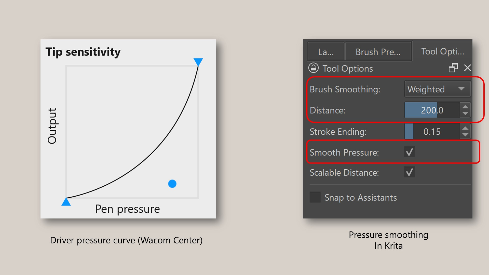<figcaption></figcaption></figure>

## Auxiliary inputs

### Multitouch

Unlike the previous Intuos Pro 2017 (PTK-x60) series, the Intuos Pro 2025 (PTK-x70) series does **NOT** support multitouch.

### ExpressKeys and dials

The PTK-x70 series tablers comes with pairs of ExpressKey rings and dials.

<figure><figcaption></figcaption></figure>

Though do be aware that the number of ExpressKeys and dials depends on which size tablet in the PTK-x70 series you get.

<figure><figcaption></figcaption></figure>

## Accidentally pressing the ExpressKeys and dials

It is possible to accidentally hit he ExpressKeys and dials depending on how the tablet is configured on your keyboard.

**Tablet next to keyboard** - no accidental presses&#x20;

<figure><figcaption></figcaption></figure>

**Tablet underneath the keyboard** - no accidental presses while drawing, but accidental presses did happen when reaching for keys toward the top of the keyboard.

<figure><figcaption></figcaption></figure>

<figure><figcaption></figcaption></figure>

**Accidental presses were not possible in the way draw** - I use a tourbox device. So my keyboard is not near the tablet at all. So accidental presses did not happen for me.

<figure><figcaption></figcaption></figure>

**Ultimately, I disabled all the ExpressKeys and dials** - I simply did not need them.

<figure><figcaption></figcaption></figure>

**I did accidentally hit the ExpressKeys when I meant to hit the dial and vice versa**. They are very similar in size, shape, and close together. Often I reached and touched the wrong one. Over time I may have been to train my brain a bit better.

## Hand placement

Another topic that comes up with the expresskeys is how the hand that uses the expresskey is placed on the tablet.

With the Intuos Pro 2017, the non-drawing hand can stay near or on the ExpressKeys without  covering the active area.

<figure><figcaption></figcaption></figure>

However with the Intuos Pro 2025, the non-drawing hand will cover some part of the active area. Some people find that this interferes with their experience since they have to move the non-drtawing hand out of the way much more often.

<figure><figcaption></figcaption></figure>

## Usage notes on dials

* Be aware that the dials only support Rotation. They do not support pressing the dial as a third action. This is not a problem, but I am just used to being able to do that with the TourBox dials so I wanted to mention it.&#x20;
* The dials feel nice to rotate. Rotating produces soft click feeling and small sound.
*
  The dials do not rotate too easily nor do they require too much force to rotate.

## Usage notes on ExpressKeys

* It is not obvious in pictures but the ExpressKey rings have 5 buttons. The fifth button in the middle is used to switch what the other 4 buttons do.

<figure><figcaption></figcaption></figure>

## Size (physical and active area)

Physically the new devices are smaller than their 2017 counterparts. but their active areas have grown in size. So, you have more room than every for drawing despite the sizes of the devices shrinking.&#x20;

<figure><figcaption></figcaption></figure>

The 2017 models had unusal aspect ratios, while the new devices all have 16x9 (or incredibly close to it) aspect ratios. This has a nice consequence. If you use a 16x9 monitor you have to turn on Force Porportions to draw normally with the 2017 models. But FP is not needed and has no effect on the new models with a 16x9 monitor. Because a mismatch in aspect ratios between the pen tablet's active area and the monitor causes Force Proportions to stop using some amount of active area ... when you take this into account the new tablets in practice give you much more active area than the 2017 models.

<figure><figcaption></figcaption></figure>

### Device size

<table><thead><tr><th width="140.20001220703125">Size category</th><th width="183.39996337890625">Intuos Pro 2017</th><th width="186.800048828125">Intuos Pro 2025</th></tr></thead><tbody><tr><td>LARGE</td><td>
PTH-860

430 x 287 mm

1234.1 cm2
</td><td>
PTK-870

377 x 253 mm
 953.81 cm2
</td></tr><tr><td>MEDIUM</td><td>
PTH-660

338 x 219 mm
 740.22 cm2
</td><td>
PTK-670

291 x 206 mm
 599.46 cm2
</td></tr><tr><td>SMALL</td><td>
PTH-460

269 x 170 mm
 457.3 cm2
</td><td>
PTK-470

215 x 163 mm
 350.45 cm2
</td></tr></tbody></table>

### Active area

<table><thead><tr><th width="140.20001220703125">Size category</th><th width="183.39996337890625">Intuos Pro 2017</th><th width="186.800048828125">Intuos Pro 2025</th></tr></thead><tbody><tr><td>LARGE</td><td>
PTH-860

311 x 216 mm
 671.76 cm2


</td><td>
PTK-870

349 x 195 mm
 680.55 cm2
</td></tr><tr><td>MEDIUM</td><td>
PTH-660

224 x 148 mm
 331.52 cm2
</td><td>
PTK-670

264 x 148 mm
 390.72 cm2
</td></tr><tr><td>SMALL</td><td>
PTH_460

160 x 100 mm
 160.0 cm2
</td><td>
PTK-470

187 x 105 mm
 196.35 cm2
</td></tr></tbody></table>

### Active area with Force Proportions enabled

<table><thead><tr><th width="140.20001220703125">Size category</th><th width="183.39996337890625">Intuos Pro 2017</th><th width="186.800048828125">Intuos Pro 2025</th></tr></thead><tbody><tr><td>LARGE</td><td>
PTH-860

311 x 174.94 mm
 544.06 cm2


</td><td>
PTK-870

349 x 195 mm
 680.55 cm2
</td></tr><tr><td>MEDIUM</td><td>
PTH-660

224 x 126.0 mm
 282.24 cm2
</td><td>
PTK-670

264 x 148 mm
 390.72 cm2
</td></tr><tr><td>SMALL</td><td>
PTH-460

160 x 90.0 mm
 144.0 cm2
</td><td>
PTK-470

187 x 105 mm
 196.35 cm2
</td></tr></tbody></table>

## Aspect ratio

<table><thead><tr><th width="140.20001220703125">Size category</th><th width="183.39996337890625">Intuos Pro 2017</th><th width="186.800048828125">Intuos Pro 2025</th></tr></thead><tbody><tr><td>LARGE</td><td>
PTH-860

TBD


</td><td>
PTK-870

16:9 (1.79)
</td></tr><tr><td>MEDIUM</td><td>
PTH-660

TBD
</td><td>
PTK-860

16:9 (1.784)
</td></tr><tr><td>SMALL</td><td>PTH-460
 TBD</td><td>
PTK-460

16:9 (1.781)
</td></tr></tbody></table>

## Size of Intuos Pro 2025 Large vs Intuis Pro 2017 medium

Also note that the new Intuos Pro 2025 large is physically very close in size to the Intuos Pro 2017 medium. This may make the 2025 large model a bit easier to place on the desktop for those of you interested in a large pen tablet.

<figure><figcaption></figcaption></figure>

<figure><figcaption></figcaption></figure>

## Bezels

With the device sizes shrinking but the active area increasing, the bezels have really changed size.

* 3 Bezels have significantly shrunk
* TOP bezel which has grown a bit to hold the ExpressKeys and dials
* All numbers here are approximate

<table><thead><tr><th width="149">Bezel size</th><th>Bezel PTH-660</th><th>Bezel PTK-670</th><th>Delta</th><th>%change</th></tr></thead><tbody><tr><td>TOP</td><td>30</td><td>40</td><td>+10mm</td><td>+33.3%</td></tr><tr><td>RIGHT</td><td>60</td><td>10</td><td>-50mm</td><td>-83.3%</td></tr><tr><td>BOTTOM</td><td>35</td><td>10</td><td>-25mm</td><td>-71.2%</td></tr><tr><td>LEFT</td><td>60</td><td>10</td><td>-50mm</td><td>-83.3%</td></tr></tbody></table>

### Bezel size visualized: Intuos Pro 2017 Medium vs Intuos Pro 2025 medium

Numbers don't capture the the difference. Here's a photo with purple tape over the right bezel of both tablets.&#x20;

<figure>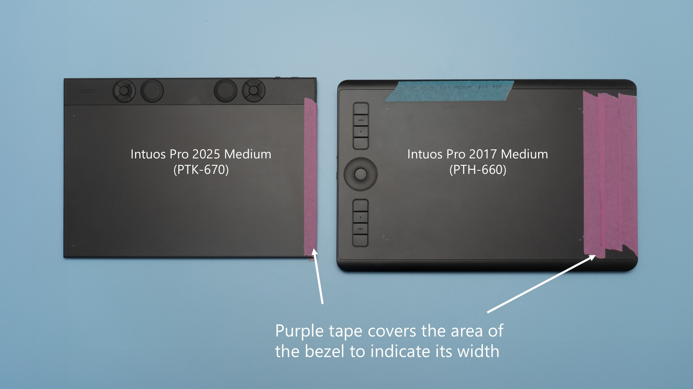<figcaption></figcaption></figure>

### Bezel size visualized: Movink 13 vs Intuos Pro 2025 medium

<figure>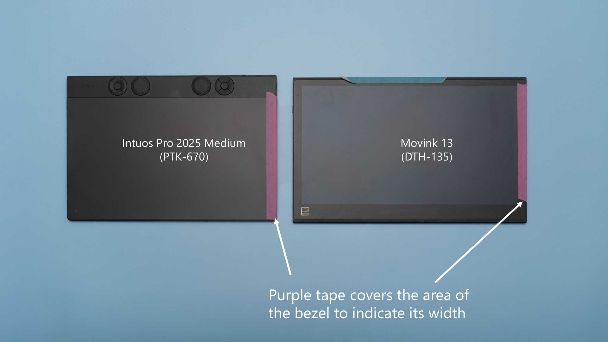<figcaption></figcaption></figure>

## Bezels vs Hand resting on the tablet

Bezels provide a place for your hand to rest as you draw. This is a fact I don't think I appreciated until I drew more with the Intuos Pro 2025 medium.

**When drawing with the Intuos Pro 2017 medium**, as the pen reaches the edge of the active area the hand can stay on the bezel almost the entire time. Only sometimes does the hand need to touch the desk - and even then the hand is still mostly resting on the tablet.

**When drawing with the Intuos Pro 2025 medium**, even when the pen is some distance from the edge of the active area the hand will make contact and partially rest on the desk. By the time the pen reaches the edge of the active area, the entire hand will be resting on the desk.

## Bezel edge

There is a slight bump at the edge of the tablet. In photos, it is hard to tell any difference in photos with the Intuos Pro 2025 medium and the Intuos Pro 2017 medium.

<figure>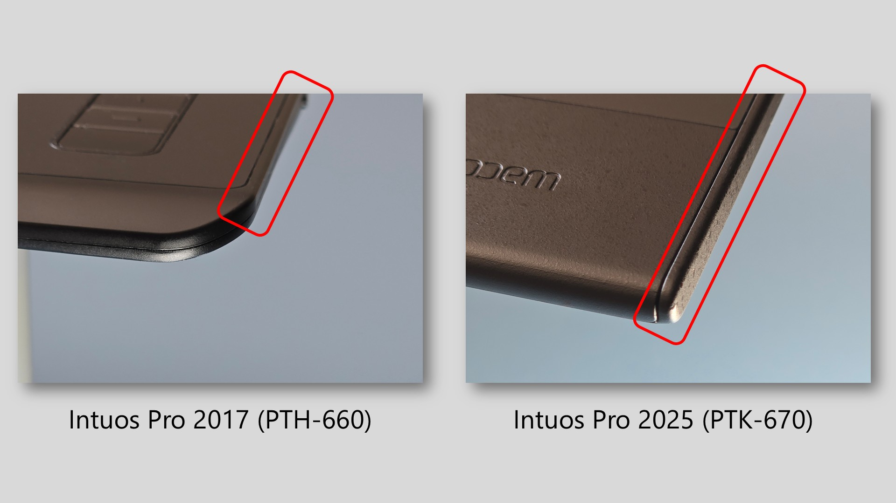<figcaption></figcaption></figure>

But you can feel the difference. The diagram below exaggerates the feeling, but with the 2025 medium you can definitely feel the edge of the tablet more. While not painful and it does not "dig into" the hand, I do notice it and other users might be disturbed by it.

<figure>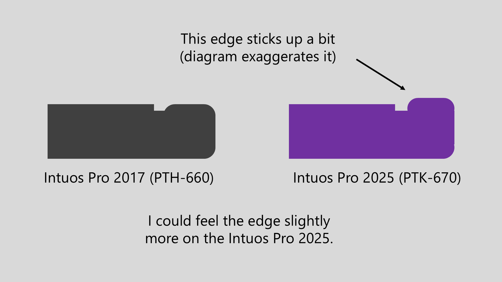<figcaption></figcaption></figure>

## Are the bezels a problem?

Answer: IT DEPENDS

It was **OK** for ME.

* Tablet is very thin - hand did not “fall off a cliff”
* Hand will transition from tablet to the desk
* Edge did not “dig into” hand – but definitely more noticeable
* I can now understand why people like wider bezels-

However, ...

* As of the May 2025, I’m still adapting to it
* For some people this could be an issue

In the future: ...

* I will try to test out smaller bezels with any other tablet

## How the bezels have been received by users

The bezel is highly polarizing for a lot of people. And to be clear there are two aspects of the bezel to take into consideration. First is the reduction in the size of the bezel. And second is that the lip of the bezel At the age of the tablet is very slightly more raised than the previous generation of Intuos Pro. The smaller bezel seems to irritate some people and for some other people it just seems to take some time to adjust. Personally after using the Intuos Pro so long with large bezels I have to admit it feels weird to use the new tablet with the much smaller bezels. Even after a month or so it's a little bit weird It's not bad just different. Again some people have a much stronger reaction to this. And then the raised edge of the tablet causes some people more discomfort than the old model. Because statistically your hand will be feeling that raised edge much more often with the new design and because it is more noticeable some people find it irritating and in fact some people find it painful.

Videos about it:

* [Jaugy - I don't recommend the new Intuos Pro 2025 series](https://www.youtube.com/watch?v=KawJkmmDuPE) 2025/05/07

## Thickness

The tablet is slightly thinner than the previous 2017 edition and has a slight wedge shape where thinner at the bottom and thicker at the top.

<figure>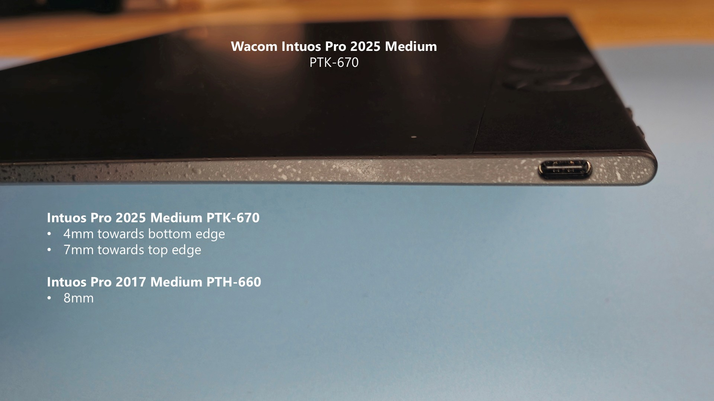<figcaption></figcaption></figure>

The thickness and wedge shape are very similar to the Wacom Movink 13.

<figure>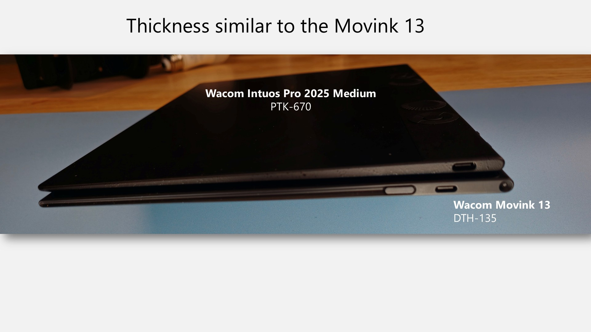<figcaption></figcaption></figure>

## Weight

* 40% weight reduction across all models
* The 2025 LARGE model weighs less than the 2017 MEDIUM model
* The 2025 MEDIUM model weighs less than the 2017 SMALL model

<table><thead><tr><th width="157">Tablet</th><th>Intuos Pro 2017 </th><th>Intuos Pro 2025</th><th>% decrease</th></tr></thead><tbody><tr><td>Large</td><td>1300g</td><td>660g</td><td>-49.23%</td></tr><tr><td>Medium</td><td>700g</td><td>411g</td><td>-41.286%</td></tr><tr><td>Small</td><td>450g</td><td>240g</td><td>-40.67%</td></tr></tbody></table>

**Does it slide around on the desk as you draw?** NO. While drawing, it will NOT slide
. Moves only if you deliberately force it to move. Requires less force to move than the PTH-660

## Surface Texture

Summary: Great texture feeling across all nib types.

Compared to Intuos Pro 2017 (PTH-660)

* Has slightly less texture
* Feels “softer” through the pen
* Exhibits less texture erosion (in my initial two week testing)

Nib wear due to texture:

* Over time, I would EXPECT nibs to wear down less
* Only time will tell

Noise due to texture

* Significantly muted / Much harder to hear
* Not “scratchy”

## Connections and cabling

### Overall

The tablet supports both wired and wireless connection.

### Single USB-C port

The port is located on the right side, close to the top.

<figure><figcaption></figcaption></figure>

* These tablets support both wired and wireless connection.
* USB-C Port location: top right
* Multiple wireless connections: TBD

### USB Cables

* The tablet comes with USB-A → USB-C cable
* Should be able to use any USB-C cable that supports data
*
  I tested with these three cables (all worked):
  *
    Included USB-A → USB-C cable
  * Intuos Pro 2017 cable
  * Monoprice USB 2.0 USB-A → USB-C cable

### USB-C cable connector

The included USB cable no longer has an L-shaped connecter like the cable that came with the 2017 Intuos Pro.

<figure>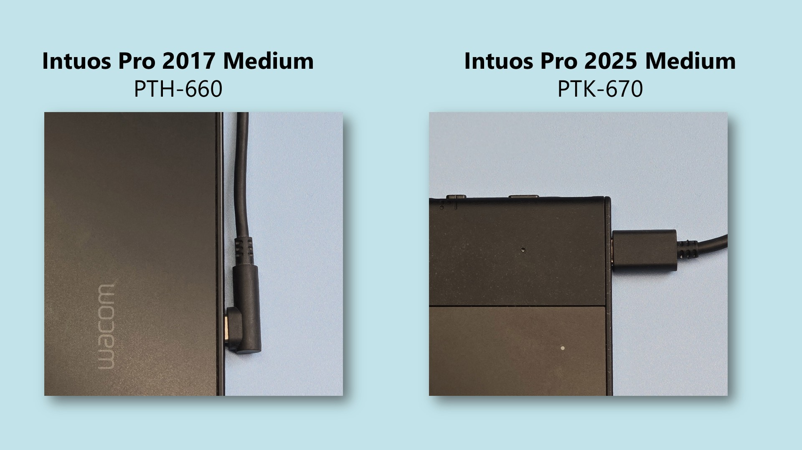<figcaption></figcaption></figure>

## Wireless

Summary

* Physical switch on top controls which whether to use wired or one of two wireless connections
* Can pair with two devices wireless. Switching between devices accomplished through the physical switch. This makes it convenient to when moving between computers since all you have to do is change the switch position and you do not have to re-pair the device each time.
* Wireless testing
  * Wirelss worked
  * I was easily able to switch between two paired devices usinfg the switch
  * In my subjective evaluation the wireless connection has a little bit more pointer lag than the wired connection. If may not bother many people but if you want/need the lowst pointer lag, you should use wired connections.

<figure>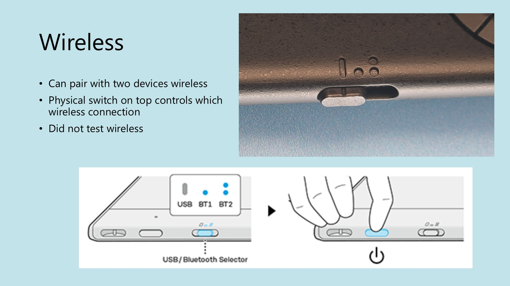<figcaption></figcaption></figure>

## Texture sheets

Wacom sells texture sheets in case you scratch up the drawing surface and want to restore it to its original pristine state. The texture sheets are available in 3 sizes (Large, Medium, Small) and only one texture (Standard).

<figure>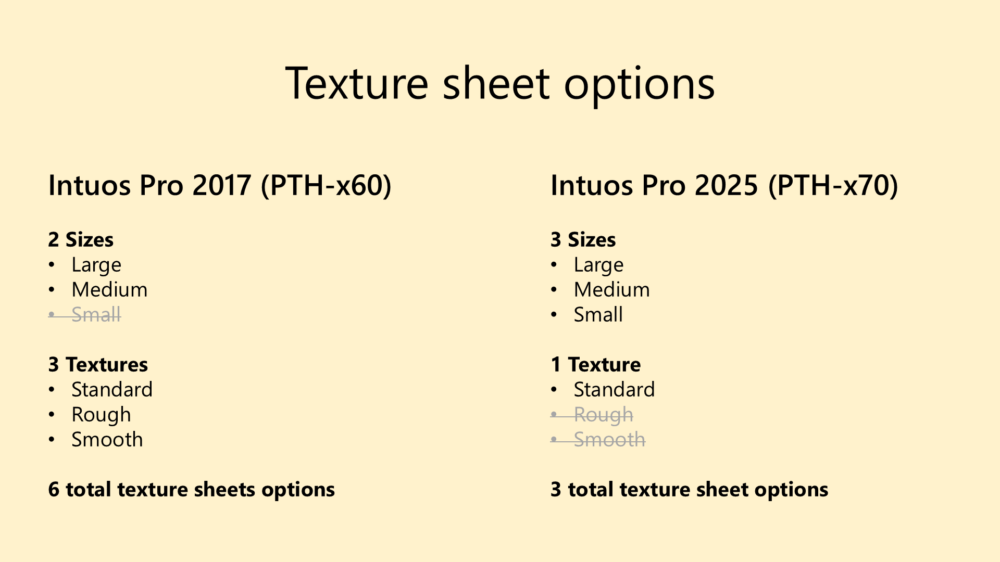<figcaption></figcaption></figure>

## Driver UI > Wacom Center vs Wacom Tablet Properties

&#x20;There are two driver configuration UIs available for Wacom tablets: Wacom Center and Wacom Tablet properties. For the Intuos Pro 2025, most features are available in both apps, but some are available only in Wacom Center.

Available in BOTH

* Tablet orientation
* Pen vs Mouse mode
* Screen area (full, portion, & specific monitors)
* Tablet area (full, portion, force proportions)
* Windows Ink&#x20;
* Tip feel (a.k.a. "the pressure curve")
* Pen Button actions

Available only in Wacom Center for Intuos Pro 2025

* ExpressKey actions
* Dial actions

## Pen Report Rate

Overall for PTK-670 with Pro Pen 3

* Wired: 300Hz
* Wireless: 260Hz

Overall for PTK-670 with Pro Pen 2

* Wired: 260Hz
* Wired: 230Hz

Overall with Samsung S Pen&#x20;

* Wired: 245Hz
* Wireless: Did not test

<table><thead><tr><th width="127">Scenario</th><th width="179.9166259765625">Driver</th><th width="113.75">Report Rate</th><th>Tested with</th></tr></thead><tbody><tr><td>PTK-670 Pro Pen 3 Wired </td><td>OpenTabletDriver</td><td>300Hz</td><td>OTD tablet debugger, skill-test.net</td></tr><tr><td>PTK-670 Pro Pen 3 Wired </td><td>Wacom driver</td><td>300Hz</td><td>skill-test.net</td></tr><tr><td>PTK-670 Pro Pen 2 Wired </td><td>OpenTabletDriver</td><td>200Hz</td><td>OTD tablet debugger, skill-test.net</td></tr><tr><td>PTK-670 Pro Pen 2 Wired </td><td>Wacom driver</td><td>200Hz</td><td>skill-test.net</td></tr><tr><td>PTK-670 Pro Pen 3 Wireless</td><td>Wacom driver</td><td>260Hz</td><td>skill-test.net</td></tr><tr><td>PTK-670 Pro Pen 2 Wireless</td><td>Wacom driver</td><td>230Hz</td><td>skill-test.net</td></tr><tr><td>PTK-670 Samsung S Pen WiIred</td><td>OpenTabletDriver</td><td>245Hz</td><td>OTD tablet debugger</td></tr></tbody></table>

Reference:

* Skill-test.net page:  [https://skill-test.net/polling-rate-test](https://skill-test.net/polling-rate-test)

## Pen hover height testing

<table><thead><tr><th width="125.5">Tablet</th><th width="122">Pen</th><th width="105.5">Driver</th><th width="115">Initial detect height</th><th width="125">Max height</th></tr></thead><tbody><tr><td>PTK-670</td><td>ACP-500</td><td>Wacom</td><td>15 mm</td><td>15 mm</td></tr><tr><td>PTK-670</td><td>KP-504E</td><td>Wacom</td><td>11 mm</td><td>15 mm</td></tr><tr><td>PTK-870</td><td>ACP-500</td><td>Wacom</td><td>16 mm</td><td>16 mm</td></tr><tr><td>PTK-870</td><td>KP-504E</td><td>Wacom</td><td>13 mm</td><td>16 mm</td></tr><tr><td>PTK-470</td><td>ACP-500</td><td>Wacom</td><td>15 mm</td><td>15 mm</td></tr><tr><td>PTK-470</td><td>KP-504E</td><td>Wacom</td><td>12 mm</td><td>15 mm</td></tr><tr><td>PTK-670</td><td>ACP-500</td><td>OTD</td><td>15 mm</td><td>16 mm</td></tr><tr><td>PTK-670</td><td>KP-504E</td><td>OTD</td><td>12 mm</td><td>16 mm</td></tr><tr><td>PTK-870</td><td>ACP-500</td><td>OTD</td><td>16mm</td><td>16mm</td></tr><tr><td>PTK-870</td><td>KP-504E</td><td>OTD</td><td>15 mm</td><td>15 mm</td></tr><tr><td>PTK-470</td><td>ACP-500</td><td>OTD</td><td>15 mm</td><td>15 mm</td></tr><tr><td>PTK-470</td><td>KP-504E</td><td>OTD</td><td>12 mm</td><td>16 mm</td></tr></tbody></table>

## Pen compatibility testing

<table data-header-hidden><thead><tr><th width="262.20001220703125">Pen</th><th width="150.60003662109375">7P Tested?</th><th>Intuos Pro 2017 PTH-x60</th><th>Intuos Pro 2025 PTH-x70</th></tr></thead><tbody><tr><td>Wacom Pro Pen 3 (ACP-500)</td><td>TESTED</td><td>NO</td><td>YES</td></tr><tr><td>SPECIFIC pens using “Wacom UD EMR”</td><td>TESTED</td><td>NO</td><td>YES</td></tr><tr><td>Wacom Pro Pen 2 (KP-504E)</td><td>TESTED</td><td>YES</td><td>YES</td></tr><tr><td>Wacom Pro Pen Slim (KP-301E)</td><td>UNTESTED</td><td>YES</td><td>YES</td></tr><tr><td>Wacom Pro Pen 3D (KP-505)</td><td>UNTESTED</td><td>YES</td><td>YES</td></tr><tr><td>Wacom Grip Pen (KP-501E)</td><td>TESTED</td><td>YES</td><td>YES</td></tr><tr><td>Wacom Pro Pen (KP-503E)</td><td>TESTED</td><td>YES</td><td>YES</td></tr><tr><td>Wacom Art Pen (KP-701E)</td><td>TESTED</td><td>YES</td><td>YES</td></tr><tr><td>Wacom Airbrush Pen (KP-400E)</td><td>UNTESTED</td><td>?</td><td>?</td></tr><tr><td>Wacom 4K pen (LP-1100K)</td><td>TESTED</td><td>NO</td><td>NO</td></tr><tr><td>Wacom 2K pen (LP-190)</td><td>TESTED</td><td>NO</td><td>NO</td></tr></tbody></table>

## Compatibility with specific Wacom UD EMR pens

Wacom lists these pens as compatible with Intuos Pro 2025

* Hi-uni DIGITAL for Wacom (CP20206BZ)
* STAEDTLER, Noris digital
* STAEDTLER Noris digital jumbo
* LAMY safari twin pen all black EMR Digital Writing
* LAMY AL-star black EMR Digital Writing
* Dr. Grip Digital for Wacom (CP202A01A/CP202A02A)
* THIRDWAVE Mitsubishi 9800 digitizer pen
* Galaxy S22 Ultra S pen
* Kaweco AL SPORT Connect EMR Black

I also tested these UD EMR pens and can confirm they work

* Wacom CP-913 (comes with Wacom One 2019)
* Wacom CP-923 (comes with Wacom One 2023)
* Samsung S Pen (that comes with Samsung Galaxy Tab)
* Samsung S Pen creator edition
* Samsung Galaxy S24 Ultra S pen

## Notes on UD EMR pens with the Wacom Intuos Pro 2025

Compatibility

Not all UD EMR pens are compatible. But many are. Before you buy any UD EMR confirm compatiblity first.

Drawing performance

* UD EMR pens have  noticeably higher IAF
* UD EMR pens have much lower max pressure
* Some UD EMR pens have only 1 button
* Stroke quality is just OK

Cost benefits

* UD EMR pens cost \~$30 USD
* $130 USD for Pro Pen 3
* $80 USD for Pro Pen 2

Recommendation

* Consider UD EMR pens as a backup pens
