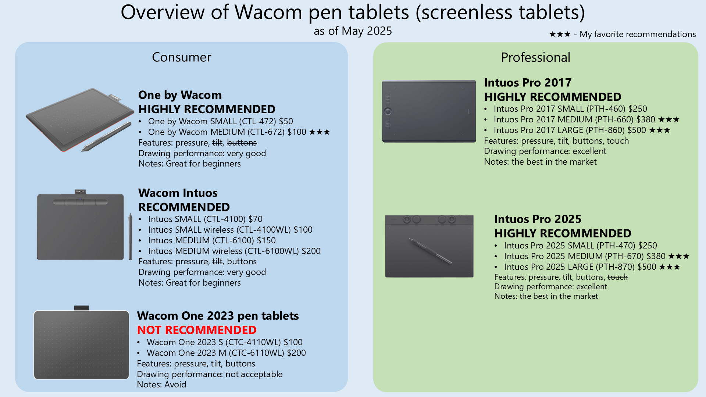
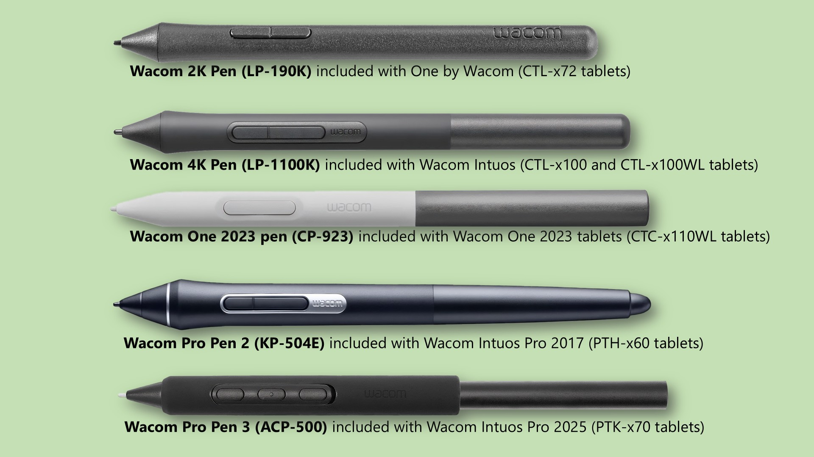

# Comparison of Wacom pen tablets

## Overview

Wacom has several separate lines of pen tablets. This document will help you understand the difference and help you make your choice.

* **One by Wacom** -> [product page](https://www.wacom.com/en-us/products/pen-tablets/one-by-wacom)
* **Intuos** -> [product page](https://www.wacom.com/en-us/products/pen-tablets/wacom-intuos)
* **Wacom One 2013** -> [product page](https://www.wacom.com/en-us/products/pen-displays/wacom-one)&#x20;
* **Intuos Pro 2017** -> [product page](https://www.wacom.com/en-us/products/pen-tablets/wacom-intuos-pro-2017)
* **Intuos Pro** **2025** -> [product page](https://www.wacom.com/en-us/products/pen-tablets/wacom-intuos-pro)&#x20;

<figure><figcaption></figcaption></figure>

If you are interested in a pen tablet (a drawing tablet without a screen) for drawing/sketching/painting and want to go with the "safe choice" then you should pick a Wacom tablet. In particular the Wacom Intuos Pro models identified here (PTH-860, PTH-660, PTH-460) are THE BEST PEN TABLETS EVER MADE.

Here are [my detailed notes on the Intuos Pro (PTH-x60) series](../../catalog/catalog-drawtabss/wacom/wacom-intuos-pro-2017/wacom-pthx60-notes.md).

## Wacom One 2023 tablets

The Wacom One 2023 pen tablets are intended to be upgrades to the consumer Wacom Intuos tablets. I do not recommend them because their pressure handling is (in my opinion) not acceptable for the Wacom brand. More here: [7P notes: Wacom One 2023](../../catalog/catalog-drawtabss/wacom/wacom-one/wacom-one-2023-pen-displays-notes.md)&#x20;

## Recommendation summary

* **Sketching, digital painting, illustration**, etc. -&#x20;
  * If budget permits,&#x20;
    * Wacom Intuos Pro 2025 Medium (PTK-670)
    * Wacom Intuos Pro 2017 Medium  (PTH-660)
  * If you tend do draw with larger gestures then...&#x20;
    * Wacom Intuos Pro 2025 Large (PTK-670)
    * Wacom Intuos Pro 2017 Large (PTH-860)&#x20;
  * If you want to spend less
    * One by Wacom MEDIUM (CTL-672)&#x20;
    * Wacom Intuos Medium (CTL-6100)
    * Wacom Intuos Bluetooth Medium (CTL-6100WL)&#x20;
* **Photo-editing** - i.e. you aren't doing anything that requires "strokes" then the One by Wacom SMALL (CTL-472) is fine.
* **Using the tablet as a mouse replacement** - i.e. you aren't doing anything that requires "strokes" but instead just clicking on things or dragging them - then the One by Wacom SMALL (CTL-472) is fine.
* **Taking notes**. I don't recommend pen tablets in general for taking notes. Use an alternative (like an iPad) instead. More here: [**Taking notes with drawing tablets**](../../basics/scenarios/taking-notes-with-drawing-tablets.md).&#x20;
* **Play Osu!** - One by Wacom SMALL (CTL-472) or One by Wacom SMALL MEDIUM (CTL-672) are the best choices. For more information regarding tablets for osu! and other tablet options consult [**Kuuube's tablet buying guide**](https://docs.google.com/spreadsheets/d/1DYVfiSpQqdpa4sWWYUALPmliOIuGyKog7B7LJJdmlhE/edit#gid=2077726645).&#x20;
* **Exploring drawing tablets** - this is if you are not sure if you are going to use a drawing tablet, but just want to dabble without spending a lot.&#x20;
  * Start with a One by Wacom SMALL (CTL-472) for general usage.&#x20;
  * Start with a One by Wacom MEDIUM (CTL-672) if you intend to draw on it.
* **Want the best and don't care about the cost.** Either:
  * Wacom Intuos Pro Large (PTH-860)
  * Wacom Intuos Pro 2025 Large (PTK-670)
  * Wacom Intuos Pro 2017 Large (PTH-860)&#x20;
  * Wacom Intuos Pro 2025 Medium (PTK-670)
  * Wacom Intuos Pro 2017 Medium  (PTH-660)
* **Picking the right size** - More information about picking the right size: [**tablet size**](../../buying-a-drawing-tablet/choosing-the-right-tablet-size.md).

## Pens

Each product line uses different pens. And the pens can only be used within that product line. For example if you try to use the LP190K pen with the PTH-860, the tablet does not even recognize there is a pen there. More here: [**Wacom pen compatibility**](../../catalog/catalog-pens/wacom-pens/wacom-pen-compatibility.md)&#x20;

<mark style="color:red;">REMEMBER: You cannot MIX AND MATCH these pens. For example, it is not possible to use the amazing Wacom Pro Pen 2 with the One by Wacom, Wacom Oner, or Intuos tablets.</mark>

| Tablet                                                                             | Included pen                 |
| ---------------------------------------------------------------------------------- | ---------------------------- |
| 
<strong>One by Wacom</strong> (CTL-472, CTL-672)
                         |  Wacom 2K Pen 2K (LP-190K)   |
| 
<strong>Wacom One 2023 pen tablets</strong>

(CTC-4110WL, CTC-6110WL)
  | Wacom One 2023 Pen (CP-923)  |
| 
<strong>Intuos</strong>

(CTL-4100, CTL-4100WL, CTL-6100, CTL-6100WL) 
 | Wacom Pen 4K (LP-1100K)      |
| 
<strong>Intuos Pro 2017</strong> (PTH-460, PTH-660, PTH-860)
             | Pro Pen 2 (KP-504E)          |
| 
<strong>Intuos Pro 2025</strong> (PTH-470, PTH-670, PTH-870)
             | Pro Pen 3 (ACP-500)          |

Of the pens identified, the Wacom Pro Pen 2 and Pro Pen 3 is the best in terms of design, materials, shape, weight distribution.&#x20;

<figure><figcaption></figcaption></figure>

## Overall drawing experience

All of the tablets except the Wacom One 2023 tablets have a very very good drawing experience. The Intuos Pro series definitely the best of all of them though - largely driven by the amazing pressure handling of the Wacom Pro Pen 2 and Wacom Pro Pen 3.&#x20;

## Pen pressure

Learn more here: [**Pen pressure**](../../core-features/pen-pressure/) &#x20;

2048 **pressure levels** is all you need for creative work. All of these pens are enough in that regard. Wacom has strong marketing towards their higher pressure level tablets, but the vast majority of users will not be able to make use of these higher levels in their work.&#x20;

More than pressure levels, the **pressure range** has a greater impact on your drawing experience. And this is driven by the quality of the pressure sensor in the pen. &#x20;

**Pens pressure range compared**&#x20;

<table data-full-width="true"><thead><tr><th width="233">Pen</th><th width="97">Levels</th><th width="107">IAF</th><th>max pressure</th></tr></thead><tbody><tr><td>
<strong>Wacom Pen 2K</strong>

(LP-190K)
</td><td>2048</td><td>&#x3C;1gf</td><td>
GOOD

300 to 400 gf
</td></tr><tr><td>
<strong>Wacom One 2023 Pen</strong> 

(CP-923) 
</td><td>4096</td><td>&#x3C;8gf</td><td>
OK to GOOD

200 to 300gf
</td></tr><tr><td>
<strong>Wacom Pen 4K</strong>

(LP-1100K)
</td><td>4096</td><td>&#x3C;1gf</td><td>
GOOD

400 to 600gf
</td></tr><tr><td>
<strong>Wacom Pro Pen 2</strong>

(KP-504E) 
</td><td>8192 </td><td>&#x3C;1gf</td><td>
VERY HIGH

700gf to 800gf
</td></tr><tr><td>
<strong>Wacom Pro Pen 3</strong>

(ACP-500) 
</td><td>8192 </td><td>&#x3C;1gf (assumed)</td><td>
VERY HIGH

600gf to 700gf
</td></tr></tbody></table>

Notes:

* Data for IAF and max pressure measurements independently made by [Kuuube](../../resources/community/kuuube/).
* Learn more about [**pen pressure**](../../core-features/pen-pressure/)&#x20;
* Learn more about how [**pen pressure ranges compare across pens**](../../core-features/pen-pressure/pen-pressure-range.md)  &#x20;

## Drawing features

<table data-full-width="false"><thead><tr><th width="269">Tablet</th><th width="115">Pressure</th><th width="104">Tilt</th><th>Barrel rotation</th></tr></thead><tbody><tr><td>
One by Wacom

(CTL-472, CTL-672)
</td><td>YES</td><td>NO</td><td>NO</td></tr><tr><td>
Wacom One pen tablets

(CTC-4100WL, CTC-6110WL)
</td><td>YES</td><td>YES</td><td>NO</td></tr><tr><td>
Intuos

(CTL-4100, CTL-4100WL, CTL-6100, CTL-6100WL) 
</td><td>YES</td><td>NO</td><td>NO</td></tr><tr><td>Intuos Pro 2017 (PTH-460, PTH-660, PTH-860)</td><td>YES </td><td>YES</td><td>Requires Wacom Art Pen (KP-701)</td></tr><tr><td>Intuos Pro 2025 (PTH-470, PTH-670, PTH-870)</td><td>YES</td><td>YES</td><td>Requires Wacom Art Pen (KP-701)</td></tr></tbody></table>

### Notes on pen tilt

TILT - Not all drawing styles require tilt. And if you do want to control the rotation of your brush many drawing apps let you control the brush rotation based on the direction of the pen movement instead of tilt. Lean more here: [**Pen tilt**](../../core-features/pen-tilt/)&#x20;

## Tablet resolution

Resolution means how many separate points the tablet can distinguish (i.e. resolve) in a given length. This is specified as Lines Per Inch (LPI) though it is also useful to think about it as lines per millimeter (LPMM)

You will not notice the difference between 2048 LPI and 5080 LPI.

* One by Wacom -> 2048 LPI = 80.62 LPMM
* Wacom One 2023 pen tablets = Unknown
* Intuos -> 2540 LPI = 100 LPMM
* Intuos Pro 2017 -> 5080 LPI = 200 LPMM&#x20;
* Intuos Pro 2025 -> 5080 LPI = 200 LPMM&#x20;

## Accuracy

Accuracy = tablet & computer know the correct position of the tip of the pen. As far as I have observed, all three tablets are very accurate.

## Pointer lag&#x20;

Pointer lag is the difference between the physical position of the pen and where the operating system pointer is drawn. Pen tablets in general display very little pointer lag. In comparison, all pen displays all show very noticeable lag.

* One by Wacom -> very little pointer lag
* Wacom One 2023 pen tablets -> very little pointer lag
* Intuos -> very little lag (when hovering has a little bit of pointer lag)
* Intuos Pro 2017 -> very little pointer lag
* Intuos Pro 2025 -> very little pointer lag

Learn more here: [**Lag**](../../core-features/lag/) &#x20;

## Accuracy / Diagonal wobble

The Intuos Pro models exhibit less wobble than the Intuos of One by Wacom. But all of the tablets are good for diagonal wobble

## Position smoothing

Position smoothing makes for better looking strokes but introduces pointer lag. All of these Wacom tablets are great for artists in terms of position smoothing.

**Driver position smoothing**

Wacom drivers by default add a little bit of position smoothing - which is needed - to make their strokes look better. The smoothing is not much and Wacom pen tablets still feel more responsive than other tablet brands.&#x20;

**Hardware position smoothing**

<table><thead><tr><th width="194">Tablet series</th><th>Hardware smoothing</th></tr></thead><tbody><tr><td>One by Wacom</td><td>no hardware smoothing</td></tr><tr><td>Wacom One 2023</td><td>unknown</td></tr><tr><td>Intuos</td><td>
No hardware smoothing when drawing/dragging. 

Some Hardware smoothing on hover. 
<ul><li>For artists, drawing is fine and unaffected. The smoothing is only happening when you are not drawing. Artists do not notice this at all in practice.</li><li>For osu! players the hardware on hover is a strong reason to avoid this tablet.</li></ul></td></tr><tr><td>Intuos Pro 2017</td><td>no hardware smoothing</td></tr><tr><td>Intuos Pro 2025</td><td>no hardware smoothing</td></tr></tbody></table>

## Wireless/Bluetooth

<table><thead><tr><th width="194">Tablet series</th><th>ExpressKeys available</th></tr></thead><tbody><tr><td>One by Wacom</td><td>none of these models support wireless</td></tr><tr><td>Wacom One 2023</td><td>all models support wireless via Bluetooth</td></tr><tr><td>Intuos</td><td>Only models with WL in their model number support wireless via Bluetooth</td></tr><tr><td>Intuos Pro 2017</td><td>all models support wireless via Bluetooth</td></tr><tr><td>Intuos Pro 2025</td><td>all models support wireless via Bluetooth</td></tr></tbody></table>

## Touch support

## USB port on tablet

The consumer series use older USB ports than the professional series.

<table><thead><tr><th width="194">Tablet series</th><th>USB port on tablet</th></tr></thead><tbody><tr><td>One by Wacom</td><td>Micro USB B</td></tr><tr><td>Wacom One 2023 pen tablets</td><td>USB-C</td></tr><tr><td>Intuos</td><td>Micro USB B</td></tr><tr><td>Intuos Pro 2017</td><td>USB-C </td></tr><tr><td>Intuos Pro 2025</td><td>USB-C</td></tr></tbody></table>

## ExpressKeys

<table><thead><tr><th width="194">Tablet series</th><th>ExpressKeys available</th></tr></thead><tbody><tr><td>One by Wacom</td><td>No ExpressKeys</td></tr><tr><td>Wacom One 2023 pen tablets</td><td>No ExpressKeys</td></tr><tr><td>Intuos</td><td>4 at the top</td></tr><tr><td>Intuos Pro 2017</td><td>8 on the left </td></tr><tr><td>Intuos Pro 2025</td><td>8 on top with 2 additional buttons to swap what those 8 do</td></tr></tbody></table>

## Touch support

<table><thead><tr><th width="194">Tablet series</th><th>Touch support</th></tr></thead><tbody><tr><td>One by Wacom</td><td>No model supports touch</td></tr><tr><td>Wacom One 2023 pen tablets</td><td>No pen tablet model supports touch. (Not that the Wacom One 2023 13 touch pen display does support touch as the name indicates).</td></tr><tr><td>Intuos</td><td>No model supports touch</td></tr><tr><td>Intuos Pro 2017</td><td>All three models support touch</td></tr><tr><td>Intuos Pro 2025</td><td>NONE odf the models support touch</td></tr></tbody></table>

For these tablets that do support touch, touch can be enabled/disabled with a physical switch on the side of the tablet.

More here:

* [My detailed notes on the Intuos Pro (PTH-x60) series](../../catalog/catalog-drawtabss/wacom/wacom-intuos-pro-2017/wacom-pthx60-notes.md).
* [Touch support](../../guides/touch-support/)

## Tablet design

With the Intuos Pro tablets and pens - everything feels great to me. The texture the weight of the pen, etc.

The One by Wacom, Wacom One 2023, and Intuos models feel a more plasticky/cheaper. Also I just don't enjoy how their pens feel in my hand.&#x20;

## Active Area

The size of the tablet is based on it's active area which is the region on the tablet that is sensitive to the EMR pen. Besides the height and width of this area it is also convenient to discuss them in terms of their diagonal lengths.

**Aspect Ratio**: Most monitors are 16:9 (1.78) or 16:10 (1.60) If the Aspect Ratio of the tablet does not match the monitor, that means your strokes will be slightly distorted. <mark style="color:red;">So, remember to enable the</mark> <mark style="color:red;"></mark><mark style="color:red;">**Force Proportions**</mark> <mark style="color:red;"></mark><mark style="color:red;">checkbox to have undistorted strokes</mark>. More info here: [https://youtu.be/9oAvsJk5ESU](https://youtu.be/9oAvsJk5ESU)&#x20;

<table><thead><tr><th>Tablet</th><th width="152">Size</th><th width="113">Diagonal</th><th>Aspect Ratio (approximate)</th></tr></thead><tbody><tr><td>One by Wacom SMALL (CTL-472)</td><td> 5.98" x 3.74"</td><td>7.06"</td><td>(4:3) 1.44</td></tr><tr><td>One by Wacom MEDIUM (CTL-672)</td><td> 8.5" x 5.31"</td><td>10.03"</td><td>(4:3) 1.47</td></tr><tr><td>Wacom One S (CTC-4110WL)</td><td> 5.98" x 3.74"</td><td>7.06"</td><td>(16:10) 1.60</td></tr><tr><td>Wacom One M (CTC-611WL)</td><td> 8.5" x 5.31"</td><td>10.03"</td><td>(16:10) 1.60</td></tr><tr><td>Intuos Wacom Intuos SMALL (CTL-4100 and CTL-4100WL)</td><td> 5.98" x 3.74"</td><td>7.06"</td><td>(16:10) 1.60</td></tr><tr><td>Wacom Intuos MEDIUM (CTL-6100WL)</td><td> 8.5" x 5.31"</td><td>10.03"</td><td>(16:10) 1.60</td></tr><tr><td>Intuos Pro 2017 SMALL (PTH-460)</td><td> 6.30i" x 3.94"</td><td>7.43"</td><td>(4:3) 1.440</td></tr><tr><td>Intuos Pro 2017 MEDIUM (PTH-660)</td><td> 8.82" x 5.83"</td><td>10.57"</td><td>(3:2) 1.514</td></tr><tr><td>Intuos Pro 2017 LARGE (PTH-860)</td><td> 12.34" x 8.50"</td><td>14.91"</td><td>(4:3) 1.44</td></tr><tr><td>Intuos Pro 2025 SMALL (PTH-470)</td><td>7.4" x4.1"</td><td>8.46"</td><td>16x9 (1.78)</td></tr><tr><td>Intuos Pro 2025 MEDIUM (PTH-670)</td><td>10.4" x 5.8"</td><td>11.91"</td><td>16x9 (1.78)</td></tr><tr><td>Intuos Pro 2025 LARGE (PTH-870)</td><td>13.7" x 7.7"</td><td>15.72"</td><td>16x9 (1.78)</td></tr></tbody></table>

## Reliability

All of these are very reliable tablets. Their pens are also very reliable. **But remember, DO NOT drop your pens.** they are much more delicate than the tablets and you can break from a fall.&#x20;

## Drivers

As of October 2025, the same Wacom driver works with all three product lines.

## Surface texture

The Intuos Pro models a more textured surface, the Intuos and One by Wacom have less texture.

The Intuos Pro 2017 has more texture than the Intuos Pro 2025.

## Texture sheets

Wacom sells texture sheets for the the Intuos Pro 2017. Three texture options are provided for both the Medium and Large sizes.

Wacom sells texture sheets for the the Intuos Pro 2025. One texture options are provided for both the Small, Medium and Large sizes.

More here: [My detailed notes on the Intuos Pro (PTH-x60) series](../../catalog/catalog-drawtabss/wacom/wacom-intuos-pro-2017/wacom-pthx60-notes.md).   &#x20;

## Potential future versions

* **Intuos -** In August of 2023, The Intuos models seem to be replaced by the Wacom One GEN2 pen tablets.
* **One by Wacom -** No sign of any updates coming
* **Intuos Pro -** Wacom released new versions in 2025, so we expect it will learn about new Intuos Pros around 2032. We certainly hope they will arrive sooner.

## Intuos Pro generations

There are three Intuos Pro generations and unfortunately the have the same name "Intuos Pro". So if you are purchasing an Intuos Pro you really need to pay attention to the model numbers.

* Intuos Pro 2025 (PTK-870, PTK-670, PTK-470): [**More here** ](../../catalog/catalog-drawtabss/wacom/wacom-intuos-pro-2025/)
* Intuos Pro 2017 (PTH-860, PTH-660, PTH-460): [**More here**](../../catalog/catalog-drawtabss/wacom/wacom-intuos-pro-2017/)&#x20;
* Intuos Pro 2013 (PTH-851, PTH-651, PTH-451): [**More here**](../../catalog/catalog-drawtabss/wacom/wacom-intuos-pro-2013.md)&#x20;

## Distinguishing physical features

* The One by Wacom has a bright red back
* The One by Wacom has a fabric pen holder on the side of the tablet
* The Intuos in available in several colors for the back plastic
* The Intuos has a fabric pen holder on the top of the tablet
* The Intuos Pro is always black both front and back
* The Intuos Pro has no fabric pen holder
* The Intuos Pro has a circular dial on the left of the tablet.

## Notes on older Wacom tablets series

* The **Wacom Bamboo** series has now been renamed to the **One by Wacom** series
