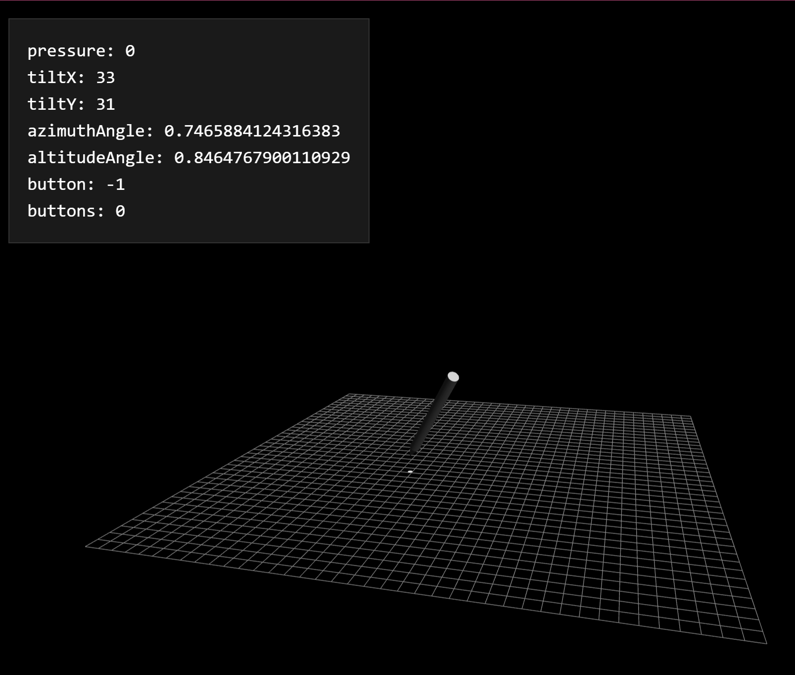

# PenTracker by Patrick Lauke

## Overview

This site ([https://patrickhlauke.github.io/touch/pen-tracker/](https://patrickhlauke.github.io/touch/pen-tracker/)) is a sample app that shows how a web page can interact with a drawing tablet. It is also a good way to diagnose some tablet or pen problems.

Start using your pen on the site and you'll see some information in the upper-left corner.

## Additional information

The source code for PenTracker is here: [https://github.com/patrickhlauke/touch/tree/gh-pages/pen-tracker](https://github.com/patrickhlauke/touch/tree/gh-pages/pen-tracker)

[https://patrickhlauke.github.io/getting-touchy-presentation/](https://patrickhlauke.github.io/getting-touchy-presentation/)
