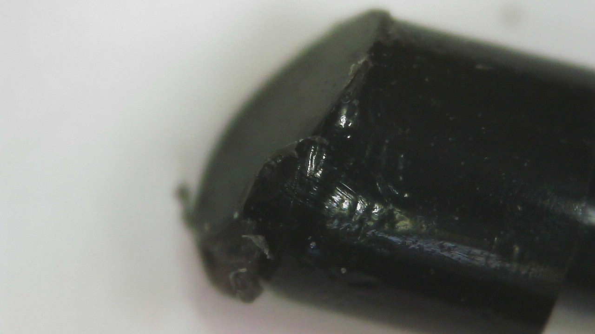

# Nib wear

## Overview

Nib wears down due to friction caused by the nib moving against the tablet surface.

**Many factors** influence how fast a nib wears down and people have **vastly different experiences**. For some people a nib may last years. Some people seem to go through a nib in a week.

<figure><figcaption></figcaption></figure>

## Examples

Below you can see the wear on an Wacom Art Pen nib which has been used on a Wacom Intuos Pro Large (PTH-860) surface after two weeks.&#x20;

<figure><figcaption></figcaption></figure>

<figure><figcaption></figcaption></figure>

## Surface texture

Tablets vary in the amount of surface texture they have. The more texture, the more likely the nib is to wear down. More here: [**surface texture**](../core-features/surface-texture.md).&#x20;

Keep in mind, even the surface texture can wear down and become smoother. So, even if the texture is eating through your nibs at first, later it may not affect them so much. More here: [**Surface wear on pen tablets**](surface-wear-on-pen-tablets.md)&#x20;

## Heavy-handed drawing

Some people draw "heavy-handed" and put a lot of pressure on their nib. This will increase the friction and the rate at which the nib wears down.

## Many fast strokes

Some people a have drawing style that features lots of strokes drawn over and over. For example they might fill in an by drawing hundreds of cross-hatched lines. This can accelerate nib wear.

## Nib material affects nib wear

Nibs are typically made of plastic or felt. And the material choice will affect how fast the nib wears down. For example felt nibs wear down faster than plastic nibs. More here: [**Nib material**](nib-material.md).

## Preventing or slowing nib wear

* Try drawing with less pressure. You can change the pressure curve in your driver to help lessen the need to press down so hard.
* If you are doing a lot of back and forth strokes to fill in an area, that repeated motion of the pen can wear down the nib fast. Consider using some other way of filling in an area.
* Some tablets like the Wacom Intuos Pro have replaceable **texture sheets**. In Wacom's case there are three texture styles: standard, smooth, rough. Try the smooth texture sheet.
* I do NOT recommend [**using a metal nib**](../customizing-your-experience/using-metal-nibs.md).

## When should you replace you nib?

I recommend you replace you nib when:

* Most of the tip has become flat
* The nib is getting short - nib remover tools need to be able to grasp enough of the nib to pull it out. If you let them get to short, they are going to be stuck or very difficult to remove.

<figure><figcaption></figcaption></figure>

## Resources

Here's some videos related to this topic:

* Mink -[ Tips for increasing your Pen Nibs’ lifespan](https://youtu.be/t2nJ4k4YJl0)&#x20;
* Aaron Rutten - [When to CHANGE Drawing Tablet Pen Nibs](https://youtu.be/iI6X41Jhm9g)&#x20;
* Aaron Rutten - [Wearing Down Nibs & Tablet Scratches](https://youtu.be/Ws\_gXgdmKX0)&#x20;

For me what works best is just buying more nibs because they are cheap and easy to replace.

##

