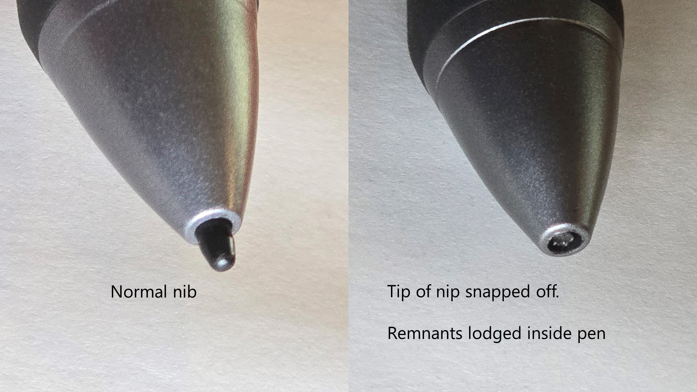

# Removing a broken nib

## Overview

If the nib is broken in half and stuck deeply inside or there's not enough of it to grip then normal techniques may not get it out.&#x20;

Here are some other options.&#x20;

<figure><figcaption></figcaption></figure>

## OPTION: Precision tweezers

I used this iFixit set of precision tweezers. Specifically I used the one in the middle. I wasn't able to put both both ends into the pen. Instead, I put one end into the pen and pressed against the side of the nib to slowly push the nib out a little bit at a time. Once enough was out, I used the tweezers normally to pull the nib out. &#x20;

<figure><figcaption></figcaption></figure>

## OPTION: The Glue method

A little bit of hot glue at the end of a toothpick

## OPTION: The hot needle method

Stick a heated needle into the nib and when the plastic of nib cools, pull it out. Some people suggest combining this technique with glue on the needle tip. <mark style="color:red;">**Use this option with great caution. People have ruined their pens and made the problem worse with this hot needle technique.**</mark>

## Reddit threads:

* ([https://www.reddit.com/r/huion/comments/1104oj6/help\_ive\_broken\_my\_stylus\_nib\_is\_there\_a\_way\_to/](https://www.reddit.com/r/huion/comments/1104oj6/help\_ive\_broken\_my\_stylus\_nib\_is\_there\_a\_way\_to/))
