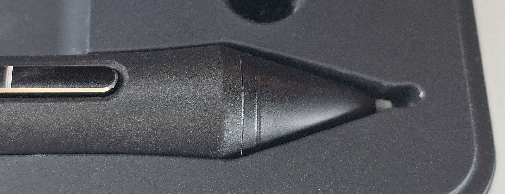
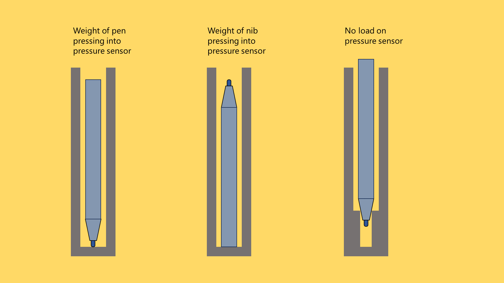

# Storing your pen

## Overview

Store your pens so that the nib is not experiencing constant pressure. Some tablet users suggest that if the nib has a constant pressure applied to it, over time the pressure could damage the pressure sensor.&#x20;

## Pen case

If you pen came with a case designed for it, that is the safest place to store it. These cases provide a lt of protection for the entire pen and the pressure sensor

In the photo below you can see how a case has extra room for the nib so nothing can press into it.

<figure><figcaption></figcaption></figure>

## Vertical options

Below, three conceptual options are presented for storing a pen.&#x20;

* The one on the far right places no load on the pressure sensor
* The one on the far left places the entire weight of the pen on the pressure sensor
* The one in the middle places only the weight of the nib on the pressure sensor. This is the way I store my pens.&#x20;

<figure><figcaption></figcaption></figure>
