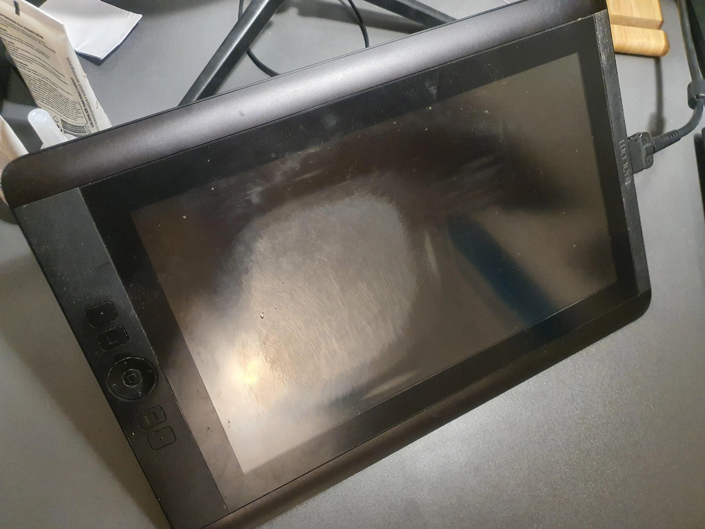

# Surface wear on pen displays

## Background

Pen displays (tablets with a screen) come in two varieties

* those that have a glass surface, where your pen is making direct contact with the glass surface
* And those that have a film on top of the glass surface, where your pen only touches the film and does not touch the glass

## Displays with etched glass surface

the glass surface is usually an etched glass surface. The etching is a very subtle texture created on the glass usually through the means of some acid that has eaten away a little bit of the surface.

The texture gives two benefits. First, it helps the glass avoid feeling slippery as you draw. That slippery feeling is a very common complaint for some devices like an iPad. Second, that texture also disperses light that is coming from the room and this dispersion will reduce glare. So the etching is often referred to as an anti glare treatment.

One negative aspect of the etching is that it can create an effect called anti glare sparkle. Sometimes the anti glare sparkle is very subtle but sometimes it is extremely strong and people do not like it. More here: Anti-Glare Sparkle.

## Displays with a film on top of glass

in this case the film provides an anti glare treatment typically and provide some texture. Though I typically find that the texture.

## Wear on a etched glass surface

In a general sense the glass that is used for append display is highly durable. They are designed to be directly drawn upon with the pens / nibs that the manufacturer also supplies.

And while these glass surfaces are designed to be very durable, they are not infinitely resistant to damage from various sources.

## Glass Surface Wear from drawing

Let's talk about the first kind of damage which is damage from just basic drawing. There are a wide variety of experiences people have with scratching up or damaging the glass of their pen display.

Some people like me have drawn on pen displays for many years and have never seen any kind of scratching or damage that came from drawing.

But you can easily find people posting on online forums who show you photos of how the surface of their pen display has become worn. You can see for example regions of their pen displays that seem more scratched up and where the etched texture has clearly changed.

## Preventing damage and wear to the glass surface

### Small particle damage

Some people suggest that small particles of various materials can be on your land on the glass or attach themselves to the nib of the pen. And they suggests that as you draw on the glass with your pen that you might see scratches that are caused not by the pen and nib itself, but by the motion of those small particles as your nib moves them across the surface of the glass.

I cannot say that I have personally experienced this myself. But I do think it is in your best interests to keep the surface of your pen display and your pens clean.

### Contact with objects on your hand

Some artists are very careful to remove anything metallic from there hands or wrists when they draw. And I think this is also a very reasonable thing to do to avoid the potential damaging the glass.

### Scratches during transport

If you were transporting your pen display you should make sure that the glass is covered by something to protect it during it's journey. I have seen people mentioned that they put their pen display in a backpack but that's some other object in the backpack made contact with and

## Removing wear damage on a glass surface

The glass surface of a pen display is not designed to be removed. In the case of fully laminated pen displays, remember that the glass is bonded to the display panel with the layer of optically clear adhesive (OCA). So in summary the glass you have is going to be there forever.

And anywhere or damage you caused the glass will also be there forever.

I have never seen anyone find anyway to somehow remove any on the glass surface

## Preventing damage using protective sheets

Protective sheets on top of the tablet glass naturally protect the glass from damage.

One benefit of protective sheets is if they do get damaged you can generally replace them.

More here: [**protective sheets**](../../accessories/surface-protectors/)

## Examples of damage

### Example 1

From this reddit post:[https://www.reddit.com/r/wacom/comments/zv593v/does\_cintiq\_13hd\_have\_screen\_protection\_see\_coment/](https://www.reddit.com/r/wacom/comments/zv593v/does\_cintiq\_13hd\_have\_screen\_protection\_see\_coment/)&#x20;

&#x20;
