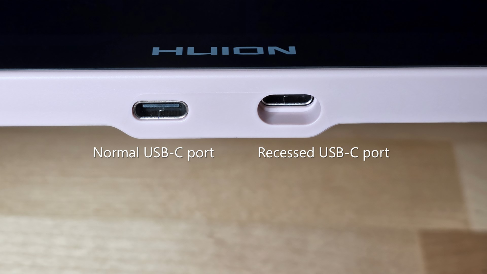

# Using 3rd-party cables with your drawing tablet

## Overview

Your drawing tablet comes with the cables needed to connect it to a computer.

You can often use other cables, depending on the tablet and computer.

* Pen tablets - you can almost always use a 3rd-party cable.
* Pen displays - you can often use a 3rd-party cable, but a manufacturer cable is sometimes the best or only option.

## Using 3rd-party USB cables for pen tablets

For pen tablets, I recommend using the manufacturer cables when possible. But those cables sometimes get lost or damaged, and 3rd-party cables usually work fine.

If you use a 3rd-party cable, make sure it can do two things:

* Can carry power
* Can carry data - not all USB-C cables carry data. Some are power-only.

Can you use the cable that you use for other devices? Yes, as long as it can carry power and data.

### The cables I use to connect pen tablets

For the exact brands and cables I use for pen tablets, see [Cables I use to connect pen tablets](my-cables-for-pen-tablets.md).

### Using adapters for USB port types

These days, pen tablets usually use USB-C ports. Older tablets may use micro-USB or mini-USB. Those cables are getting harder to find, so I prefer to use USB-C cables with adapters for older tablets when possible.

More here: [Cable adapters](../../../catalog/accessories/cable-adapters.md)

## Using 3rd-party cables for pen displays

**Single USB-C cable connection**

If the pen display was connected with a single USB-C cable, then you can TYPICALLY use a USB-C cable that MEETS CERTAIN REQUIREMENTS to connect your pen display. More here: [Connecting a pen display with USB-C](../connecting-pen-display/connecting-pen-display-usbc.md). If the pen display connects with a single USB-C cable, you can typically use another USB-C cable that meets the required specs. More here: [Connecting a pen display with USB-C](../connecting-pen-display/connecting-pen-display-usbc.md).

Even if the cable meets the requirements - there are some issues you should be aware of.

**Recessed Ports**

Sometimes the USB-C port on the tablet sits inside a recessed opening, and the manufacturer cable is designed to fit it.

<figure><figcaption></figcaption></figure>

**Longer connectors**

Sometimes the USB-C port is not recessed, but it expects the metal part of the connector to be slightly longer. The manufacturer cable works correctly, but a 3rd-party cable may not insert as deeply. The connection may work, but feel loose and disconnect if the cable moves.

**Random issues**

Sometimes, in my experience, 3rd-party cables just do not work as well as manufacturer cables. This is rare, but it happens.

**3-in 1 cable connection**

3-in-1 cables provided by the manufacturer are almost always proprietary. You usually need the exact replacement cable from the manufacturer.
