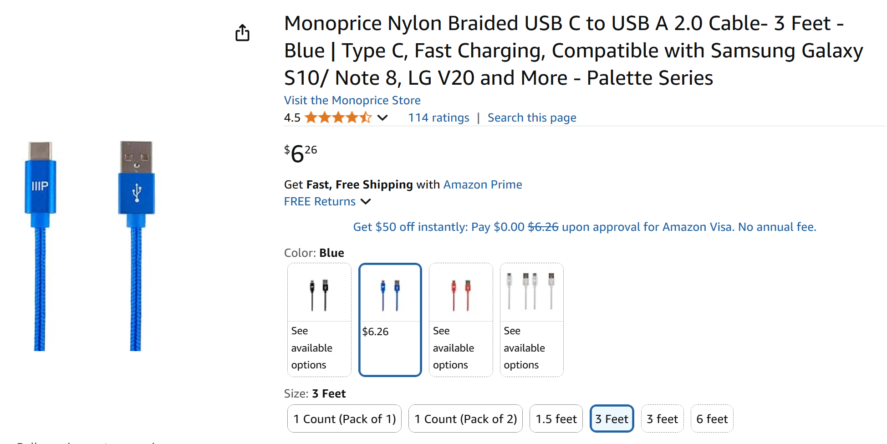

# Cables I use to connect pen tablets

## Overview

I hate plugging and unplugging different cables when I use many pen tablets, so I standardized on specific USB 2.0 cables instead of using the manufacturer cables. Details on the exact cables and brands are below.

These cables are **NOT suitable for pen displays** (screen tablets) as they cannot carry a video signal.

## Notes

I use these cables for **many** devices, such as pen tablets, keyboards, speakers, and microphones. They work well for devices that need a little power and a small amount of data transfer.

As USB 2.0 cables, they are not meant for high-speed data transfer. I usually do not use them to transfer files from a phone because faster options exist.

## Monoprice Nylon Braided USB 2.0 cable USB-C to USB-A

[https://www.amazon.com/Monoprice-Type-C-Type-Charge-Nylon-Braid/dp/B08511STS1](https://www.amazon.com/Monoprice-Type-C-Type-Charge-Nylon-Braid/dp/B08511STS1)

<figure><figcaption></figcaption></figure>

* There is nothing special about them. I just liked that they came in a bright blue color. I use that color to organize my cables. Whenever I see that color, I know what kind of device the cable is for.
* The cables are a little stiff, so they do not lay flat easily on a desk.
* They are available in multiple colors and lengths. I usually get the 3 ft and 6 ft versions.

## Anker Flow Cord USB 2.0 USB-C Cable

[https://www.amazon.com/Anker-Powerline-Charging-MacBook-Midnight/dp/B09FTFK4FT/](https://www.amazon.com/Anker-Powerline-Charging-MacBook-Midnight/dp/B09FTFK4FT/)

<figure><figcaption></figcaption></figure>

* These cables are very pliable. They lay flat on a desk.
* They are available in black and several light pastel colors.
* They are available in 3 ft and 5 ft lengths.

And I use these cables with many other devices that only need USB 2.0 connectivity.
