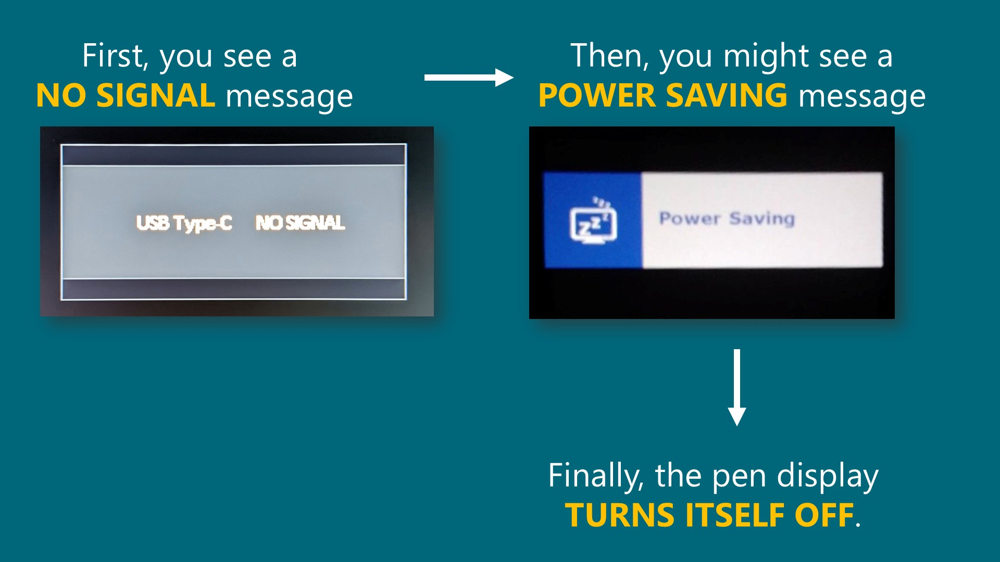

# Connecting a pen display

## Overview

Connecting a pen display to a computer can be challenging. This guide explains the fundamentals you need to make it work.

## The fundamentals

A pen display has three requirements to work: **power**, **data**, and a **video signal**. And each one of this must be carried by a cable.

They could be carried by three separate cables, a single cable, or specialty cables. It depends on the specific tablet and your computer.

<figure><figcaption></figcaption></figure>

<figure><figcaption></figcaption></figure>

## Basic connection strategies

We know there are three fundamental requirements. Now the challenge is making sure the cables and ports used to connect the tablet to the computer can meet those requirements.

You can categorize the connections by **which cable carries the video signal**.

Almost always, that cable is either HDMI or USB-C. Instructions for each case are below. I recommend that you <mark style="color:red;">**WATCH BOTH VIDEOS BELOW**</mark>.

* HDMI for video: [Connecting with HDMI](connecting-pen-display-hdmi.md)
* USB-C for video: [Connecting a pen display with USB-C](connecting-pen-display-usbc.md)

<figure><figcaption></figcaption></figure>

## What happens if the requirements are not met

### No Video Signal (aka NO SIGNAL)

If there is no video signal, the tablet screen will show a message such as **NO SIGNAL**. It may then show **POWER SAVING** and turn off. **NO SIGNAL** explicitly identifies the fundamental problem: the tablet is not receiving a video signal. This message can result from issues in multiple places. It can be complex to troubleshoot. For more information, see [TSG: Pen display shows NO SIGNAL message](../../../troubleshoot/tsg-no-signal.md).

<figure><figcaption></figcaption></figure>

If the **NO SIGNAL** message occurs and your tablet stays on, you might be able to continue using the pen, even if you see nothing. In other words, it will behave like a pen tablet. Although not ideal, it may be useful in an emergency.

### No data

If the tablet cannot send data to the computer, the tablet driver will show a message that the tablet is not detected or connected. This message can occur even when the tablet is correctly connected. If you have this problem, see [TSG: Tablet driver does not detect the tablet](../../../troubleshoot/tsg-tablet-driver-does-not-detect-tablet.md).

<figure><figcaption></figcaption></figure>

If there is no power or not enough power, you might see these symptoms:

* The pen display will not turn on.
* The pen display screen turns on briefly, then goes dark for a few seconds. This may repeat.
* The display will not get as bright.
* The screen shows nothing, but the pen works.

## No power or not enough power

Insufficient power shows up in a few characteristic ways:

* The pen display simply won't turn on.&#x20;
* It turns on for a second or two, then off, then on again — cycling repeatedly. See: [TSG: Pen display turns on and off constantly](../../../troubleshoot/tsg-pen-display-turns-on-and-off.md)
* It turns on, but the screen is dimmer than expected.
* The screen stays black, but the pen still works (so it behaves like a screenless tablet).

Larger pen displays need more power. If your computer's port can't supply enough, power the display from a wall adapter instead. See [Connecting a pen display with USB-C](connecting-pen-display-usbc.md) and [Connecting with a 3-in-1 cable](connecting-with-a-3-in-1-cable.md).

## Connector types

This guide talks about connectors a lot, so you should know what they look like first. Read [Display connector types](../../pen-displays/display-connector-types.md) before you continue.

## Connection diagrams

Your tablet user manual should contain diagrams that show you exactly how to connect the tablet to your computer. Check those diagrams before you start. Ideally, check them before you buy a pen display.

## Other topics

### What about connecting a pen display to mobile devices?

Go here: [Connecting a pen display to a mobile device](pen-display-with-mobile-device.md)

### What about wireless connectivity?

No pen displays connect wirelessly. They all require at least one cable to connect to your computer.
