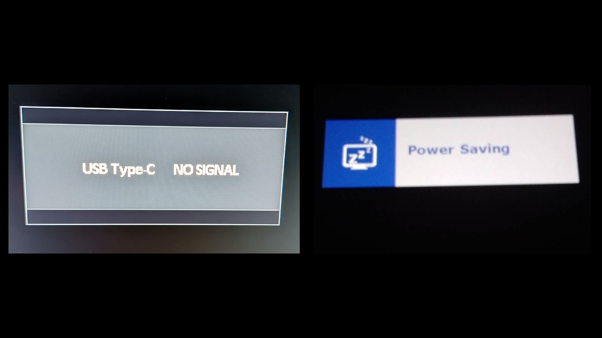

# Connecting with HDMI

## Overview


Read this first: [Connecting a pen display](./)


There are two common ways to get a video signal to a pen display: an **HDMI** cable or a **USB-C** cable. This page covers the **HDMI** approach — how to connect to an HDMI port, and what to do if you don't have one. For the other approach, see [Connecting a pen display with USB-C](connecting-pen-display-usbc.md).

## Video

[https://youtu.be/iKl\_3NYjlsY](https://youtu.be/iKl_3NYjlsY)



## The fundamentals

A pen display has three requirements to work: **power**, **data**, and a **video signal**.&#x20;

<figure><figcaption></figcaption></figure>

**HDMI** carries only the video signal, so power and data are handled by separate cables. Typically this will be two cables (one for power and one for data) or a 3-in-1 cable (see [Connecting with a 3-in-1 cable](connecting-with-a-3-in-1-cable.md)). Usually when a 3-in-1 cable is used - there will be to USB-C ports on the tablet.

<figure><figcaption></figcaption></figure>

<figure><figcaption></figcaption></figure>

## Getting power

The power cable will typically be marked with a red connector or tag that is red or has a power symbol.

<figure><figcaption></figcaption></figure>

A power adapter will come with the the tablet. Use it.

<figure><figcaption></figcaption></figure>

Some tablets also have a power extension cable to be used with the 3-in-1 cable.

<figure><figcaption></figcaption></figure>

## Important reminder

ALL THREE CABLES/CONNECTIONS MUST BE USED.

<figure><figcaption></figcaption></figure>

**If the DATA cable is not connected** the screen will show something but the driver will not detect the tablet and the pen will not work.

**If the POWER cable is not connected** - your tablet MIGHT get enough power from the DATA cable. But even if it does I highly recommend you connect the power cable to the supplied power adapter.

<figure><figcaption></figcaption></figure>

In the case where the power cable is not connected, you might see more a variety of problems:

* Pen display will not turn on (screen is black)
* Pen display screen turns on for a moment and the goes dark for a few seconds. This may keep repeating.
* Pen displays screen shows something but it cannot get to maximum brightness.

**If the HDMI cable is not connected** - the screen will turn on but you will see a NO SIGNAL message (maybe followed by a POWER SAVING message) or you might see the the screen cycle between RED, GREEN, and BLUE. The NO SIGNAL problem can occur for other reasons and is a conusing topic. For a detailed troubleshooting guide go here: [TSG: Pen display shows NO SIGNAL message](../../../troubleshoot/tsg-no-signal.md)

<figure><figcaption></figcaption></figure>

<figure><figcaption></figcaption></figure>

## Which USB-C port on the tablet to use?

Usually pen displays have 3 USB-C ports. And the 3-in-1 cable needs to be plugged into one of them. Which one to use or if both can used depends on the specific tablet. Consult the user manual.

* Sometimes the top USB-C port is intended for the 3-in-1 cable.
* Sometimes the bottom USB-C port is intended for the 3-in-1 cable.
* Read the user manual or contact customer support if you are not sure.

<figure><figcaption></figcaption></figure>

## Unusual cabling

There are some variations on the 3-in-1 cable pattern. Not many tablets use these alternatice connection patterns, but you should be prepared for it. Everything in this doc will still apply to these cases also.

<figure><figcaption></figcaption></figure>

<figure><figcaption></figcaption></figure>

## Picking an HDMI port

If your computer has multiple HDMI ports you need to pick one.

**Laptops.** It shouldn't matter. Any HDMI port should work.

**Small form factor / mini PCs.** Also shouldn't matter. Any HDMI port should work.

**Desktop PCs with a separate graphics card.** This is where it gets complicated. You might have HDMI ports in two different locations:

* You could have HDMI ports on the graphics card (GPU)
* You could have HDMI ports on the motherboard I/O panel

As a general rule, always use the HDMI ports on the graphics card. Only use the motherboard HDMI ports as a last resort. More here: [Motherboard HDMI vs GPU HDMI ports](motherboard-vs-gpu-hdmi.md).

### Your HDMI ports may be hidden with a port cover

Sometimes a port you are looking for is there, but it is covered by a small plastic cap.&#x20;

You may see these caps referred to as:

* port dust covers
* port dust plugs&#x20;
* port protectors
* port caps

These caps are often black and easy to miss. They pull off with almost no effort, and they do **not** mean the port is unusable — they are only there to protect the port from dust and damage. I mention this because I've seen a lot of people conclude they "don't have a port" when it was simply capped - and people didn't realize what they were looking at.

## What if you don't have enough HDMI ports?

A very common situation: your computer has one HDMI port, but it is already being used by a monitor.

Before you buy anything, know that **most modern GPUs have only one HDMI port but several DisplayPort ports**. So you often have more video outputs than you think — they just aren't HDMI. Here are your options, roughly best to worst:

* **Move your monitor to a DisplayPort connection.** Many monitors accept DisplayPort. If you connect the monitor with DisplayPort, that frees up the HDMI port for your pen display.
* **Use an adapter** to convert another video output (DisplayPort, USB-C, DVI, VGA) to HDMI. See [Using HDMI adapters with pen displays](../../pen-displays/hdmi-adapters/).
* **Add or upgrade a graphics card** so you have more — and better — video outputs.
* **Avoid HDMI splitters.** They can be flaky, they can only mirror the same image to both displays, and your computer sees them as a single display. More here: [Using HDMI splitters with pen displays](../../pen-displays/hdmi-splitters.md).

### What if you don't have any HDMI ports at all?

If you need an HDMI connection but have no HDMI ports, you can convert other ports to HDMI with an adapter. See [Using HDMI adapters with pen displays](../../pen-displays/hdmi-adapters/).

In theory if you have a GPU, you could be a different one that has multiple HDMI ports. The challenge is there are vanishingly few such GPUs.&#x20;
