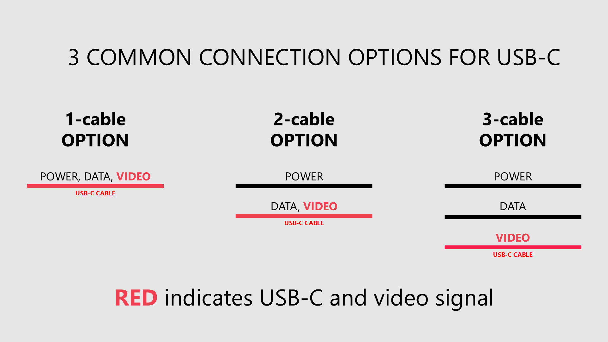
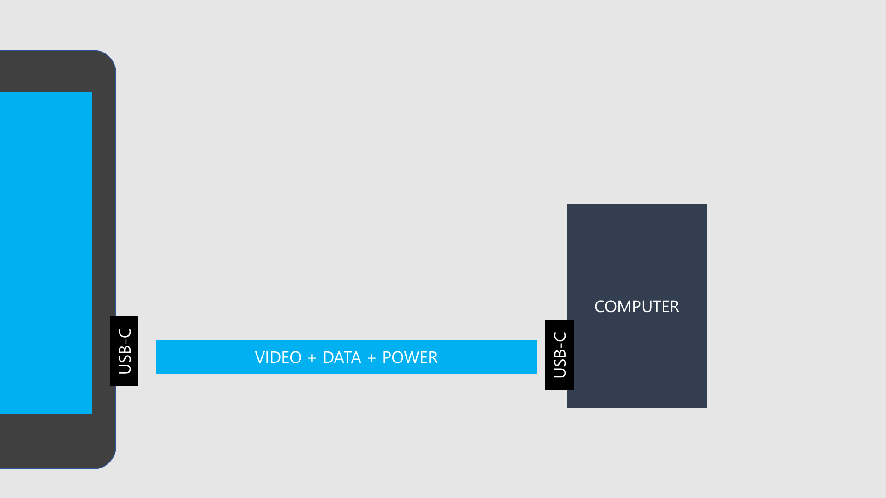
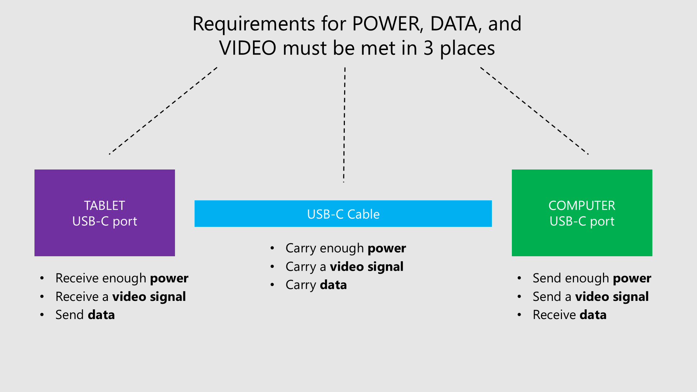
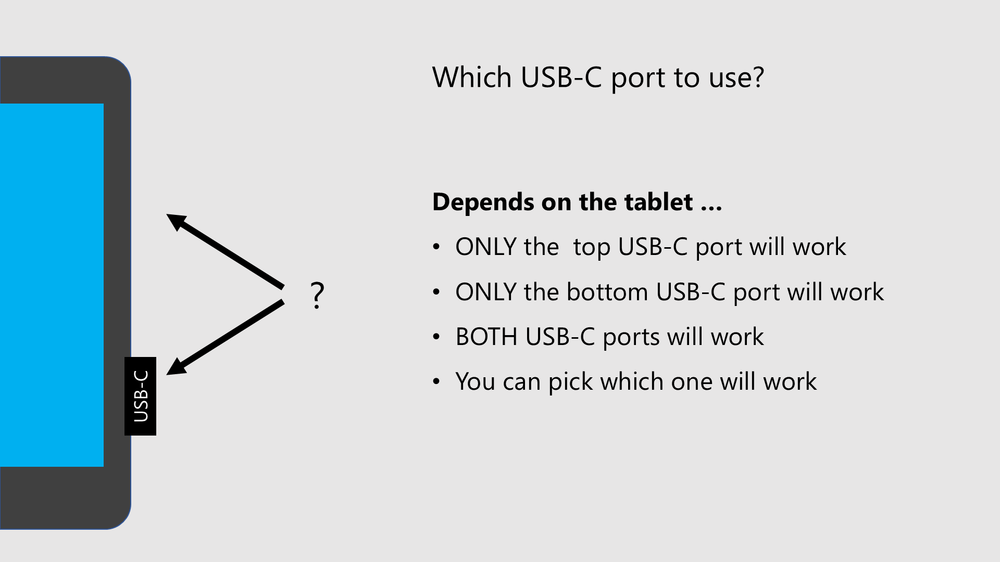
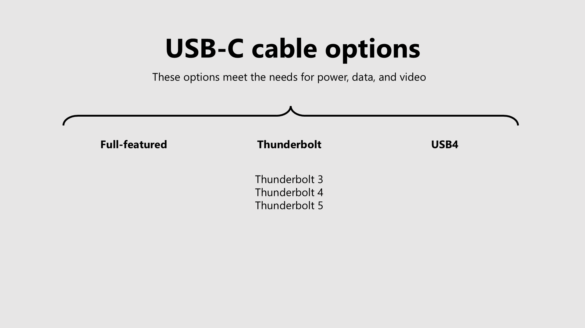

# Connecting a pen display with USB-C

## Overview


Read this first: [Connecting a pen display](./)


There are two common ways to get a video signal to a pen display: an **HDMI** cable or a **USB-C** cable. This page covers the **USB-C** approach. For the other approach, see [Connecting with HDMI](connecting-pen-display-hdmi.md).

A pen display has three requirements to work: **power**, **data**, and a **video signal**. Unlike an HDMI cable, which carries only video, a single USB-C cable can potentially carry all three at once. That makes USB-C appealing, but also more complicated. Many more hardware requirements must be met.

## Video

If you'd like a video walkthrough of this topic, watch [this video](https://youtu.be/eyHkd3kcOZk).



## Understand the basics

PLEASE read [Connecting a Pen Display](./). One you understand the basics, this document will be easier understand.

## Considerations before buying anything

### Key things to keep in mind

* Not all pen displays support this configuration, even if they have USB-C ports.
* Not all computers can send power and a display signal over USB-C.
* Not all USB-C cables can be used for this purpose.

### Do your research and plan carefully

* Do not buy a pen display assuming that a single USB-C connection will work.
* Do not buy a computer assuming that it will work with a single USB-C connection.
* Do not buy a cable assuming that it will work with a single-cable connection.

### Verify

The first thing you should do is verify whether the tablet supports a single USB-C connection. Ideally, do this before you buy the tablet.

You can do this verification easily:

* Read the user manual and check how the tablet connects.
* Or contact support and ask whether it works for that specific model.

Ideally, you could find someone with the same computer, pen display, and USB-C cable. That would be good evidence that it will work for you.

### Test/evaluate your computer

You can test most of the requirements before you even own the tablet:

* **Does the USB-C port carry data?** Plug a USB mouse or keyboard into it. If it works, the port supports data.
* **Does the USB-C port carry video?** Connect a monitor (or anything that accepts video over USB-C) to the port. If you get a picture, the port supports video (DP alt mode).
* **Does the USB-C port supply enough power?** There's no easy test for this. Check your computer's documentation for how much power the port delivers. As a rule of thumb, don't count on a port powering anything larger than a 13-inch pen display on its own.
* **Can your computer drive another display at all?** A pen display is essentially another monitor. If you already run two monitors, adding a pen display means your computer needs to support three at once. Test this by temporarily plugging in a spare monitor. If your computer can't handle the extra display, that's a problem to solve before you buy. On a laptop or mini PC this is hard to change; on a desktop you may be able to fix it with a better GPU.

## The three USB-C connection styles

When a USB-C cable carries the video signal, there are three common ways to wire everything up. They mainly differ in how **power** is delivered.

* **One cable.** A single USB-C cable carries power, data, and video between your computer and the tablet. This is the simplest and most elegant setup - but it is also the hardest to get working. All three requirements must be met in three separate places: the tablet's USB-C port, the computer's USB-C port, and the cable. The requirement sections below describe what the one-cable connection needs.
* **Two cables.** A separate power cable delivers power (usually from a wall adapter), and a USB-C cable carries data and video. This solves the very common problem where a computer's USB-C port doesn't supply enough power. See **The two-cable connection** below.
* **Three cables.** One cable for each requirement - power, data, and video. See **The three-cable connection** below.

The bigger your pen display, the more likely you'll need two or three cables, because a single USB-C port often can't supply enough power on its own.

### A USB-C port on your computer doesn't guarantee that a single USB-C connection will work

Just because your tablet has a USB-C port does not mean it supports a USB-C video connection. For example, the Wacom One 2019 (DTC-133) has a single USB-C port, but its manual requires a proprietary Wacom cable that ultimately connects to an **HDMI** port on your computer. It cannot use a USB-C video connection at all. This is why reading the user manual before buying matters so much.

## Single cable requirements

To fully connect a pen display, three requirements must be met:

* The pen display must receive enough power.
* The pen display must be able to send data to your computer.
* The pen display must receive a video signal from your computer.

FUNDAMENTALS

### USB-C connection options

Depending on your ports, the tablet, and its power needs, there are three connection styles where USB-C carries video.

* **One-cable option:** A single USB-C cable carries power, data, and video.
* **Two-cable option:** A single USB-C cable carries data and video. A separate cable carries power.
* **Three-cable option:** A USB-C cable carries video. Separate cables carry power and data.

<figure><figcaption></figcaption></figure>

### Video signal with DP alt mode support

To carry video, your USB-C cable and ports must support DP alt mode. To find out whether your ports and cables support DP alt mode, read [USB-C DisplayPort alt mode](../../pen-displays/usbc-dp-alt-mode.md).

## 1 cable option

The one cable option is the most physically elegant and in some sense ideal connection type. It is also the most complex in terms of requirements. Many computers simply cannot accommodate this option. Not all pen displays support it, even if they have USB-C ports. Every port and cable must meet all the requirements.

<figure><figcaption></figcaption></figure>

<figure><figcaption></figcaption></figure>

## Power support

* Cables
  * Thunderbolt USB-C cables can usually carry enough power.
* Ports
  * Even if the cable supports power, your computer's USB-C port may not supply enough power.
* Power needed
  * The size of the pen display affects how much power is needed.
  * A 13-inch pen display is more likely to work from USB-C power alone.
  * Around 16 inches, it's roughly 50/50 whether a USB-C port supplies enough power.
  * At 19 inches and above, a single USB-C cable is basically never enough - you'll need external power.

If your USB-C port can't supply enough power, use a **two-cable** or **three-cable** connection (described below) to draw power from another source.

## Computer USB-C ports

### Which USB-C port on the tablet should you use?

<figure><figcaption></figcaption></figure>

Often with tablets there are two USB-C ports.

Sometimes they are not interchangeable:

* Some tablets dedicate the top port to video and data, and the bottom port to power.
* Some tablets dedicate the bottom port to video and data, and the top port to power.
* Some tablets can use any combination of ports for video, data, and power.

### Recessed USB-C ports on the tablet

You should be aware that recessed USB-C ports on your pen display typically mean that only the manufacturer-provided USB-C cables will fit them.

More here: [Recessed USB-C ports](../recessed-usbc-ports.md)

<figure><figcaption></figcaption></figure>

## USB-C cables

### Cables that meet the power, video, and data requirements

You have three options:

* Full-featured USB-C cables
* USB-C Thunderbolt cables
* USB-C USB4 cables

<figure><figcaption></figcaption></figure>

### How to tell if a USB-C cable could be used as a single-cable for your pen display

Unfortunately, this can be hard because there are no reliable visual indicators for USB-C cables. Most USB-C cables are unmarked.

**Thunderbolt-labeled USB-C cables** - If you see a Thunderbolt logo on a USB-C cable, it is a Thunderbolt 3, 4, or 5 cable. That means it supports the needed requirements.

**USB4-labeled USB-C cables** - I've never seen a cable labeled USB4. But if you see one, it should support the needed requirements.

**Unlabeled USB-C cables** - You will need to rely on the manufacturer specs. These cables are sometimes described as "full-featured" USB-C cables.

**Full-featured USB-C cables** - Unfortunately, these are never labeled as "full-featured" on the cable itself. You may only know by reading the documentation or packaging, or by contacting customer support.

### Manufacturer cables vs third-party cables

I recommend you get the USB-C cables provided by the manufacturer for two reasons:

* These cables are known to work with your tablet.
* The tablet may have recessed USB-C ports and these cables are designed to fit that port. Other cables may not even fit inside.
* I have personally seen third-party USB-C cables fail with a tablet even though they met the specs and worked with other tablets.

More here: [Using 3rd-party cables with your drawing tablet](../3rd-party-cables-for-drawtab/)

### The specific Thunderbolt cables I use

I use a CableMatters Thunderbolt 3 cable. The exact cable and my testing results are here: [CableMatters Thunderbolt 3 cable](../../../catalog/accessories/cables/cablematters-thunderbolt-3-cable.md).

### Two tips that save money and frustration

* **Watch the price.** Full-featured, Thunderbolt, and USB4 cables vary a lot in price - anywhere from about $15 to $70. Before you buy a tablet, check whether the cable you need comes in the box. If it doesn't, factor in the extra cost. For example, the Wacom Movink 13 (DTH-135) includes a roughly $15 full-featured USB-C cable, while the Huion Kamvas 13 Gen 3 (GS1333) only includes a 3-in-1 (HDMI) cable - a compatible full-featured cable is sold separately for about $30 (1 m) to $70 (2 m).
* **Label your cables.** When a USB-C cable comes with a tablet, put a label on it with the tablet's name and whether the cable carries video. USB-C cables are nearly impossible to tell apart just by looking, and a quick label will save you a lot of confusion later.

## The two-cable connection

If your computer's USB-C port can send video and data but can't supply enough power, use two cables:

* A **USB-C cable** (full-featured, Thunderbolt, or USB4 - the same kind used for the one-cable case) carries data and video.
* A **separate power cable** delivers power from an external source.

**Where should the power come from?** You may be able to draw power from another USB-C port, a USB-A port, a Thunderbolt dock, or a wall adapter. To keep things simple and reliable, **start with a wall adapter**. Once that works, you can experiment with other power sources.

**Which power cable?** That depends entirely on your tablet - it might be USB-C, USB-A, a standard power cable, or a proprietary one. You have to use whatever the manufacturer specifies. The power cable only carries power; it will not carry data or video. Power cables are often marked in some way - a red connector, a small power-symbol tag, and so on. As with all your cables, labeling them (for example, with colored tape) makes it easy to tell the power cable from the data/video cable.

## The three-cable connection

The three-cable connection is the easiest to understand: one cable for each requirement - power, data, and video. The video cable still plugs into a USB-C port on the tablet, but remember that not every USB-C port on a computer can send video (DP alt mode).

If your computer doesn't have a USB-C port that supports video, you may be able to adapt another video output to USB-C.

### Adapting a video port to USB-C

The tablet's video cable ends in USB-C, but your computer's video output might be something else. Here's what can and can't be adapted:

* **DisplayPort → USB-C.** This works well. You can buy a DisplayPort-to-USB-C cable or adapter to feed video from your computer's DisplayPort into the tablet's USB-C port. These only carry **video** - not data and not power - so you'd use one as the video cable in a two- or three-cable setup. This is the approach I personally use; it's inexpensive and reliable.
* **HDMI → USB-C.** These adapters exist, but I haven't used them. HDMI carries only video (no data, no power). Honestly, if you have an HDMI port, you're usually better off using the HDMI 3-in-1 cable designed for your tablet instead. See [Connecting with HDMI](connecting-pen-display-hdmi.md).
* **USB-A → USB-C.** An adapter won't help you get video. USB-A carries data and some power, but it does **not** carry a video signal (no DP alt mode).

## Desktop computers are the hard case

Whether your computer has a USB-C port that works for a video connection depends heavily on the type of computer. **Modern laptops and mini PCs** usually have the ports you need (though they still may not supply enough power for larger tablets). **Desktops rarely do**, so with a desktop you'll often end up using an HDMI-based connection with a 3-in-1 cable instead.

On a desktop, USB-C ports can appear in two places, and both have catches:

* **USB-C on the GPU (graphics card).** These are uncommon, and even when present they usually send video (and maybe data) but almost never supply power - so they generally don't work for a one-cable connection. More here: [Connecting a pen display to a USB-C port on a GPU](connecting-pen-display-gpu-usbc.md).
* **USB-C (Thunderbolt) on the motherboard I/O panel.** Here's a surprise: you can have clearly-labeled Thunderbolt USB-C ports on the motherboard, plug in your pen display, and still get **no video signal**. That's because the motherboard port often has no video source of its own. The fix is to route video from the GPU into that port: check that your motherboard has a **DisplayPort IN** connector and your GPU has a **DisplayPort OUT**, then connect the two with a DisplayPort cable. That feeds the GPU's video into the motherboard's Thunderbolt port so it can pass video on to your tablet. Some unlabeled motherboard USB-C ports can work the same way - check your motherboard's documentation to confirm.

## Adding a USB-C with DisplayPort to your computer

If your computer does not have a USB-C port that supports DP alt mode, you may be able to add one.

This requires a desktop computer that can accept an expansion card.

See: [Dan S Charlton: Add USB-C with DisplayPort-alt-mode to your PC](https://dancharblog.wordpress.com/2020-07-20/add-usb-c-with-dp-alt-mode-to-your-desktop-pc/) ([archive link](https://archive.is/WylTo))

## Resources

* Huion's list of devices that can use a single USB-C cable: [compatible devices](https://support.huion.com/en/support/solutions/articles/44002011098-list-of-compatible-devices-support-usb-c-to-usb-c-connection-with-huion-displays)
* Brad Colbow connects the Huion Kamvas 13 with a single USB-C cable. See 6:00 in [this video](https://youtu.be/ku8x1q_nhFQ).
* Teoh on Tech connects the XP-Pen Artist 13 (2nd gen) using a single USB-C cable. See 4:30 in [this video](https://youtu.be/Exj2PZu4MHM).
