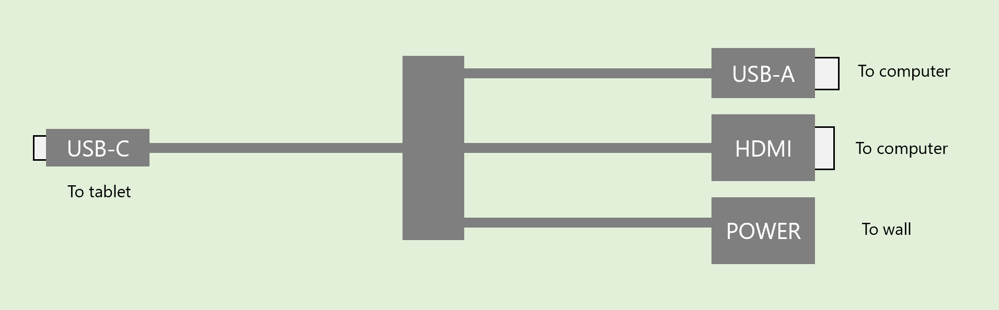
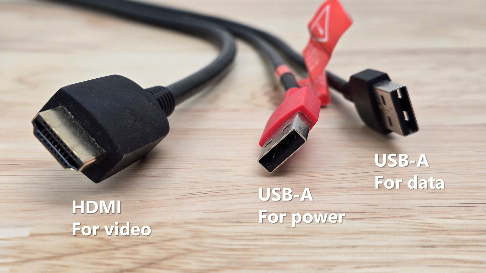
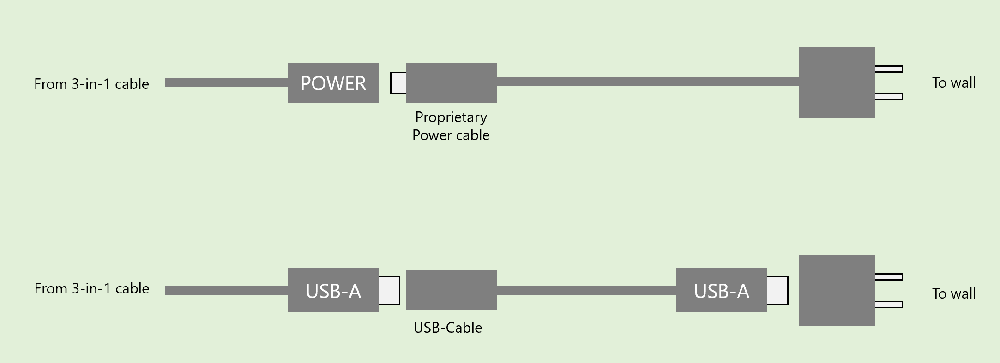
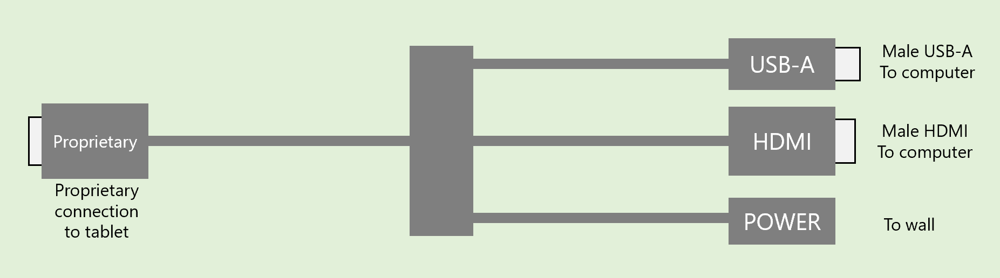

# Connecting with a 3-in-1 cable

A 3-in-1 cable is a special connection cable that pen displays use to connect to a computer.



More here on the different ways a pen display can connect to a computer: [Connecting a pen display](./)

A 3-in-1 cable typically looks like this:

<figure><figcaption></figcaption></figure>

Here's a typical picture of the three cables on the right.

<figure><figcaption></figcaption></figure>

The power end can work in different ways, depending on which 3-in-1 cable you have.

<figure><figcaption></figcaption></figure>

Older 3-in-1 cables may have a proprietary connection to the tablet instead of a regular USB-C connection.

<figure><figcaption></figcaption></figure>

## Benefits of a 3-in-1 cable

* **Simplifies the physical design of the tablet**. It minimizes the number of physical ports on the tablet. Instead of having an HDMI port, power port, and USB-A data port, the tablet can just have 1 USB-C port.
* It also makes it **easier to keep track of cables**. You only need one 3-in-1 cable instead of three separate cables.
* Ideally, you would connect your tablet to the computer with a single USB-C cable. But this is not always possible.
  * USB-C ports on your computer may not supply enough power
  * USB-C ports on your computer may not support sending a display signal (aka DP alt mode)
  * Your computer may not have a USB-C port at all
  * So a 3-in-1 cable lets you use older ports that many computers do have, such as HDMI and USB-A, while still getting enough power to the tablet.

## Using the 3-in-1 cable without the power end connected

You may encounter situations where the 3-in-1 cable is only partially connected:

* The HDMI cable is plugged into the computer
* The USB data cable is plugged into the computer
* But the power cable is not connected to anything

In some cases, even though only 2 of the 3 connections are accounted for, you may still successfully be able to use your pen display.

The reason for this is that the USB data cable MAY be able to get enough power from the USB-C port it is plugged into.

Some notes:

* If this works, it tends to be with 13-inch pen displays. At 16 inches or larger, they often need more power than many computer USB ports can provide.
* If this works, it may supply enough power for your pen display, but it might not be enough to use the display at full brightness.
* If there is not enough power from the USB data cable then you might see the pen display briefly turn on, then off, then on again repeatedly.
* I haven't seen anyone damage their tablet because of this configuration.

**My recommendation**

I strongly recommend that you always plug in all three parts of the 3-in-1 cable. It is better to know you have enough power than to guess.
