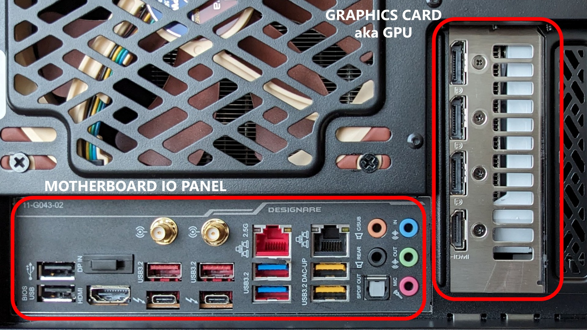

# Motherboard HDMI vs GPU HDMI ports

## Overview

On some computers there may be HDMI ports in two different locations:

* The motherboard
* The GPU (aka the graphics card)

You should always use the GPU's HDMI ports first. Use the motherboard HDMI ports only as a last resort.

## Location

There are two general locations on the back of a computer.

* The motherboard I/O panel
* The GPU (aka the graphics card)

<figure><figcaption></figcaption></figure>

## Motherboard HDMI vs GPU HDMI

If you have two working ports, one on the motherboard and one on the graphics card, which should you pick? The answer is **always use the graphics card's HDMI port first. Use the motherboard HDMI port only as a last resort**.

First, motherboard HDMI support is usually less capable than a graphics card from the same era. The motherboard HDMI port may not support 4K or a high enough refresh rate. It might work, but the experience may be worse.

Second, both motherboard HDMI and a graphics card need memory to do their work. A graphics card has its own dedicated memory. Motherboard HDMI usually does not. It instead uses system memory, which means your CPU and system lose some memory to graphics.

## Issues with motherboard HDMI

Sometimes you'll read a statement like "HDMI doesn't work on the motherboard." That is an exaggeration, but it is well-intentioned. It is true that motherboard HDMI sometimes does not work. Here are the common reasons.

For a motherboard HDMI port working, several things need to be true:

* The HDMI port must exist.
* The computer must have "integrated graphics" hardware that sends a display signal to the port. It's called "integrated" because the graphics component is on the CPU.
* The HDMI port must be enabled.

Sometimes not all these conditions are met on PCs with motherboard HDMI ports.

* The HDMI port might exist, but there may be no integrated graphics, so that port will not work.
* You might have the port and integrated graphics, but the BIOS may disable that port. In that case, you need to enable it in the BIOS.
* Some computers automatically disable motherboard HDMI when a graphics card is installed. In other words, you can use either the motherboard HDMI or the graphics card, but not both.

## Is using a motherboard HDMI safe?

Yes. You aren't going to hurt your computer by trying to use motherboard HDMI, but you should know why it might not work.

