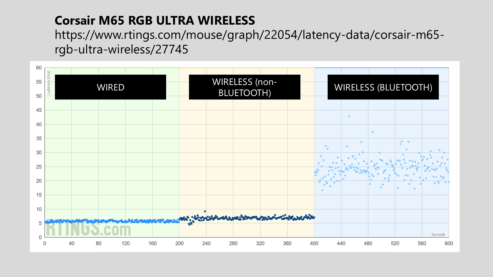

# Wireless connection

## Overview

Some drawing tablets, specifically some pen tablet models, support wireless connection to a computer. No pen displays support wireless connection.

## Wireless protocol

Most pen tablets use some version of Bluetooth to connect to a computer. Some use a different wireless protocol. If a tablet uses Bluetooth, that is usually advertised clearly on the box.

## Hardware

If a pen tablet supports wireless over Bluetooth, the feature is built into the tablet and should work with any computer that also supports Bluetooth. Pen tablets that use a non-Bluetooth wireless protocol often come with a dongle that plugs into the computer.

## Latency and Lag

Nobody has measured exactly how much latency wireless adds for a pen tablet. But we can borrow a few clues from mouse testing. RTINGS measured mouse click latency, and here are two examples.

<figure><figcaption></figcaption></figure>

<figure><figcaption></figcaption></figure>

Bluetooth wireless connections show that there can be very little latency or a lot of latency. It varies quite a bit even within a single mouse.

Keep these points in mind when interpreting the numbers:

* There are different versions of the Bluetooth protocol that have different latencies.
* These numbers are for mouse click latency, not pen tablets.

## Reliability

It is possible for electromagnetic interference in a room to cause problems with a wireless connection. In my experience, though, this is uncommon.

## Setting up your tablet

If you just bought a drawing tablet and are setting it up, I recommend connecting it with the provided USB cable first. Once that works, try the wireless connection.
