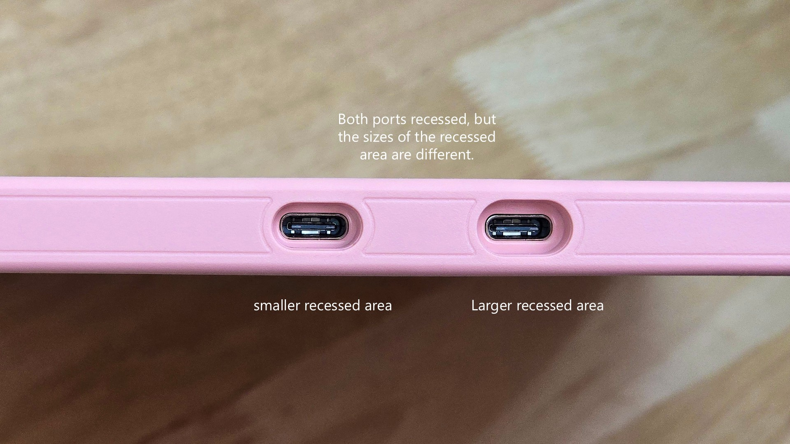

# Recessed USB-C ports

If the ports are recessed, usually only specific cables from the manufacturer will fit them.

<figure><figcaption></figcaption></figure>

In cases where both USB-C ports are recessed, the recessed areas may be different sizes. One cable might fit one port, but not the other.

<figure><figcaption></figcaption></figure>
