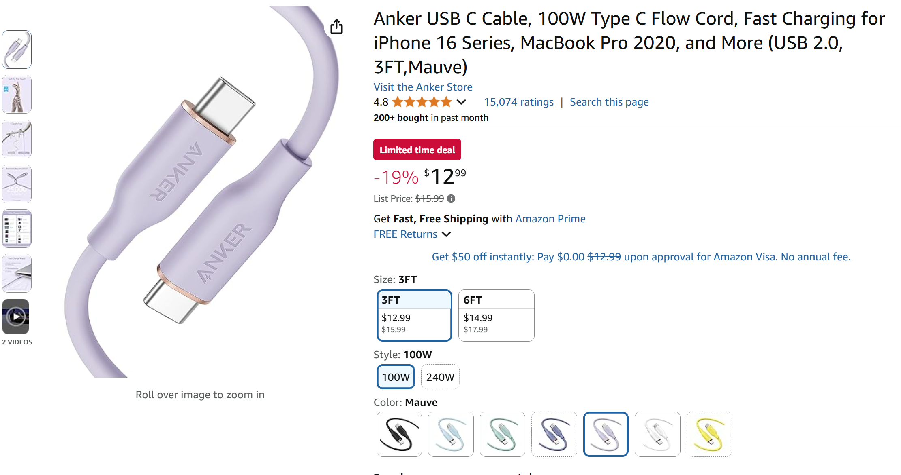

# Cables I use to connect pen tablets

## Overview

I hate plugging and unplugging different cables when I use many different pen tablets so I standardized my home on specific USB 2.0 cables instead of using the cables provided by the manufacturer. Details on the exact cables and brands are listed below.

These cables are **NOT suitable for pen displays** (screen tablets) as they cannot carry a video signal.

## Notes

I use these cables for **many** devices such as pen tablets (screenless tablets), keyboards, speakers, microphones. Any devices that need a little bit of power and the ability to transmit a small amount of data.

As USB 2.0 cables they are not meant for high-speed data transfer so I don't often use them to transfer files from a phone because there are faster options.

## Monoprice Nylon Braided USB 2.0 cable USB-C to USB-A

&#x20;

[https://www.amazon.com/Monoprice-Type-C-Type-Charge-Nylon-Braid/dp/B08511STS1](https://www.amazon.com/Monoprice-Type-C-Type-Charge-Nylon-Braid/dp/B08511STS1)

<figure><figcaption></figcaption></figure>

* There's nothing special about about them, I just liked that they were available in a bright blue color. And I use that color to organize my cables. Whenever I see a cable with this color I know the kidn of device it is meant for.
* The cables are kind of stiff so they won't lay down down easily on a desk. &#x20;
* They are available in multiple colors and lengths. I usually get the 3ft and 6ft lengths.

## Anker Flow Cord USB 2.0 USB-C Cable

[https://www.amazon.com/Anker-Powerline-Charging-MacBook-Midnight/dp/B09FTFK4FT/](https://www.amazon.com/Anker-Powerline-Charging-MacBook-Midnight/dp/B09FTFK4FT/)

<figure><figcaption></figcaption></figure>

* These cables are very pliant. They will lay flat on a desk.
* These are available in black and several light pastel colors.
* They are available in 3ft and 5ft lengths.

And I use these cables with many other devices that only need USB 2.0 connectivity.
