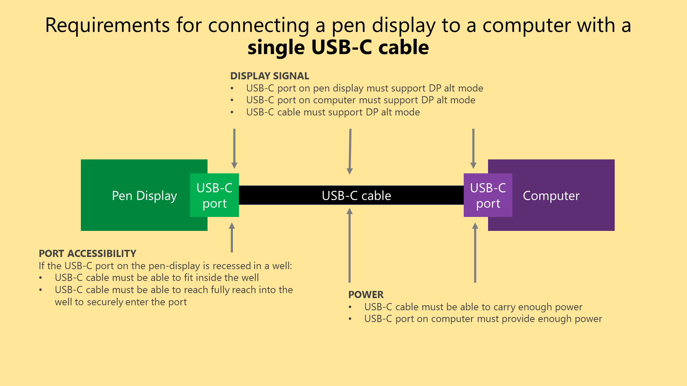

# Connecting a pen display with a single USB-C cable

## Overview

Ideally you would be able to connect your pen display to your computer with a single USB C cable. And that cable would provide display signal as well as enough power for the pen display. You should understand

## Considerations

Key things to keep in mind:

\-        Not all pen displays support this configuration - even if they do have USB C ports on the tablet

\-        Not all computers are capable of sending power and display signal over their USB C ports

\-        Not all USB C cables can be used for this purpose.&#x20;

So, you have to do your research and plan carefgully. Do not buy a pen display assuming that a single USB C cable connection will work.

## Verify with your manufacturer

The first thing you should do is verify whether the tablet supports a single USB C connection.

Ideally you do this before you even purchase the tablet.

You can do this verification easily:

* look at the user manual for the tablet and see how it connects
* or contact product support for the tablet and ask them specifically if it will work for that specific model.

When doing this research it will simplify things if you know the exact model number of the tablet and not just its name.

## Summary of requirements

<figure><figcaption></figcaption></figure>

## **Display signal with DP alt mode support**

Your cable and ports MUST support DP alt mode. To find out if you ports and cables support DP alt mode, read this**:** [USB-C DisplayPort alt mode](../pen-displays/usb-c-displayport-alt-mode.md).

## Power support

* Cables
  * Thunderbolt USB-C cables do support carrying enough power
* Ports
  * Even if the cable supports power, your computers USB-C port may not supply enough power.
* Power needed
* The size of the pen display affects how much power is needed.&#x20;
  * It's very likely that if your USB-C port can deliver enough power a 13" pen display
  * At 16", some pen displays require additional power usually from a power adapter that is plugged into a wall.&#x20;
  * Above 16" most often in my experience a single USB-C cable is not enough and these pen displays require additional power.&#x20;

## Manufacturer cables vs third-party cables

I recommend you get the USB-C cables the manufacturer provides for use with a single USB-C cable configuration - primarily because these are known to work with the device and will fit into the well that contains the port.

## Thunderbolt 3/4 cables

To keep it simple, I often just use Thunderbolt 3 or Thunderbolt 4 cables since these are USB-C cables that are defined to support DP alt mode and enough power.&#x20;

## The specific Thunderbolt 3 cable I use

I use a CableMatters Thunderbolt 3 cable. The exact cable and my testing results can be found here. [**7P notes: CableMatters Thunderbolt 3 cable**](../../accessories/cables/7p-notes-cablematters-thunderbolt-3-cable.md).

## Resources

* Here is a list from Huion about devices that can use a single USB-C cable: [https://support.huion.com/en/support/solutions/articles/44002011098-list-of-compatible-devices-support-usb-c-to-usb-c-connection-with-huion-displays](https://support.huion.com/en/support/solutions/articles/44002011098-list-of-compatible-devices-support-usb-c-to-usb-c-connection-with-huion-displays)&#x20;
* Brad Colbow connecting the Huion Kamvas 13 with a single USB-C cable: See 6:00 in this video: [https://youtu.be/ku8x1q\_nhFQ](https://youtu.be/ku8x1q\_nhFQ)
* Teoh on Tech connecting the XP-Pen Artist 13 (2nd gen) using a single USB-C cable. See 4:30 in the video:  [https://youtu.be/Exj2PZu4MHM](https://youtu.be/Exj2PZu4MHM)
