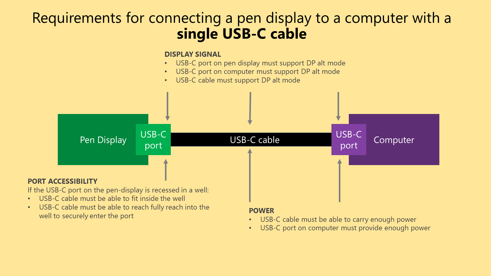
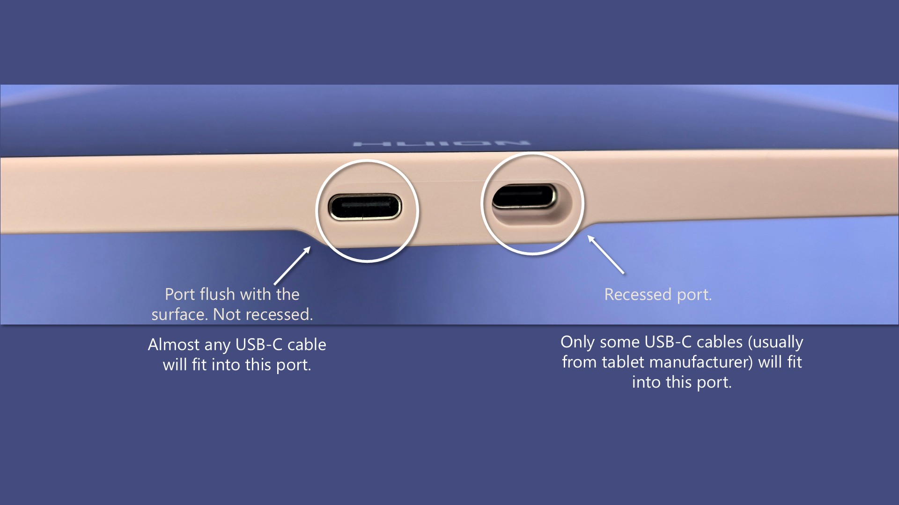

# Connecting a pen display with a single USB-C cable

## Overview

Ideally you would be able to connect your pen display to your computer with a single USB C cable. And that cable would provide display signal as well as enough power for the pen display. You should understand

## Considerations

Key things to keep in mind:

* Not all pen displays support this configuration - even if they do have USB C ports on the tablet
* Not all computers are capable of sending power and display signal over their USB C ports
* Not all USB C cables can be used for this purpose.&#x20;

So, you have to do your research and plan carefully. Do not buy a pen display assuming that a single USB C cable connection will work.

## Verify with your manufacturer

The first thing you should do is verify whether the tablet supports a single USB C connection. Ideally you do this before you even purchase the tablet.

You can do this verification easily:

* Read the user manual for the tablet and see how it connects
* Or contact product support for the tablet and ask them specifically if it will work for that specific model.

## Summary of requirements

<figure><figcaption></figcaption></figure>

## **Video signal with DP alt mode support**

Your cable and ports MUST support DP alt mode. To find out if you ports and cables support DP alt mode, read thi&#x73;**:** [USB-C DisplayPort alt mode](../pen-displays/usb-c-displayport-alt-mode.md).

## Power support

* Cables
  * Thunderbolt USB-C cables can carry carrying enough power
* Ports
  * Even if the cable supports power, your computers USB-C port may not supply enough power.
* Power needed
* The size of the pen display affects how much power is needed.&#x20;
  * It's very likely that if your USB-C port can deliver enough power a 13" pen display
  * At 16", some pen displays require additional power usually from a power adapter that is plugged into a wall.&#x20;
  * Above 16" most often in my experience a single USB-C cable is not enough and these pen displays require additional power.&#x20;

## USB-C Port preference

Often with tablets there are two USB-C ports.

Sometimes they are not interchangeable:

* Some tablets dedicate the top port for video and data, and the bottom to power
* Some tablets dedicate the bottom port for video and data, and the bottom to power
* Some tablets can any any combination of ports for video, data, and power

## USB-C Ports that are recessed

You should be aware that recessed USB-C ports on your pen display typically mean that only the manufacturer-provided USB-C cables will fit them.

More here: [**Recessed USB-C ports**](recessed-usb-c-ports.md)&#x20;

<figure><figcaption></figcaption></figure>

## Manufacturer cables vs third-party cables

I recommend you get the USB-C cables provided by the manufacturerfor two reasons:

* These cables are known to work with your tablet
* The tablet may have recessed USB-C ports and these cables are designed to fit that port. Other cables may not even fit inside.

More here: [Using 3rd-party cables with your drawing tablet](using-3rd-party-cables-with-your-drawing-tablet/)&#x20;

## Thunderbolt 3/4/5 cables

To keep it simple, I often just use Thunderbolt 3/4/5 cables since these are USB-C cables that are defined to support DP alt mode and enough power.&#x20;

## The specific Thunderbolt 3 cable I use

I use a CableMatters Thunderbolt 3 cable. The exact cable and my testing results can be found here. [**7P notes: CableMatters Thunderbolt 3 cable**](../../accessories/cables/cablematters-thunderbolt-3-cable.md).

## How to tell if a USB-C cable could be used as a single-cable for your pen display

Unfortunately, this can be very hard since there are reliable indicators for USB-C cables. The vast majority of USB-C cables are unmarked.

**Thunderbolt labeled USB-C cables**- if you see a thunderbolt logo on A USB-C cable. This means it is either a thunderbolt 3,4,or 5 cable. And this means it supports all the needed requirements

**USB4 labeled USB-C cables** - I've never seen a cable labelled USB4. But if you see one, it should support all the requirements needed.

**Unlabeled USB-C cables** - You will have to rely on manufacturer specs to determine this. Sometimes these cables are described as "Full-featured" USB-C cables.

## Resources

* Here is a list from Huion about devices that can use a single USB-C cable: [https://support.huion.com/en/support/solutions/articles/44002011098-list-of-compatible-devices-support-usb-c-to-usb-c-connection-with-huion-displays](https://support.huion.com/en/support/solutions/articles/44002011098-list-of-compatible-devices-support-usb-c-to-usb-c-connection-with-huion-displays)&#x20;
* Brad Colbow connecting the Huion Kamvas 13 with a single USB-C cable: See 6:00 in this video: [https://youtu.be/ku8x1q\_nhFQ](https://youtu.be/ku8x1q_nhFQ)
* Teoh on Tech connecting the XP-Pen Artist 13 (2nd gen) using a single USB-C cable. See 4:30 in the video:  [https://youtu.be/Exj2PZu4MHM](https://youtu.be/Exj2PZu4MHM)
