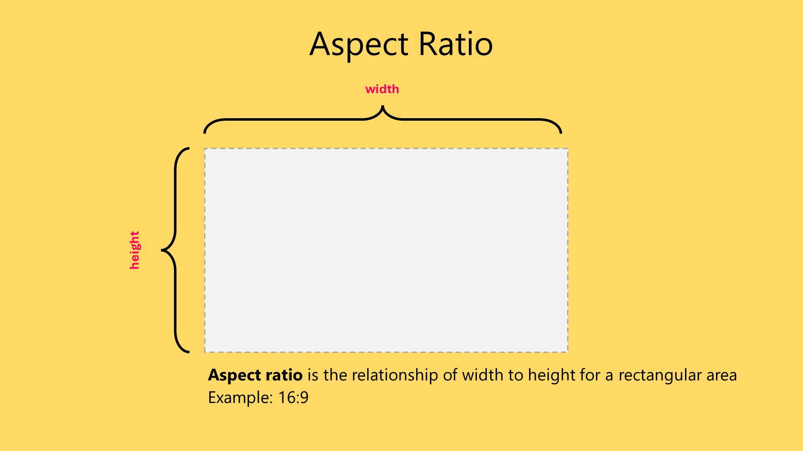
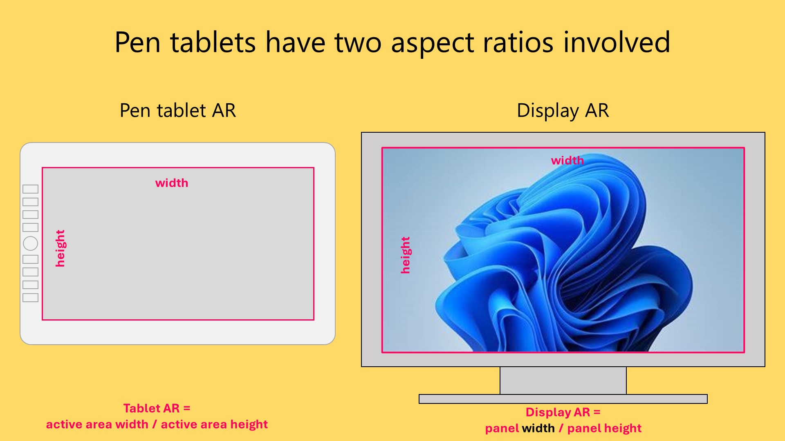
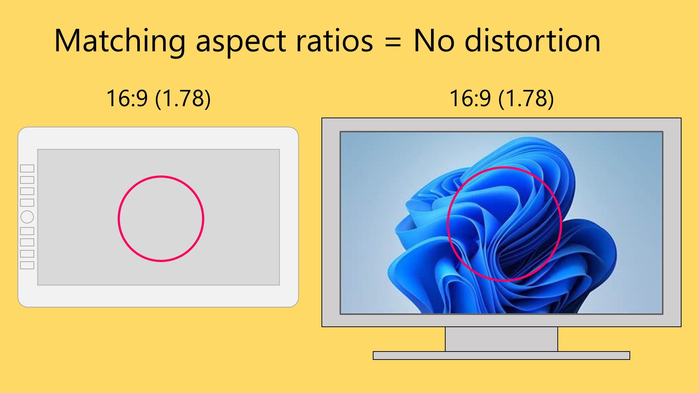
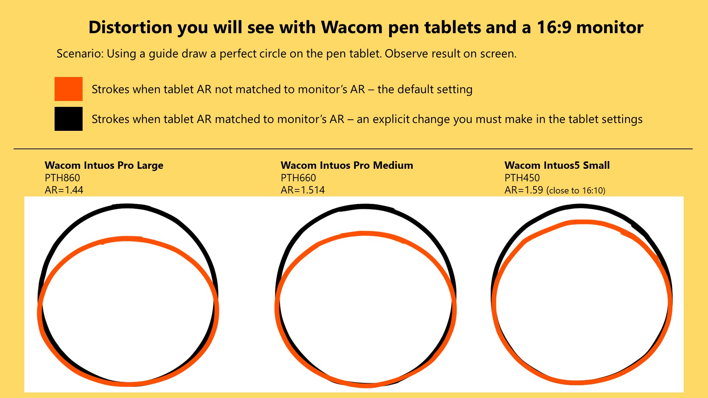
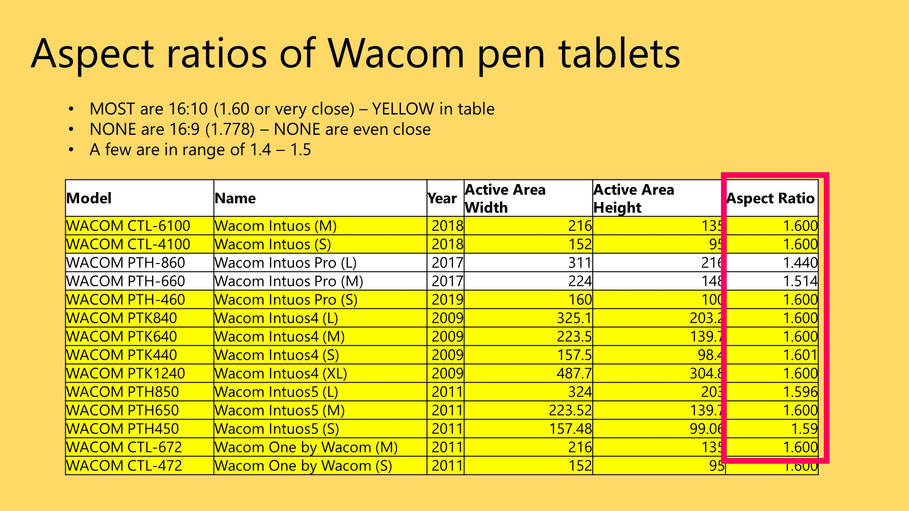

# Active area aspect ratio

## Introduction

The aspect ratio of your drawing tablet's [**active area**](active-area.md), can have a big impact on how good it feels to draw on them.

## Basics

Any rectangular area has an aspect ratio. Which is the relationship between the width and height. Usually we will express the AR as a ratio like 16:9 or 16x9.&#x20;

<figure><figcaption></figcaption></figure>

Displays (monitors) tend to have aspect ratios like 16x9 and 16x10. 16x9 is the most common aspect ratio.

<figure><figcaption></figcaption></figure>

##

## Aspect ratio mismatches with pen tablets

The issue with pen tablets is that the tablet and the display are separate devices. And each has its own aspect ratio.

<figure><figcaption></figcaption></figure>

If the aspect ratios coincidentally match, then there is no distortion when you draw.

<figure><figcaption></figcaption></figure>

But unfortunately, there is almost always some noticable distortion.

Here is the most common one:

* the tablet has AR=16:10
* the display has AR = 16:9

<figure><figcaption></figcaption></figure>

Here are some examples of what happens some Wacom pen tablets because of the mismatched aspect ratios.

<figure><figcaption></figcaption></figure>

### Companion Video

This video goes into great detail about this topic. [https://youtu.be/9oAvsJk5ESU](https://youtu.be/9oAvsJk5ESU)

## Forcing the aspect ratios to match on pen tablets

### Wacom

* Launch **Wacom Tablet Properties**
* Under the **Mapping** tab, enable **Force Proportions**&#x20;

### Huion

* Launch the **HuionTablet App**
* Go to **Working Area**&#x20;
* On the bottom left there is a drop down.&#x20;
* Switch the dropdown to **Screen Ratio**.

### Gaomon

* Open the Gaomon driver app
* Go to **Workspace**
* Select **Screen Ratio**

### XP-Pen

* Open the XP-Pen driver app (called **PenTablet**)
* Go to **Work Area**
* Go to **Pen Tablet**
* Select **Proportion**

## Pen displays and aspect ratios

The active area of a pen display and their display panel inside the pen display are equivalent. So they always match.

## Reference

### A survey of aspect ratios of Wacom pen tablets

As of 2023, NONE of Wacom's pen tablets have an exact 16:9 aspect ratio.

<figure><figcaption></figcaption></figure>

##
