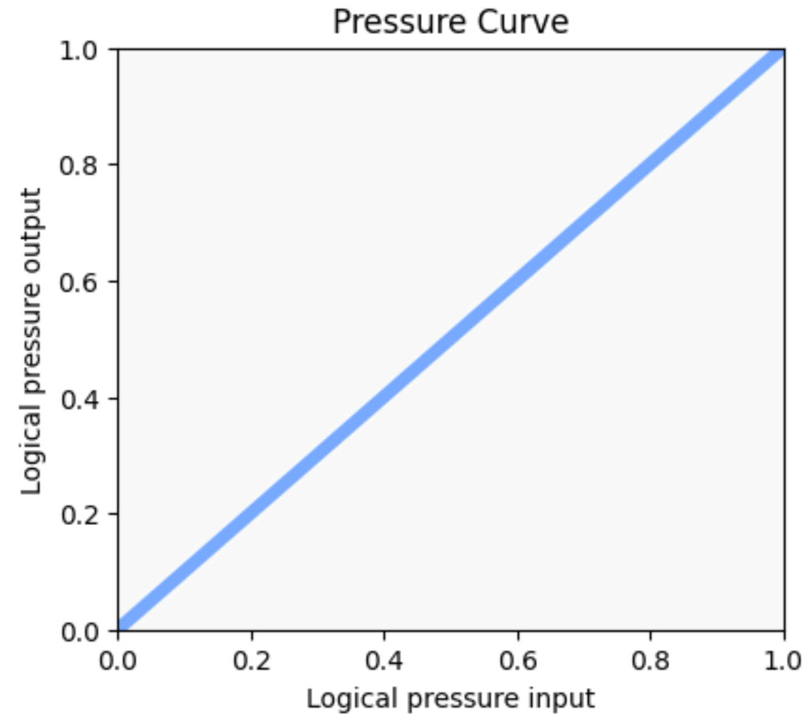

# Active Area Mapping for pen tablets and widescreen monitors

Using a pen tablet with a widescreen monitor presents some challenges and some new opportunities with a pen tablet due to the extreme differences in aspect ratio.

## The typical case

Normally a pen tablet aspect ratio has an aspect ratio of around 16:10 but monitors often have an aspect ratio of 16:9. By default this distorts shapes drawn on the pen tablet so that they appear stretched slightly in one direction. The solution is to force the tablet's active area aspect ratio to match that of the monitor.&#x20;

<figure><figcaption></figcaption></figure>

Because the aspect ratios are close (1.6 vs 1.78), we lose a little bit of active area on the tablet, but now the drawing is without distortion.&#x20;

## The widescreen case

But in the widescreen case, the aspect ratios are quite different (1.6 vs 2.33). So, if we match the tablet's aspect ratio to the monitor, we lose much more active area.

<figure><figcaption></figcaption></figure>

## Options for widescreen monitors

You could map the active area of the tablet to a region of the monitor with the same aspect ratio.

<figure><figcaption></figcaption></figure>

The region is shown in the center of the monitor, but it could be left or right aligned.

You get to use the full area of your tablet, but then you have to carefully possition yoru drawing application into a region that the tablet is mapped to.

This is pretty rare, but I've seen people do it.

If you can reliably tile your windows to the left half and right half, this is an alternative arrangement

<figure><figcaption></figcaption></figure>

It loses active area on the tablet, but may be easier to work with in terms of resizing windows.

Some widescreen monitors, support presenting themselves to a computer as two separate monitors. Usually this requires two separate cables for two separate video signals.

In this case you can map the tablet to one the monitors.

This still loses some active area on the tablet, but now it is very easy to get windows into the appropriate regions.

Also some tablets, have the ability for you to use an express key or a pen button to swap between monitors. This means you can use your tablet with the entire physical display of your monitor.
