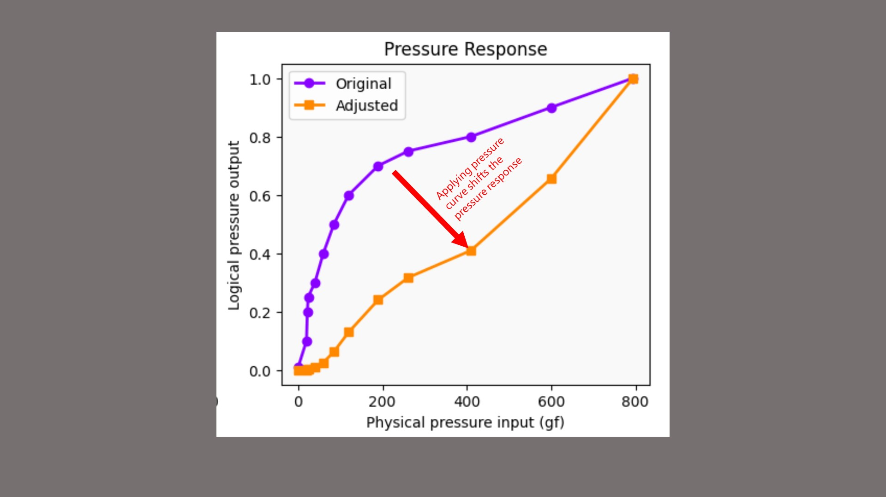
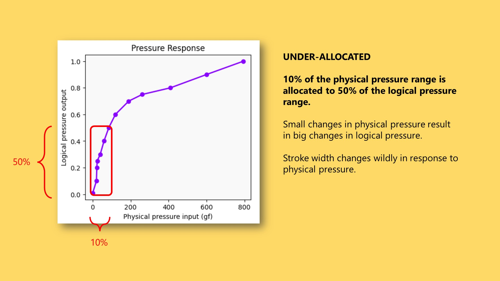
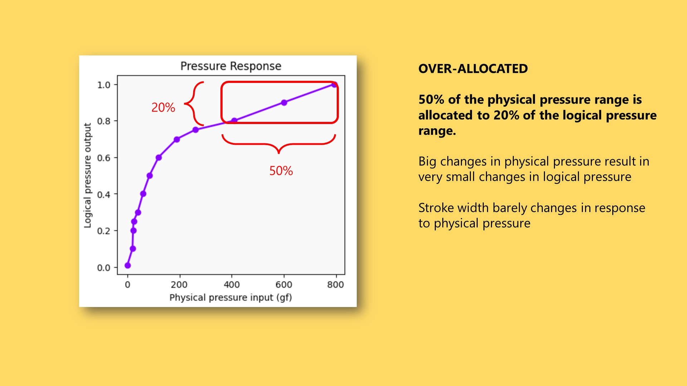
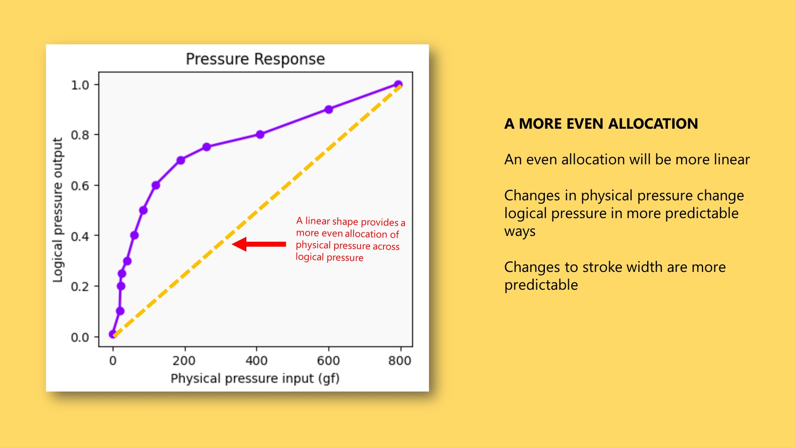
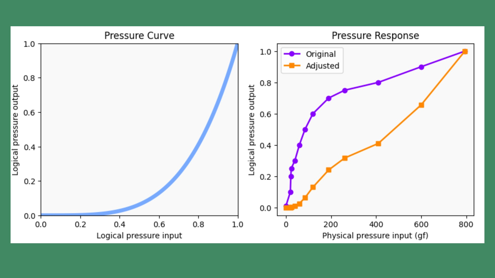

# Pen pressure response

he pressure response of a pen describes the behavior of a pen with regard to pressure.

The pen measures of physical force at its tip. Information about the physical force is sent to the tablet and then translated into a logical pressure value. The pressure response is the relationship between that physical pressure and the logical press.

<figure><figcaption></figcaption></figure>

In numerical terms it can be expressed as a simple set of data points. And if we graph those data points with the physical pressure on the X axis and the logical pressure on the Y axis - then we get a chart that visualizes the pressure response.

<figure><figcaption></figcaption></figure>

All pens come out-of-the-box with a specific pressure response. And keep in mind the response is unique to each pen. The response even for pens of the same model will differ a little bit at the very least.

One thing that is generally found among EMR - is that the shape of the pressure response is bowed up quite a bit.

<figure><figcaption></figcaption></figure>

If we need to change the pressure response of a pen. We have to apply a pressure curve.

<figure><figcaption></figcaption></figure>

&#x20;A pressure curve modifies a pressure response. You could think of it as creating a new pressure response. In the example above the pressure curve that we apply to the original pressure response has created a new pressure response which is much more linear.

I like to think pressure responses and pressure curves as a game of resource allocation - where we are trying to the physical pressure range in useful ways across the logical pressure range.

The reasons we want to think about this allocation intentionally is because it can give us three potential things:

* a better drawing experience
* we might be able to solve problems while we're drawing or even address or mitigate some hardware problems
* and also it's a way of getting some creative effects four our brush strokes

This pressure response is similar to that of a Wacom pro pen 2 (KP-504E). It has that typical bowed up shape. The one thing that separates it from many other pens pressure responses it goes extremely far on the X axis because it has an extremely wide pressure range.

There are two interesting things about how physical pressure is allocated in this specific pressure response.

For the purposes of this discussion I'm going to only talk about how pressure affects the width of a stroke. Simply because it's easiest for me to visualize that in this document. But for everything I'm saying it equally applies when for example pressure is mapped to opacity or even to color.

<figure><figcaption></figcaption></figure>

The first is the shape of the response indicates an under allocation at lower physical pressure. About only 10% of the physical pressure range is allocated to about 50% of the logical pressure range.

This means that small changes in physical pressure result in big changes in logical pressure. In turn this means that there are big changes in the width of a stroke.

This can make it feel like it's hard to control the width of your stroke when you're drawing very lightly.

<figure><figcaption></figcaption></figure>

At the higher end of this pressure response we encounter an over allocation of physical pressure to logical pressure. About 50% of the physical pressure range is allocated to only about 10% of the logical pressure range.

This means that big changes in physical pressure produce small changes in lot pressure which produce small changes in the width of a stroke.

This can make it seem like you're pressing very hard but you aren't seeing your stroke size increase or decrease by much.

<figure><figcaption></figcaption></figure>

In general I think we would want a more even allocation of physical pressure range into the logical pressure range. The visualization of such a more evenly allocated pressure response is one that is much more linear.

To be clear I am not saying that linear is the best shape for a pressure response. I'm just saying it's a good starting point. Ultimately you'll have to use pressure curves to change your pressure response into something that works for you.

<figure><figcaption></figcaption></figure>

Here you can see how a specific pressure curve takes the original pressure response and shifts it to a more linear shape. I'll show you this example just to help illustrate how much you might have to bend the pressure curve to get a linear response.

And keep in mind again that the pressure response shown is for specific pen. This pressure curve may not have the same effect on different pens.

