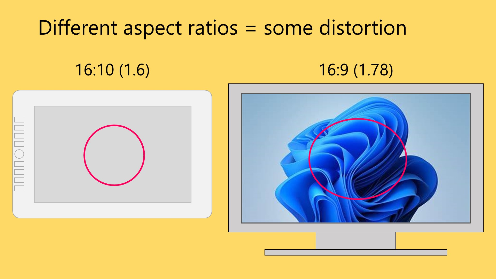
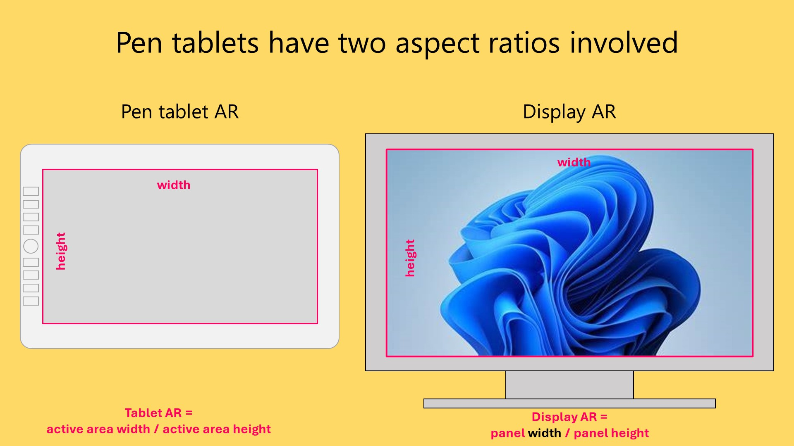
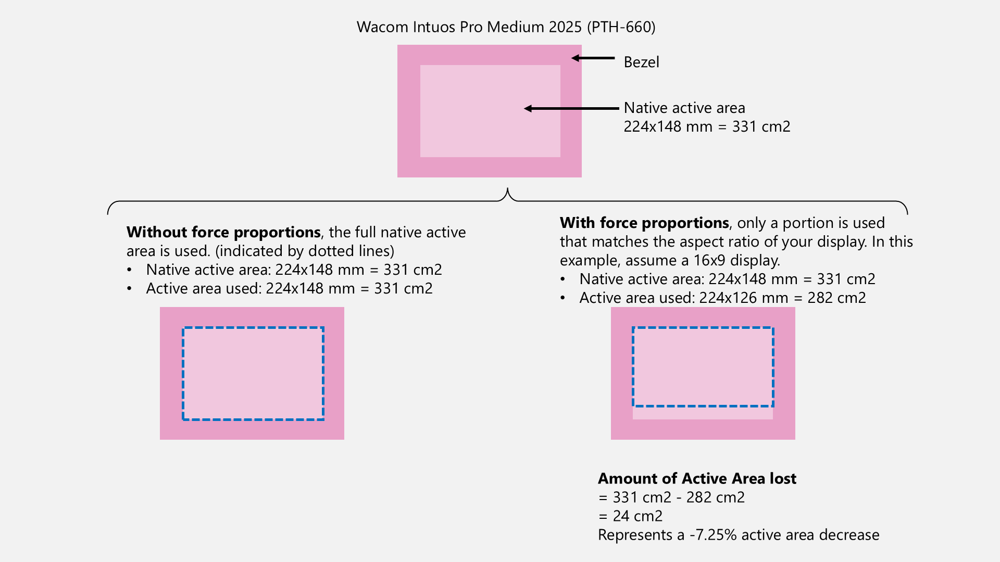

# Matching aspect ratios with Force Proportions

## Introduction

I STRONGLY RECOMMEND that you ENABLE FORCE PROPORTIONS if you are using a pen tablet (screenless tablet). Once you enable Force Proportions, you will find it easier and more natural to draw.

## Terminology

**"Force Proportions"** is Wacom term. Other tablet brands use different names such as "Screen ratio" or "Proportion". I'll use Wacom's name for it in this document. This document will show you how to enable the setting for non-Wacom tablet brands.

## Force proportions removes distortion

If the aspect ratio of your pen tablet's active area does not match your monitor's aspect ratio. You will see distortion when drawing. For example, if you trace out a circle on the pen tablet, you will have traced out an oval on the screen.

This distortion affects every movement of your pen on the tablet. Drawing with this distortion feels VERY WEIRD. You can **EASILY** correct this by enabling FORCE PROPORTIONS.

<figure><figcaption></figcaption></figure>

## Pen tablets are prone to distortion

Your monitor has its aspect ratio - for example most monitors are 16x9

Your pen tablet's active area has its own aspect ratio - and most often it is NOT exactly 16x9. It can be off by a little bit or by a lot.

<figure><figcaption></figcaption></figure>

So statistically most people run into a mismatch in aspect ratios when using pen tablets. And that means, many people are at the risk of distorted drawing.

## How Force Proportions work

FP restricts the region of the active area that matches to that of your monitor - so the aspect ratios will match. This removes the distortion.

## Enabling force proportions



**Wacom tablet properties app: Force proportions**

* Launch **Wacom Tablet Properties**
* Under the **Mapping** tab, enable **Force Proportions**

**Wacom Center app: Force proportions**

* Launch **Wacom Center**
* Navigate to the **Mapping** tab
* Enable **Force Proportions**



* Open the XP-Pen **PenTablet** driver app
* Go to **Work Area**
* Go to **Pen Tablet**
* Select **Proportion**



* Open the **Gaomon** driver app
* Go to **Workspace**
* Select **Screen Ratio**



* Open the **Xencelabs** driver app
* Go to **Device Settings**
* Navigate to **Tablet to Screen Area Mapping**
* There's a drop down on the left side that has three options: **Full Tablet Area**, **Define Portion**, and **Screen Ratio**
* Select the **Screen Ratio** option



#### Linux (Fedora)

* Open **Settings** > **Graphics Tablets**
* Enable **Keep Aspect Ratio**



* Launch the **HuionTablet** app
* Go to **Working Area**
* On the bottom left there is a drop down.
* Switch the dropdown to **Screen Ratio**./



### Companion video

This video goes into great detail about this topic.



## Active area loss

If you enable FP, you will not be able to take advantage of some of your tablet's full native active area, but BY FAR this is the better alternative than distorted drawing.

The amount of active area you lose by turning on force proportions varies depending on the specific aspect ratio of tablet and monitor. The more mismatched they are the bigger the loss. For the Wacom Intuos Pro 2017 series with FP on 16:9 monitors the loss can be between 10% to 20%.

Note that if the active areas of the tablet and monitor are the same, then enabling FP does not incur any loss.

<figure><figcaption></figcaption></figure>

## The amount of distortion varies

Here are some examples of what happens some Wacom pen tablets because of the mismatched aspect ratios when using a 16:9 monitor. The black circle is what I draw on the tablet. The red circle is what actual got drawn on the monitor.

<figure><figcaption></figcaption></figure>

## Multiple displays with Force Proportions

When enabling Force Proportions with multiple displays, you will notice a BIG reduction in the available active area is needed to maintain the correct non-distorted drawing. For this situation, after enabling Force Proportions also enable [Display toggle](../../core/active-area/display-toggle.md).

## Who should enable Force Proportions

* For users of pen tablets (screenless tablets) : YES. I highly recommend it for for everyone using a pen tablet.
* For users of pen displays (screen tablets): NO. It is not needed.

## Simulation

This tool simulates the effect of Force Proportions: [SevenPens Force proportions simulator](../../resources/sevenpens-force-proportions-simulator.md)
