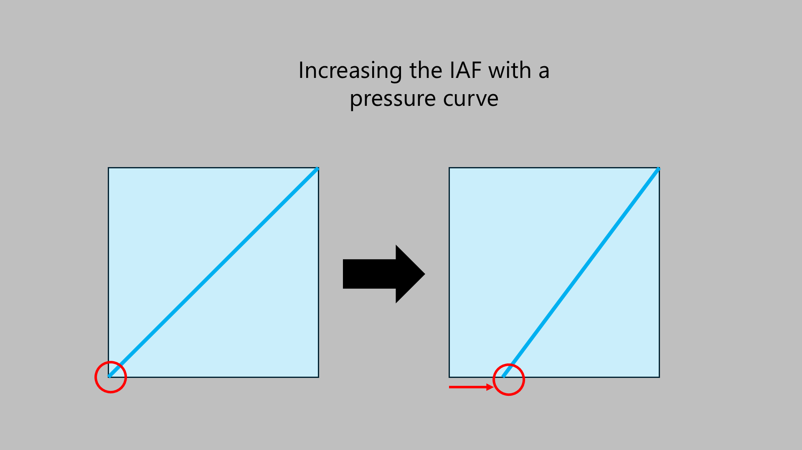

# Increasing IAF

The IAF is a property of the pen hardware. There is nothing you can do to lower the IAF

However, with pressure curves, you can effectively increase the IAF. This is done by moving the lower-left part of the pressure curve to the right.

<figure><figcaption></figcaption></figure>

More here: [Pressure curve dead zones](../../core/pressure/pen-pressure-curves/pressure-curve-deadzone.md)
