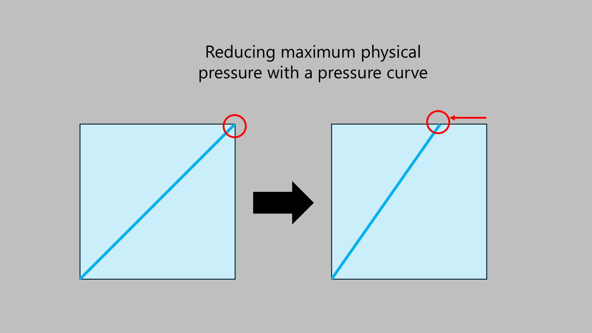

# Lowering maximum physical pressure

The maximum physical pressure is a property of the pen hardware. There is nothing you can do to increase the maximum pressure.

HOWEVER, with pressure curves you can effectively decrease the maximum physical pressure. This is done by moving the upper-right part of the pressure curve to the left.

To decrease the maximum physical pressure:

<figure><figcaption></figcaption></figure>
