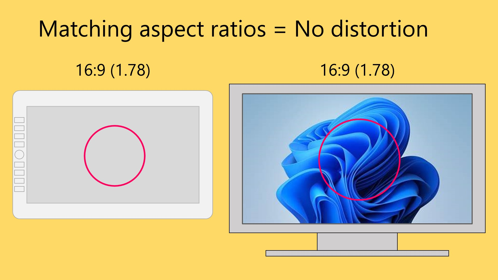
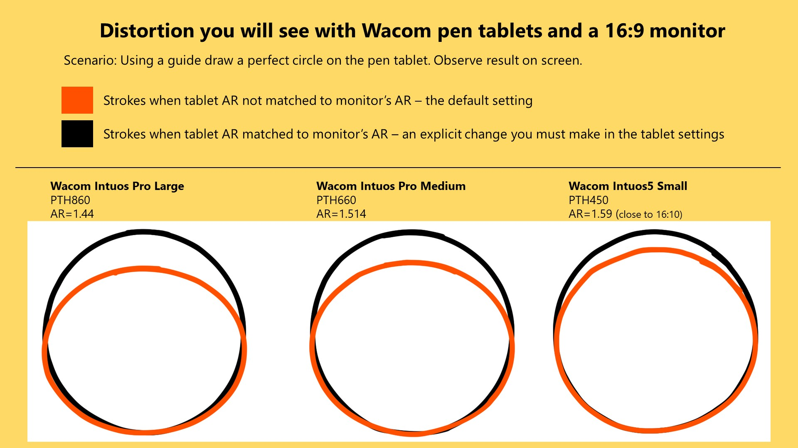

# Matching aspect ratios with Force Proportions

## Introduction

I STRONGLY RECOMMEND that you ENABLE FORCE PROPORTIONS if you are using a pen tablet (screenless tablet). It solves a very common problem for these kinds of tablets. Once you enable Force Proportions, you will find it easier and more natural to draw.

## Terminology

**"Force Proportions"** is Wacom term. Other tablet brands use different names such as "Screen ratio" or "Proportion". I'll use Wacom's name for it in this document. This document will show you how to enable the setting for non-Wacom tablet brands.

## Force proportions solves a common problem

If the aspect ratio of your pen tablet's active area does not match your monitor's aspect ratio. You will see distortion. For example, if you trace out a circle on the pen tablet, you will have traced out an oval on the screen. This distortion affects every movement of your pen on the tablet. Drawing with this distortion feels VERY WEIRD. You can **EASILY** correct this by enabling FORCE PROPORTIONS.&#x20;

<figure><figcaption></figcaption></figure>

## Who should enable Force Proportions

* For users of pen tablets (screenless tablets) : YES. I highly recommend it for for everyone using a pen tablet.
* For users of pen displays (screen tablets): NO. It is not needed.

## Pen tablets are prone to this problem

The issue with pen tablets is that the tablet and the your monitor are separate devices. And each device has its own aspect ratio. The odds of the aspect rations matching by chance are very low. For example, as of 2025 most pen tablets do not have a 16x9 aspect ratio even though most displays do have a 16x9 aspect ratio.

<figure><figcaption></figcaption></figure>

If the aspect ratios match, then there is no distortion when you draw.

<figure><figcaption></figcaption></figure>

## How Force Proportions work

FP restricts the region of the active area that matches to that of your monitor - so the aspect ratios will match. You&#x20;

## Trade-offs

If you enable FP, you will not be able to take advantage of some of your tablet's full native active area, but BY FAR this is the better alternative than distorted drawing.

<figure><figcaption></figcaption></figure>

## Instructions&#x20;

### Wacom > Wacom tablet properties: Force proportions

* Launch **Wacom Tablet Properties**
* Under the **Mapping** tab, enable **Force Proportions**&#x20;

### Wacom > Wacom Center: Force proportions

* Launch **Wacom Center**
* Navigate to the **Mapping** tab
* Enable **Force Proportions**

### Huion: Screen ratio

* Launch the **HuionTablet** app
* Go to **Working Area**&#x20;
* On the bottom left there is a drop down.&#x20;
* Switch the dropdown to **Screen Ratio**.

### Gaomon: Screen ratio

* Open the **Gaomon** driver app
* Go to **Workspace**
* Select **Screen Ratio**

### XP-Pen PenTablet app: Proportion

* Open the XP-Pen **PenTablet** driver app
* Go to **Work Area**
* Go to **Pen Tablet**
* Select **Proportion**

### Xencelabs app: Screen ratio

* Open the **Xencelabs** driver app
* Go to **Device Settings**
* Navigate to **Tablet to Screen Area Mapping**
* There's a drop down on the left side that has three options: **Full Tablet Area**, **Define Portion**, and **Screen Ratio**
* Select the **Screen Ratio** option&#x20;

### Companion video

This video goes into great detail about this topic.&#x20;



## Active area loss

The amount of active area you lose by turning on force proportions varies depending on the specific aspect ratio of tablet and monitor. The more mismatched they are the bigger the loss. For the Wacom Intuos Pro 2017 series with FP on 16:9 monitors the loss can be between 10% to 20%.&#x20;

Note that if the active areas of the tablet and monitor are the same, then enabling FP does not incur any loss.

## The distortion can be significant without Force Proportions

Here are some examples of what happens some Wacom pen tablets because of the mismatched aspect ratios when using a 16:9 monitor. The black circle is what I draw on the tablet. The red circle is what actual got drawn on the monitor.

<figure><figcaption></figcaption></figure>

## Understading force proportions via simulation

This tool simulates the effect of Force Proportions: [**Force proportions simulator**](../../resources/sevenpens-force-proportions-simulator.md) &#x20;
