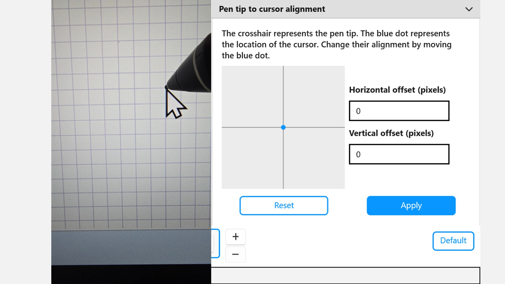
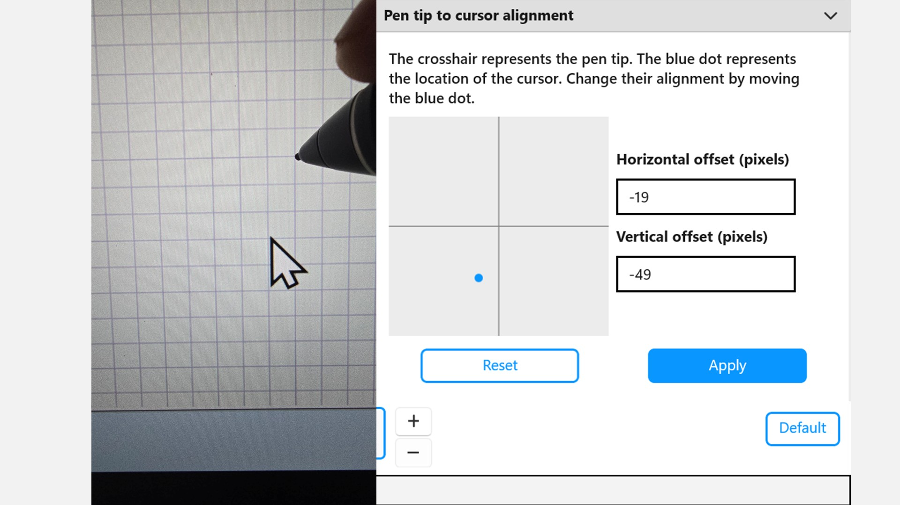

# Configuring pointer offset

## Overview

When you’re drawing on a pen display, the goal is usually to have the pointer sit directly under the pen tip. However, drawing tablet drivers actually let you tweak this alignment and introduce a manual pointer offset for two main reasons:

* **Fixing alignment issues**: Sometimes, due to hardware quirks or calibration errors, the cursor is slightly off from where the pen tip actually touches. Adjusting the offset fixes this so they align perfectly.
* **Getting a clearer view**: Some artists intentionally move the cursor slightly away from the pen tip. This keeps their hand and the pen from blocking the artwork, making it easier to see exactly where the lines are going.

## It is a static offset

This offset is completely static. Once you set it, the distance stays exactly the same across the entire screen. It doesn't dynamically change or adjust based on where your pen is moving.Does this hit the right casual tone for your document? If you want to keep expanding it, let me know if we should add details about specific driver settings or how parallax plays into this. 

## Example with Wacom Center

If you want to configure this on a Wacom display, you can find the settings directly inside the Wacom Center app under the pen's **Advanced Settings**. Look for the section labeled **Pen tip to cursor alignment**. Inside, you'll find two specific adjustment options:

* Horizontal offset: Controls the left-to-right shift.
* Vertical offset: Controls the up-and-down shift.

<figure><figcaption></figcaption></figure>

Both of these fields use pixels as their unit of measurement. By default, the values are set to 0 and 0, which means the cursor is perfectly centered with no offset applied.&#x20;

<figure><figcaption></figcaption></figure>

<figure><figcaption></figcaption></figure>

