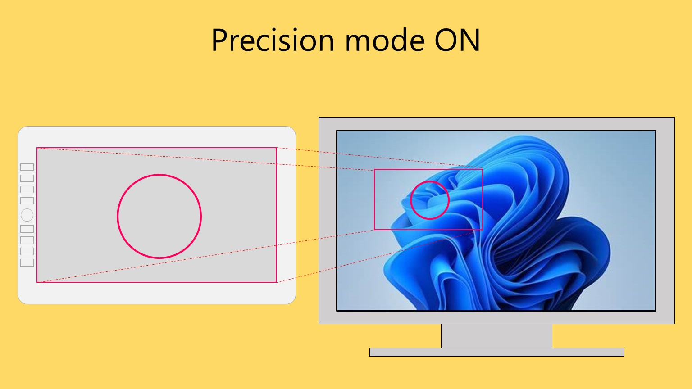

# Precision mode

## Overview

Precision mode is a temporary modification of active area mapping in to help achieve more precise strokes.

## How it works

When precision mode is activated, the active area is left alone but it is mapped to a small area on the screen where the pointer is.

While active, precision mode allows you to make LARGE strokes on the tablet that create SMALLER strokes on the monitor. This has the effect that your strokes get smoother.

<figure><figcaption></figcaption></figure>

<figure><figcaption></figcaption></figure>

## Activating precision mode

Drivers let you toggle precision mode by using a button on the pen or the tablet.

## Availability

Precision mode is available in:

* Wacom driver
* Huion driver
* XP-Pen driver
* Xencelabs driver

## Links

[Wacom - How to use the Wacom's Precision Mode](https://www.youtube.com/watch?v=FzhQcPQaDWs) Nov 14, 2024
