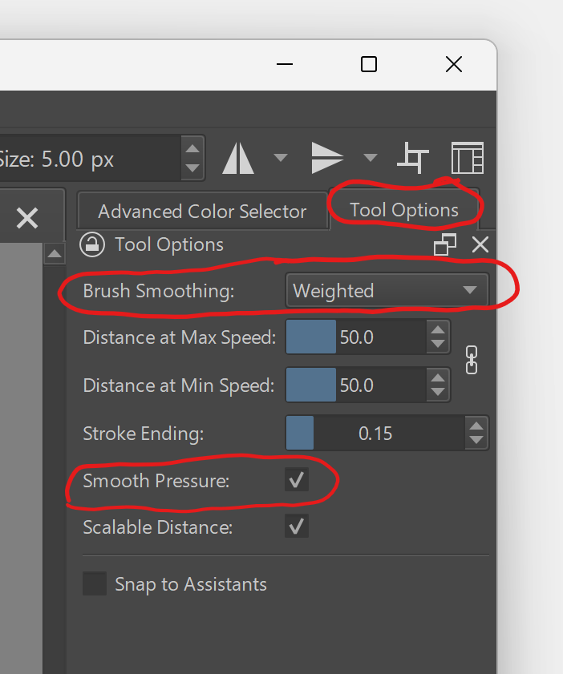
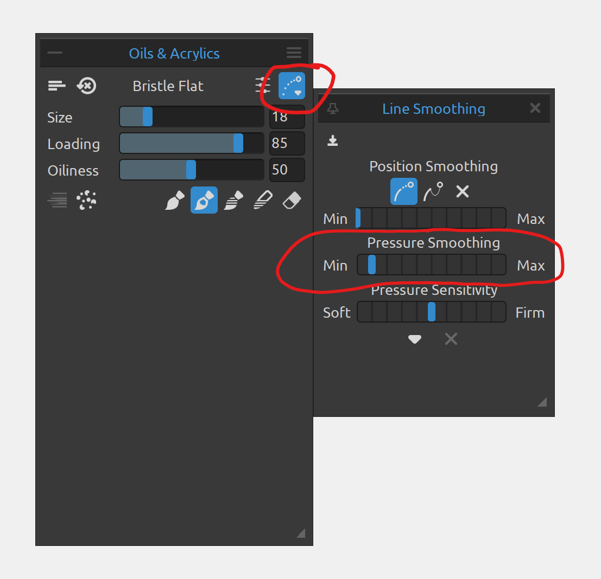

# Pressure smoothing

### Overview

Pressure smoothing is the process of removing noise/jitter/etc in the pressure data from the tablet. It is most often useful in:

* Helping minimize blobby strokes when drawing with low physical pressure near the pen's IAF
* Smoothing out the inherent variations due to holding the pen with the hand and moving the pen across the textured surface of the tablet.

See:

* [Drawing at low physical pressure](../../core/pressure/drawing-low-pressure.md)
* [Drawing smooth strokes](../drawing/drawing-smooth-strokes.md)

### Availability

* Tablets - MAY perform some light pressure smoothing.&#x20;
* Drivers - MAY perform some light pressure smoothing. No drivers offer any direct control over pressure smoothing.
* Applications - MAY support performing some pressure smoothing. If it is done, it might be directly exposed as something users have control over (see Rebelle) or it may be a part of other smoothing/stabilization features (Krita and Clip Studio Paint). Overall it is very rare for an application to explicitly mention pressure smoothing to the user.

### Pressure smoothing in Krita

In Krita, in **Tools Options**, when **Brush Smoothing** is set to Weighted, there is a **Smooth Pressure** checkbox. Note that this pressure smoothing is NOT independent of the position smoothing. You can't have pressure smoothing without position smoothing.

<figure><figcaption></figcaption></figure>

### Pressure smoothing in Rebelle

In Rebelle 8, You can open the **Line Smoothing** UI to configure pressure smoothing. Note that pressure smoothing is independent of position smoothing.

<figure><figcaption></figcaption></figure>
