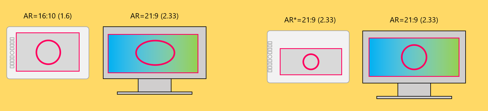
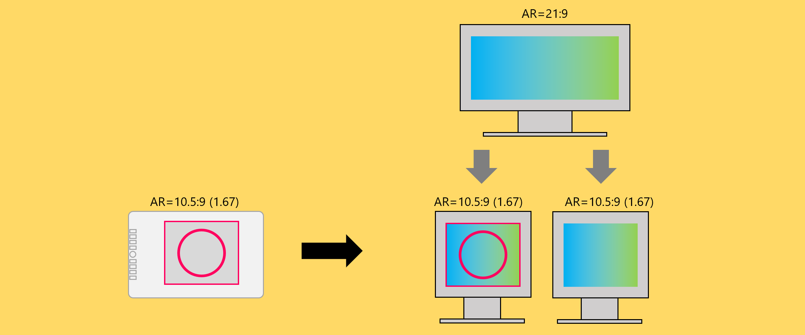

# Using pen tablets with ultrawide monitors

## Overview

Using a pen tablet with a widescreen monitor presents some challenges and some new opportunities with a pen tablet due to the extreme differences in aspect ratio.

## The problem

If your pen tablet and monitor have different aspect ratios (let's say 16:10 or 16:9) the mismatch in aspect ratios, causes strokes to be slightly distorted. For example, a circle drawn on the the pen tablet will appear as an oval on the monitor.

Widescreen or ultrawidescreen monitors have very different aspect ratios. So, the mismatch might be between 16:10 and 32:9. In this case, the distortion will be extreme.

## Option 1: Use Force Proportions. Map a proportional part of the tablet's active area to the entire monitor.

The solution is the use the Force Proportions feature which changes the tablets active area to match that of the monitor. This solves the distortion problem at the cost of the loss of some of the tablet's active area.  See: [**Force proportions**](force-proportions.md)

<figure><figcaption></figcaption></figure>

## Option #2: Entire tablet active area mapped to a portion of the widescreen monitor

This is like the opposite of Option #1.

You could map the active area of the tablet to a region of the monitor with the same aspect ratio.

<figure><figcaption></figcaption></figure>

The region is shown in the center of the monitor, but it could be left or right aligned.

You get to use the full area of your tablet, but then you have to carefully position your drawing application into a region that the tablet is mapped to.

## Option #3 Split the widescreen into two monitors

Some widescreen monitors support being treated as two separate monitors. In this configuration, the computer will be have TWO SEPARATE HDMI CABLES leading to the monitor and will think it connected to two independent monitors. The computer will not realize in any way they are part of the same physical monitor.

Not all monitors support splitting in this way - but when do it can be done via a monitor's **Picture-by-Picture (PBP)** feature. &#x20;

This option:

* Avoids drawing distortion
* Maximizes use of tablet active area
* Maximizes use of monitor screen

Here are the overall steps:

* In the monitor, enable Picture-by-Picture in the monitor
* In the monitor, Connect a second video cable to the monitor
* In the drawing tablet driver, enable Force Proportions
* in the drawing tablet driver, setup a pen or tablet button for Display Toggle

<figure><figcaption></figcaption></figure>

###

