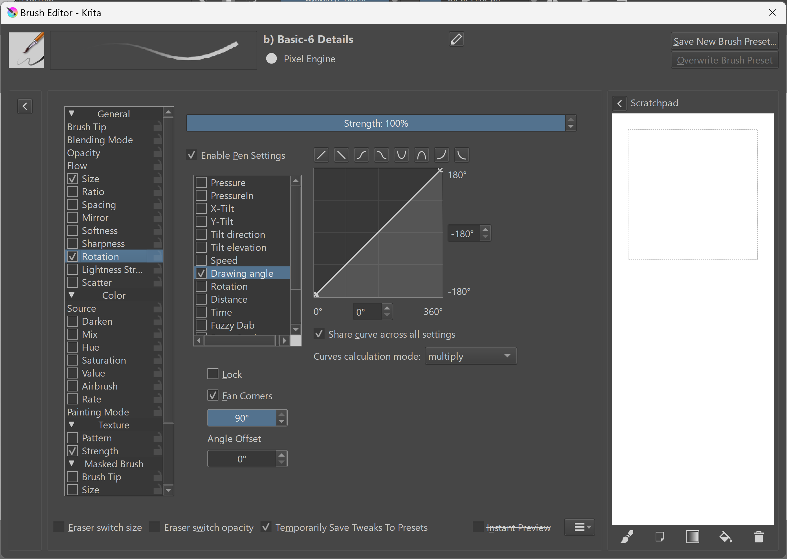

# Using tilt with your brush

## Overview

For background information, see: [Pen tilt](../../core/tilt/)

## App usage of tilt

Even if your tablet is sending tilt data to your computer, your application may or may not be using the data.

* Some applications don't use tilt data at all. Most note-taking applications, such as OneNote, recognize pressure but not tilt.
* Some applications recognize tilt only for specific brushes. For example, a "pencil" brush typically supports tilt. Other brush types may not. These brushes may also have settings for customizing whether and how they use tilt.
* Some applications support tilt, but you have to configure the brush to enable tilt to affect the brush.
* Apps that support tilt use inconsistent terminology to describe tilt. So you may not see it described using standard terms such as tilt altitude and tilt azimuth.

## Krita example

The brush's Rotation setting uses the Drawing Angle, but it could use tilt instead.

* 
