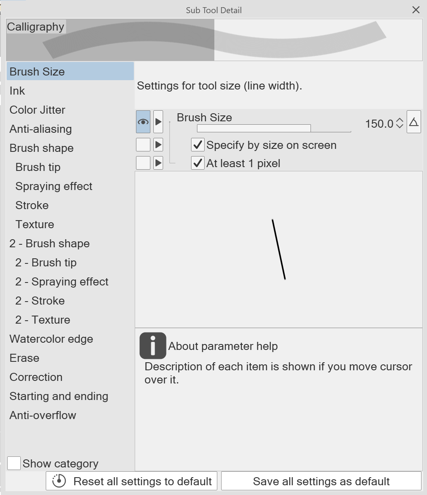
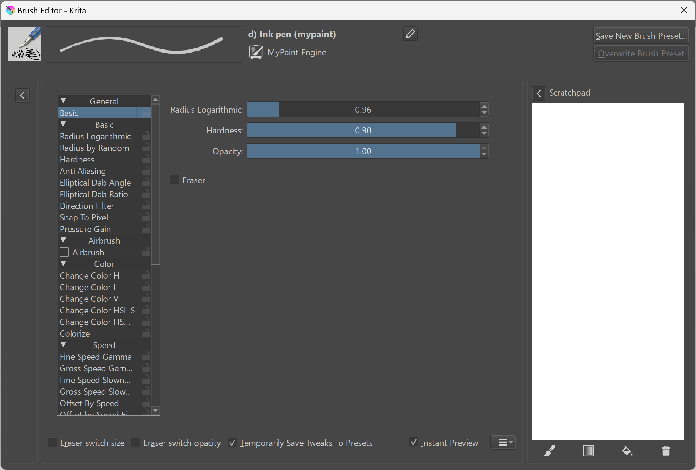

# How a brush engine uses pen data

## Introduction

The tablet sends "tablet reports" to the computer at somewhere around 200 reports per second. Each report contains information like pen position, pressure, tilt, button info, etc. More here: [Tablet reports](../advanced/tablet-reports.md). A brush engine's responsibility is to take that information and use it to draw a stroke in a drawing application.

## Brush engines

In creative applications that draw strokes — applications such as Clip Studio Paint, Krita, or Photoshop — there is a component, or set of components, we can refer to as the **brush engine**.

One of its responsibilities is to take this pen data and combine it to draw a stroke.

## Brush engines vs brushes

Your drawing apps typically feature different brushes: pen, pencil, watercolor, etc. You could think of separate brush engines for each kind of brush. In reality a single brush engine may handle multiple kinds of brushes.

## Applying pen data to the brush

But what all these brush engines have in common is that they transform the pen data in various ways to affect how the brush works.

Typically, these are the ways in which a brush engine can control the stroke:

* stroke opacity
* brush size
* brush rotation

And there are a lot of other settings.

Here is an example from Clip Studio Paint 2.0 for its Calligraphy brush.

Here is an example from Krita.

## Pressure

If you are in a creative application that draws strokes, the most common mapping of pen input to stroke is how pressure is handled. Typically, pressure is either:

* pressure -> ignored - it has no effect on the brush. This is common for very simple brushes.
* pressure -> brush size - more pressure gives a bigger brush.
* pressure -> brush opacity - more pressure gives a more opaque brush.

## Tilt

Tilt typically is treated like this:

* tilt -> Ignored
* tilt -> brush size - for example, a pencil brush may get wider as the pen is tilted to simulate how a real pencil makes wider marks on paper as it is tilted.
* tilt -> brush rotation - using tilt to orient the brush shape.
