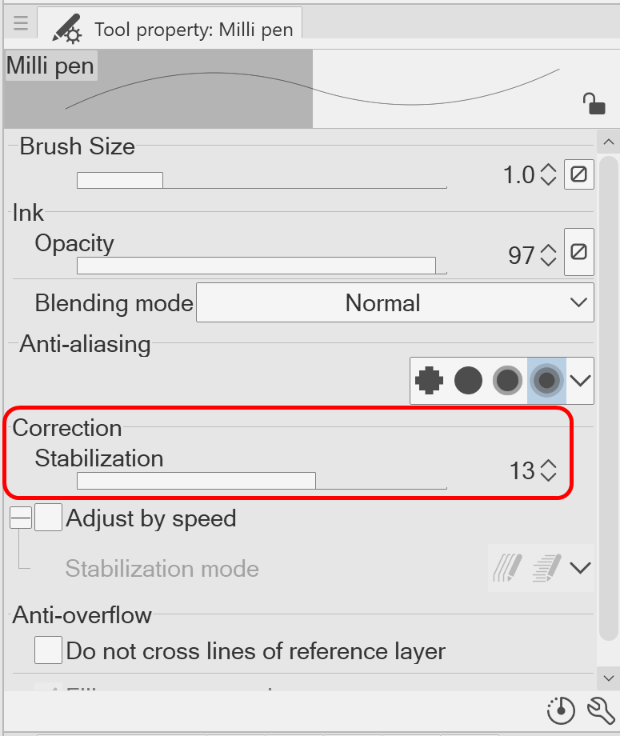
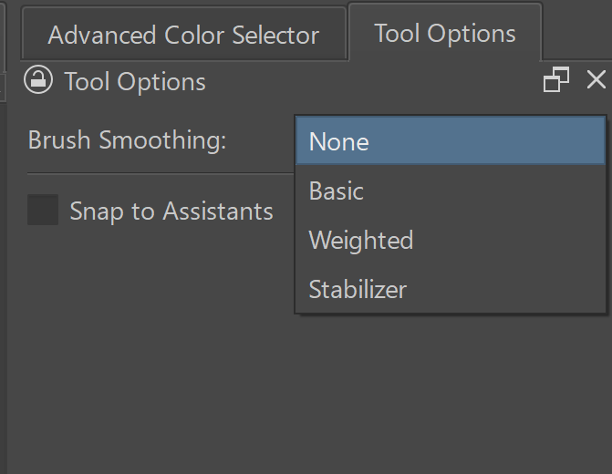
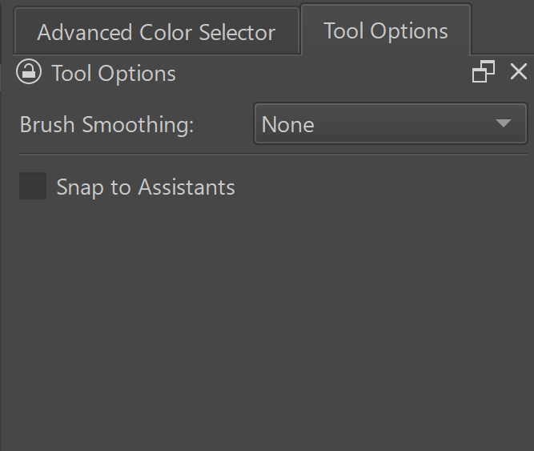
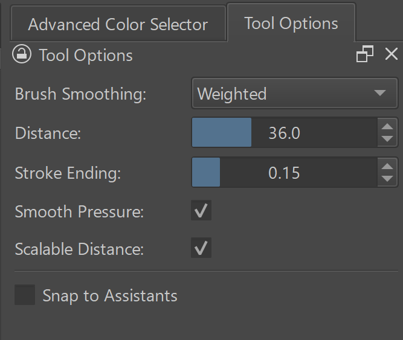
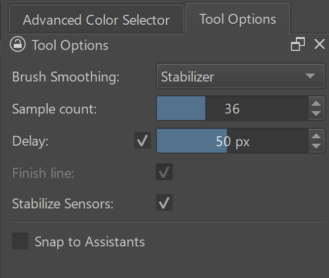

# Configure smoothing in applications

## Clip Studio Paint

In Clip Studio Paint, smoothing is called **Stabilization**. The **Stabilization** setting is found under the brush's **Tool property** > **Correction** options.

If you do not see this setting, click the little wrench icon at the bottom right of the Tool property palette. Then you can see the option, set it, and make it appear in the brush's tool property palette.

## Krita

In Krita, under Tool Options, use the **Brush Smoothing** options.

* [David Revoy - The Brush Stabilizer - Krita features explained](https://www.youtube.com/watch?v=r6-HnDT9GCs) 2024-03-01
* [TutsByKai - HOW TO USE BRUSH SMOOTHING in Krita](https://youtu.be/7epKupnxIDA) 2020-04-29

