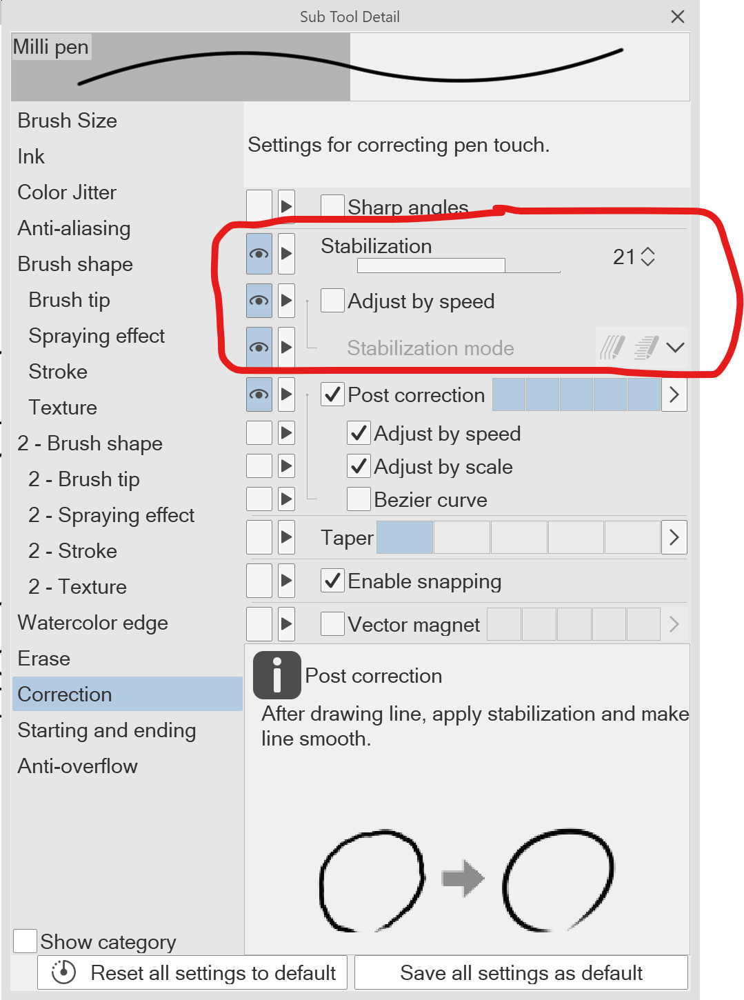
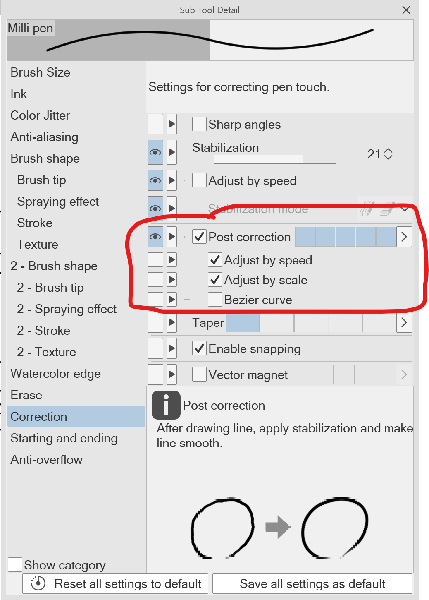

# Drawing smooth strokes

## Overview

When you draw a stroke with a drawing tablet, your stroke will not be perfectly smooth. There are many causes for it any many things you can do to address it.

Smooth can mean different things for a stroke.

* A smoothly changing position
* A smoothly changing stroke width or opacity based on pressure

## Causes

The tablet and driver are components that can contribute to strokes that aren't as smooth as you would like

* All tablets have a degree of [Diagonal wobble](../../core/diagonal-wobble.md) that can appear in your stroke.
* Tablet sometimes exhibit a little bit of "noise" in their stroke. This noise is similar to wobble in that it deviates from a smooth line, but it does so in a more random way.
* The surface of a tablet may be too smooth and this can cause the pen to easily "slip" away from your intended path.

You are user and your drawing style can affect the smoothness of a stroke

* Your hand and arm and way of moving them over the tablet can cause imperfections in your stroke.
* Drawing slower is more prone to introducing errors into your strokes.

## <mark style="color:red;">For pen tablets (screenless tablets), use Force Proportions to match aspect ratios!!!</mark>

If you are using a pen tablet, mismatched aspect rations between your pen tablet and your monitor will distort your strokes and make it harder to draw smoothly. Make sure you check for this and correct it. More here: [Matching aspect ratios with Force Proportions](../customizing/force-proportions.md).

Please do check for this. Many people have been using their tablets for years with mismatched aspect ratios and when they make the ratios match it is a BIG DIFFERENCE in their ability to draw strokes correctly.

## How you hold the pen

Consider how you hold you pen. Different techniques of holding your pen can affect how smooth your strokes are.

* [**Aaron Rutten - How to Hold a Drawing Tablet Pen**](https://www.youtube.com/watch?v=AAm0DrOrDGQ) 2023-09-03
* [**Brad Colbow - How Pros Hold a Pencil**](https://www.youtube.com/watch?v=pB9m4TxZ7oQ) 2024-05-28

## Increase the surface texture of your tablet

Using a digital; pen on a very smooth tablet surface can result in the pen feeling "slippery" as you draw. And so the pen often seems to "slide away" from the intended path of the stroke you are trying to make. This is a common complain for iPads because an iPad's surface if very smooth glass.

Consider buying a protective sheet to increase the surface texture a bit. See: [Surface protection](../../misc/surface-protectors-obsolete.md).

## Use a felt nib

Another way of increasing the surface texture and avoiding a slippery feeling is to use a felt nib. Many tablets now come with felt nibs, though they may not be installed in your pen by default.

## Draw with your shoulder instead of your wrist

Many people draw just by moving their wrist. Try instead drawing by moving your shoulders more.

## Rotate or mirror the canvas to make it easier to draw a smooth stroke.

Usually someone's hand can draw a smooth stroke easier at some angles than at others. For example, if you are right handed drawing a strong from bottom left to top right is easy but drawing from top left to bottom right is harder and the stroke less smooth. Rotate the application canvas so that you accommodate what your hand is better at doing.

## Draw your stroke toward your instead of away from you

Some people find that drawing a stroke toward themselves is easier to keep smooth than drawing away from themselves.

## Draw a faster stroke

Generally speaking a faster stroke will result in a smoother stroke.

## Avoid mouse mode

Occasionally some people enable mouse mode in their tablet driver. Mouse mode uses relative positioning and usually makes it harder to make a consistent stroke. Instead try disabling mouse mode.

## Zoom in as much as possible for your stroke

Use zoom to your advantage. The stroke is affected several things which are physical in nature. For example, a diagonal wobble may introduce a 1mm wobble as your draw. If you are drawing with your canvas zoomed out then 1mm accounts for a lot of pixels. If you zoom in more then the 1mm accounts for fewer pixels of wobble. So you can really minimize some effects my zooming in as much as possible for your stroke. This minimizes the effect of those disturbances and also forces you to draw with a longer stroke which itself will minimize errors.

## Use your tablet's precision mode

Precision mode is a temporary change in how the active area of the tablet is mapped to your desktop. it When, you your large physical gestures on the tablet are mapped to smaller gestures on your screen. That has the effect of making it easier to create smoother strokes especially when you are trying to make small strokes. More here: [Using precision mode](../customizing/precision-mode.md).

## Zooming in vs precision mode

In effect, precision mode, is different way of accomplishing the same thing as zooming in. They both map large physical strokes to small regions on your canvas.

## Application brush smoothing

Use brush smoothing in your applications. Depending on the application, both position smoothing and pressure smoothing can be performed.

### Krita

Krita, under **Tool Options**, has 4 different brush smoothing options: **None**, **Basic**, **Weighted**, and **Stabilizer**.

### Clip Studio Paint

Clip Studio Paint has several options

* A setting called **Stabilization** that goes from 0 to 100. Where 100 adds the most amount of smoothing possible.
* You can also separately use the **Adjust by speed** setting. It has two options: **Increase stabilization when drawing slowly** and **increase stabilization when drawing quickly**.

<figure><figcaption></figcaption></figure>

### Rebelle

Rebelle offers distinct position and brush smoothing.

## Limit what is affecting the width of your brush

Some brushes are configured to calculate the size of the brush based on MULTIPLE points of data from the pen.

For example:

* Both pressure AND tilt may be used to calculate the stroke width.
* You may be expecting a constant width line, but the brush is configured to take pressure or tilt into account to calculate the width.

You may be able to get a smoother and more consistent stroke with if are sure what is contributing to the width and then consider reducing the number of contributing factors.

## Application stroke post-correction smoothing

Some apps like Clip Studio Paint have the ability to "fix" strokes after they have been drawn.

The advantage to this technique is that it doesn't slow down your stroke as you draw.

The disadvantage to this technique is that you don't exactly know the path of your stroke until a moment after you draw the stroke. Also if you draw a sharp corner, post-correction techniques can somethings not recognize the corner and instead show it as a smooth corner.

<figure><figcaption></figcaption></figure>

## Use vector drawing tools

Applications like Krita also support vector tools. If you are having problems with smooth strokes with you pen, the vector tools can produce perfectly smooth strokes.

## Use application auto-shape detection

Some applications, like Procreate on the iPad, have a a shape detection feature. Roughly speaking after you draw a stroke and hold you pen still for a moment, it will recognize a line, or circle, or curve and create a perfect smooth version of your stroke.

## Use application pressure smoothing

A typical EMR pen is hypersensitive to pressure changes especially at the lower end of physical pressure range. Using a pressure curve can reduce some of that sensitivity. Another technique, possible is some apps (for example Krita and Rebelle) is to use **pressure smoothing**.

Note that BOTH a **pressure curve** AND **pressure smoothing** together can produce better results than using them separately.

See: [Pressure smoothing](../customizing/pressure-smoothing.md)

## Use application straight line assistants

Some applications have special ways of drawing straight lines. And these tools are available even if the application is NOT using vectors.

For example in Clip Studio Paint, holding down thew SHIFT key will draw line from the last point the pen was drawing on the canvas to the current position the pen is in.

## Use application guides

Some applications let you add special guides to help draw straight lines.
