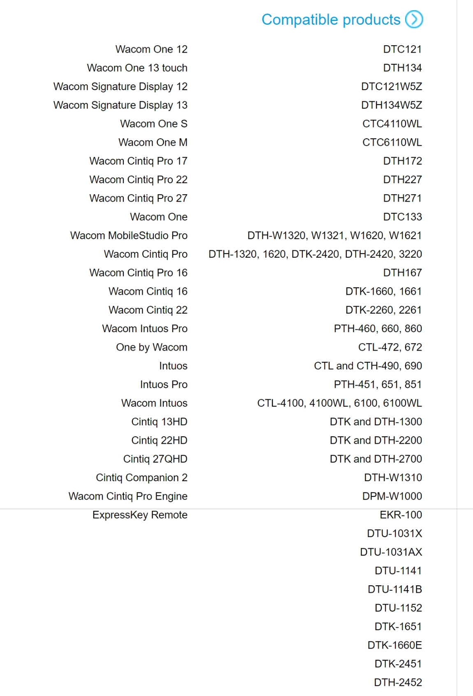

# Drivers

## Overview

To fully use all the features of your drawing tablet, you must to install drivers in your computer.

## The importance of installing tablet drivers

Without tablet drivers you won't be able to:

* Use tilt
* Use pressure
* Configure the buttons on the pen
* Configure buttons on the tablet
* Control which display the tablet is mapped to
* Ensure that you have matching aspect ratios between your tablet and display so that you are drawing without distortion
* Control the pressure curve of the pen - though you will still be able to control it in those applications that support it.

Related video: Why you need to install tablet drivers: [https://www.youtube.com/watch?v=qUsZUcH6SWk](https://www.youtube.com/watch?v=qUsZUcH6SWk)

## Driver downloads

* Wacom: [https://www.wacom.com/en-us/support/product-support/drivers](https://www.wacom.com/en-us/support/product-support/drivers)
* Huion: [https://www.huion.com/download/](https://www.huion.com/download/)
* XP-Pen: [https://www.xp-pen.com/download](https://www.xp-pen.com/download)
* Xencelabs: [https://www.xencelabs.com/support/download-drivers/](https://www.xencelabs.com/support/download-drivers/)

## Using a tablet without installing drivers

In **some** cases it is possible to use a tablet without drivers. More here: [Using a drawing tablet without installing drivers](drawtab-without-installing-drivers.md).

## Driver compatibility with multiple tablets

A specific version of a tablet driver tends to be compatible with a range of tablets from a specific manufacturer.

For example Wacom's windows are compatible with wide range of their tablets.

Here is the [compatibility list](https://cdn.wacom.com/u/productsupport/drivers/win/professional/releasenotes/Windows_6.4.4-3.html) for version 6.4.4-3 of the Wacom drivers.

## OpenTabletDriver

* An alternative to manufacturer-provided drivers is **OpenTabletDriver** ([https://opentabletdriver.net/](https://opentabletdriver.net/))
* If you want to try OpenTabletDriver:
  * [Install OpenTabletDriver on Windows](opentabletdriver/otd-windows-install.md)
  * [Using OpenTabletDriver on MacOS](opentabletdriver/otd-macos-install.md)
