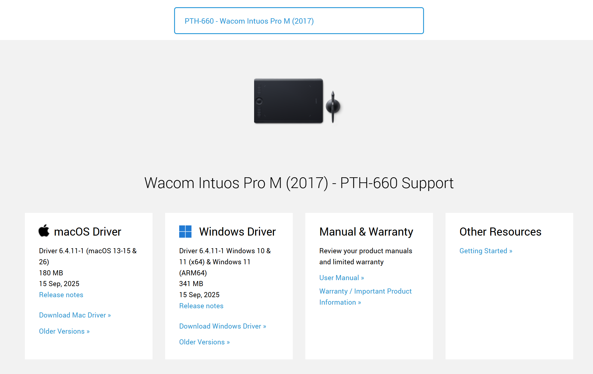
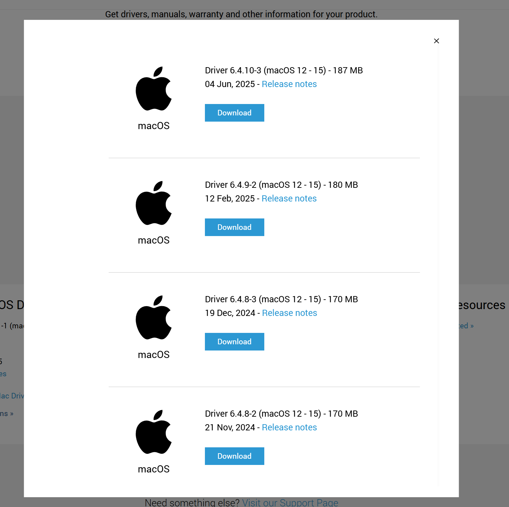

# Older Wacom drivers

There are several ways of finding older Wacom drivers for your tablet.



## Wacom support site

Go here: [https://www.wacom.com/en-us/support/product-support/drivers](https://www.wacom.com/en-us/support/product-support/drivers)

By entering the model name or number. The latest driver for the tablet is shown and link is provided to older drivers.

<figure><figcaption></figcaption></figure>

If you click on Older versions you'll find a small list of older driver versions

<figure><figcaption></figcaption></figure>



Go here for the list: [https://thesevenpens.github.io/Wacom-Driver-List/](https://thesevenpens.github.io/Wacom-Driver-List/)

Docs are here:  [SevenPens Wacom Driver List](../../resources/sevenpens-wacom-driver-list.md)

This is a single unified list for drivers found on Wacom.com and Archive.org

It is useful if you want a simple flat list to look at.

I think this list is also more complete than the other options.



## Archive.org (for Windows drivers)

LINK: [https://archive.org/details/wacom-tablet-drivers-for-windows](https://archive.org/details/wacom-tablet-drivers-for-windows)

Click on SHOW ALL and you'll be taken to the list: [https://archive.org/details/wacom-tablet-drivers-for-windows](https://archive.org/details/wacom-tablet-drivers-for-windows)

Many versions of Wacom drivers are there:

* Some very old
* Some newer
* They may not have the very latest versions though

NOTE: These drivers are stored on archive.org and don't come directly from Wacom's site. So, take precaution against malware.



