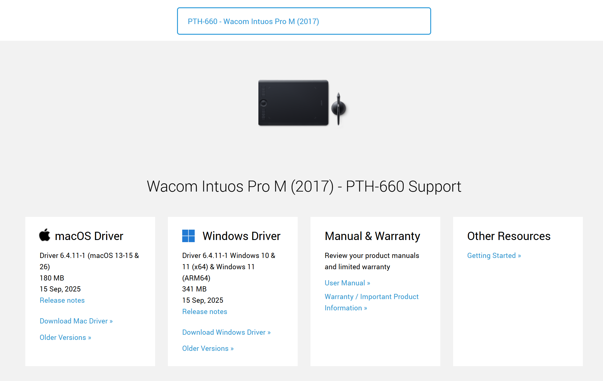
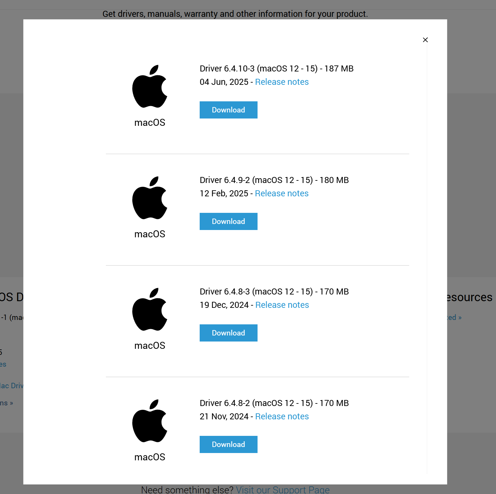

# Older Wacom drivers

There are several ways of finding older Wacom drivers for your tablet.



## Wacom support site

Go here: [https://www.wacom.com/en-us/support/product-support/drivers](https://www.wacom.com/en-us/support/product-support/drivers)

By entering the model name or number, the latest driver for the tablet is shown, and a link to older drivers is provided.

<figure><figcaption></figcaption></figure>

If you click on Older versions, you will find a small list of older driver versions.

<figure><figcaption></figcaption></figure>



This is the list I maintain: [https://thesevenpens.github.io/DrawTabDataExplorer/drivers](https://thesevenpens.github.io/DrawTabDataExplorer/drivers)

Notes:

* This list is built from drivers found on Wacom.com and Archive.org.
* Available as a simple flat list with search and filtering
* This list LINKS to driver downloads on Wacom.com or archive.org. It is not my own copy of the downloads



## Archive.org (for Windows drivers)

LINK: [https://archive.org/details/wacom-tablet-drivers-for-windows](https://archive.org/details/wacom-tablet-drivers-for-windows)

Click on SHOW ALL and you'll be taken to the list: [https://archive.org/details/wacom-tablet-drivers-for-windows](https://archive.org/details/wacom-tablet-drivers-for-windows)

Many versions of Wacom drivers are there:

* Some very old
* Some newer
* They may not have the very latest versions though

NOTE: These drivers are stored on Archive.org and do not come directly from Wacom's site. So, take precautions against malware.


