# Install OpenTabletDriver on macOS

## Overview

This document is for creatives who want to use OpenTabletDriver (OTD) on macOS and need features such as pressure sensitivity and tilt.


If you do not know about OpenTabletDriver or why you might use it, read [OpenTabletDriver](./).

Familiarize yourself with [Notes on OpenTabletDriver](otd-notes.md).

For Windows instructions, see [Install OpenTabletDriver on Windows](otd-windows-install.md).



What follows is a detailed walkthrough for users unfamiliar with OTD. This document **does not** replace the official OTD documentation: [https://opentabletdriver.net/Wiki/Install/MacOS](https://opentabletdriver.net/Wiki/Install/MacOS).



**This document is IN PROGRESS and going through some significant edits. You might encounter incomplete sections.**


### Some expertise is required

Using OTD for artwork is an advanced setup. Try this only if you are confident in your technical skills or can get someone to help you.

### Supported tablets

* OTD supports 300+ tablets from different brands.
* See the complete list of supported tablets at [https://opentabletdriver.net/Tablets](https://opentabletdriver.net/Tablets).

### Version information

#### OTD version

* These instructions cover OTD version `v0.6.6.2`.
* Use OTD version `v0.6.5` or later. Earlier versions do not support pressure or tilt on macOS.

#### macOS versions

* These instructions apply to macOS Tahoe.
* Earlier versions, such as Sequoia, should require similar steps. This has not been confirmed.

#### CPU architecture

OTD runs on both Intel and Apple Silicon Macs, but there is only one macOS build and it is Intel-only (`osx-x64`). OTD does not ship a native Apple Silicon build.

* On an **Intel** Mac, the build runs natively.
* On an **Apple Silicon** Mac (M1 and later), the build runs through **Rosetta 2**. If Rosetta 2 is not already installed, macOS prompts you to install it the first time you launch OTD. Accept the prompt.

### Prerequisites

There are none. The macOS download is self-contained.


If you have read the Windows instructions, note two differences:

* You do **not** need to install the .NET Runtime. The macOS build bundles it. This is why the macOS download is much larger than the Windows one.
* There is no VMulti driver to install, and no Windows Ink plugin. On macOS, pressure and tilt work through the driver itself once OTD is running.


## PHASE 1: Preparation

### STEP 1.1: Verify that OTD supports your tablet

* Find your tablet at [https://opentabletdriver.net/Tablets](https://opentabletdriver.net/Tablets).
  * Some tablets are listed by name, and some are listed by model number.
  * To find your tablet's model number, see [Finding the model number of your drawing tablet](../../general/finding-tablet-model-number.md).

### STEP 1.2: Uninstall existing tablet drivers


**You MUST uninstall any existing tablet drivers on your Mac. If you leave them installed, they will interfere with OTD.**


* If you have a Wacom, Huion, XP-Pen, or other tablet driver, uninstall it now.
* After uninstalling it, restart your Mac.

### STEP 1.3: Download OpenTabletDriver

* Click this link to download [OpenTabletDriver 0.6.6.2 for macOS](https://github.com/OpenTabletDriver/OpenTabletDriver/releases/download/v0.6.6.2/OpenTabletDriver-0.6.6.2_osx-x64.tar.gz).
* This downloads a file called `OpenTabletDriver-0.6.6.2_osx-x64.tar.gz` to your Downloads folder.
* Double-click on the tar.gz file that was downloaded.
* A brief progress bar shows the archive extracting into a folder.
* When extraction finishes, your **Downloads** folder shows the following:

<figure>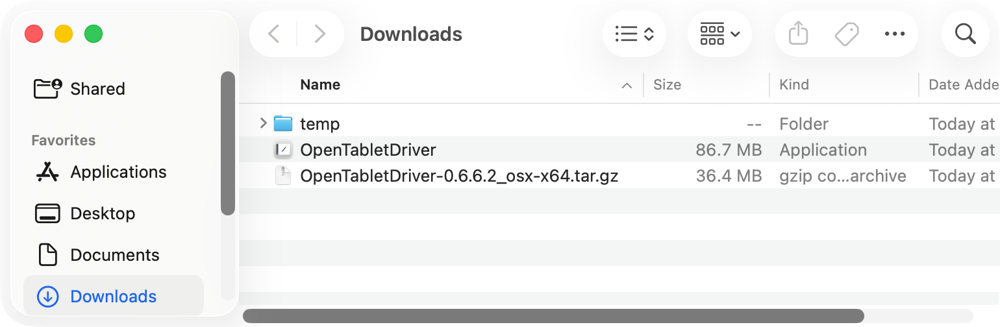<figcaption></figcaption></figure>

### STEP 1.4: Install OpenTabletDriver into Applications

* Open the extracted folder and drag `OpenTabletDriver` into **Applications**.

<figure>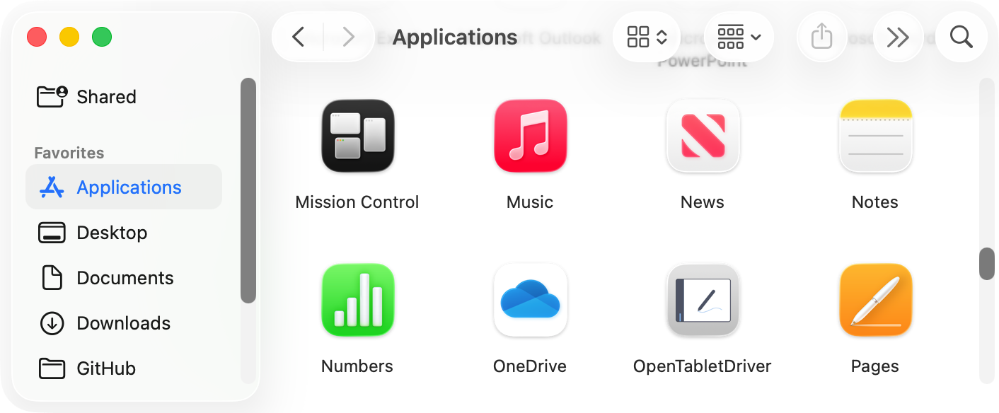<figcaption></figcaption></figure>

## PHASE 2: First launch and permissions

### STEP 2.1: Launch OTD and get past Gatekeeper

* Run the OpenTabletDriver app.
* You will see a warning about verifying OTD.

<figure>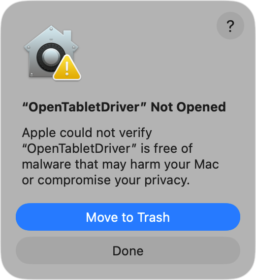<figcaption></figcaption></figure>


This warning is normal. macOS is protecting your device. You will still be able to install OTD.


* Click **Done**.
* To dismiss the “Apple is not able to verify that it is free from malware” warning, go to **System Settings → Privacy & Security**. Scroll down and click **Open Anyway**.

<figure>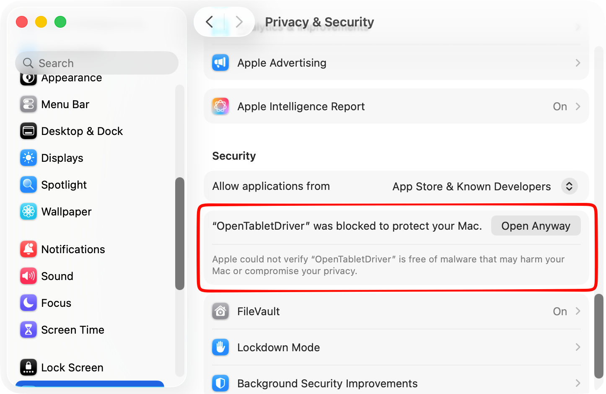<figcaption></figcaption></figure>

* After you click **Open Anyway**, macOS asks you to confirm.

<figure>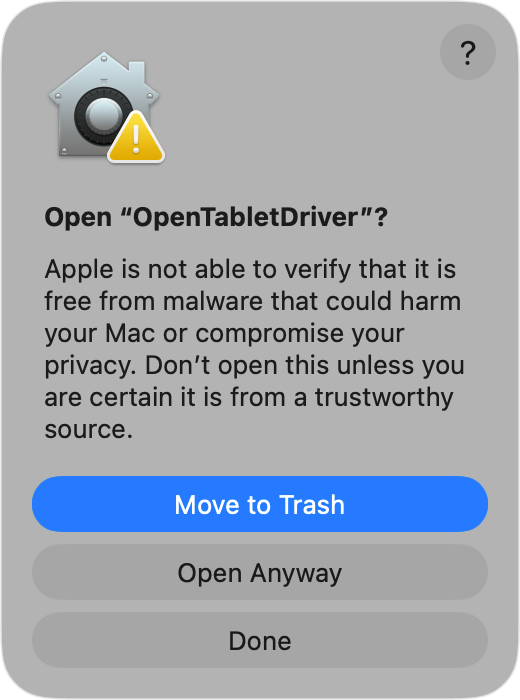<figcaption></figcaption></figure>

* Click **Open Anyway**.
* macOS then prompts you for your password.

### STEP 2.2: Grant the Input Monitoring permission

OTD needs **Input Monitoring** to read the current cursor position, and to send relative movements when you use relative mode.

* OTD explains that it needs the **Input Monitoring** permission. You must grant this for OTD to work correctly.

<figure>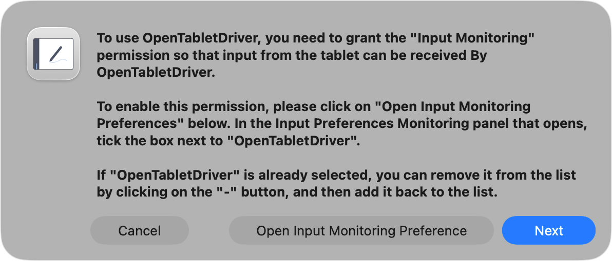<figcaption></figcaption></figure>

* Click **Open Input Monitoring Preference**.
* The **Input Monitoring** panel of **System Settings** opens. Make sure **OpenTabletDriver** is listed and its toggle is turned on.

<figure>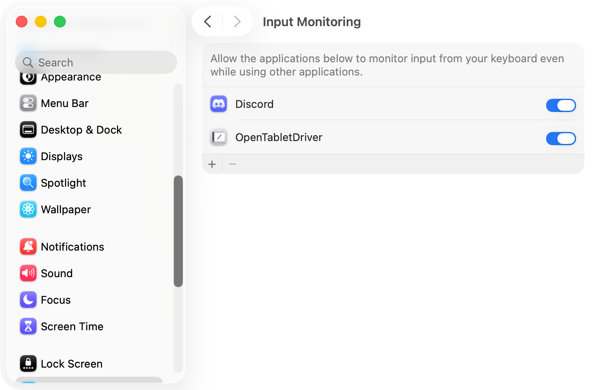<figcaption></figcaption></figure>

* macOS also shows a **Keystroke Receiving** prompt. Click **Open System Settings**.

<figure>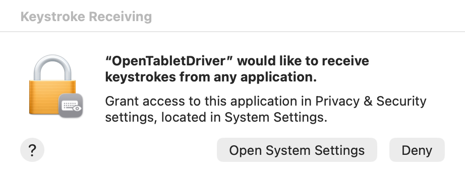<figcaption></figcaption></figure>

### STEP 2.3: Grant the Accessibility permission

OTD needs **Accessibility** to control cursor movement. This is a different job from Input Monitoring, which is why macOS asks for both.


**Accessibility** is a second permission, separate from **Input Monitoring**. You must grant both. If you grant only Input Monitoring, OTD will not work correctly.


* When the **Accessibility Access** prompt appears, click **Open System Settings**.

<figure>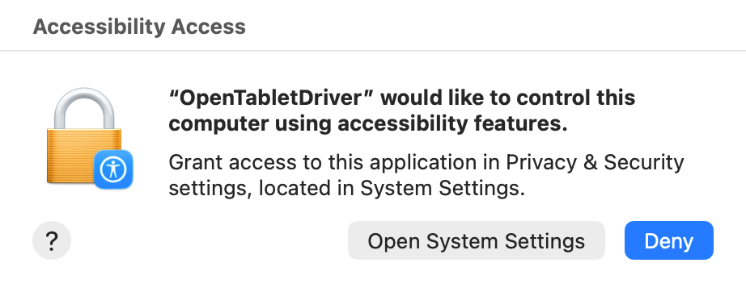<figcaption></figcaption></figure>

* In the **Accessibility** panel, turn on the toggle for **OpenTabletDriver**. You may also see a separate **OpenTabletDriver.UX.MacOS** entry, as shown below.

<figure>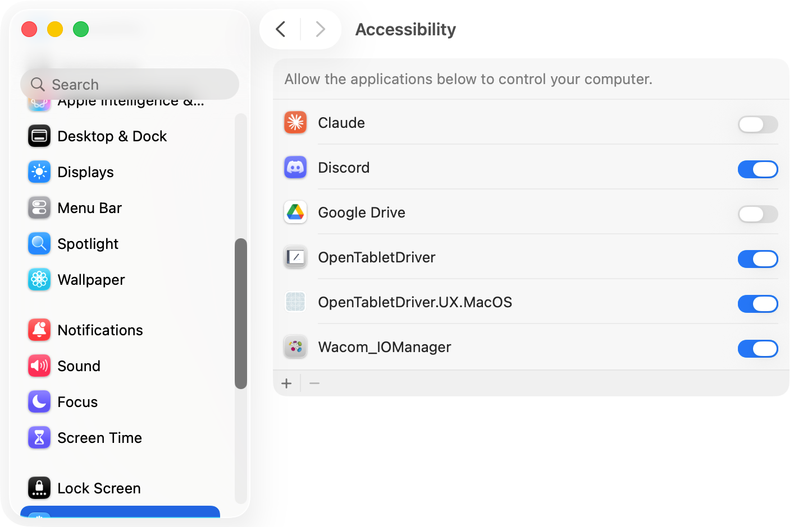<figcaption></figcaption></figure>

#### If a permission looks granted but OTD still does not work

macOS sometimes keeps a stale permission, so the toggle appears to be on while the permission is not actually in effect. This is most likely after you replace or upgrade the app.

To fix it, for either permission:

* In the **Input Monitoring** or **Accessibility** panel, select the **OpenTabletDriver** entry.
* Click the **-** button to remove it.
* Add it back with the **+** button, or restart OTD and grant the permission when it asks again.

### STEP 2.4: Understanding the OTD app on macOS

For you to use OTD on macOS, the OpenTabletDriver app MUST always be running. The app contains the driver daemon that talks to your tablet. If you quit the app, your tablet stops working with OTD.

Although it must always be running, you do not have to keep it visible on your screen. You can hide the window and leave the app running.


**Quitting OpenTabletDriver stops your tablet from working. Closing or hiding the window is fine.**


### STEP 2.5: Detect your tablet with OTD

Launch OTD from **Applications**.

If no tablet is connected, you see the following:

<figure>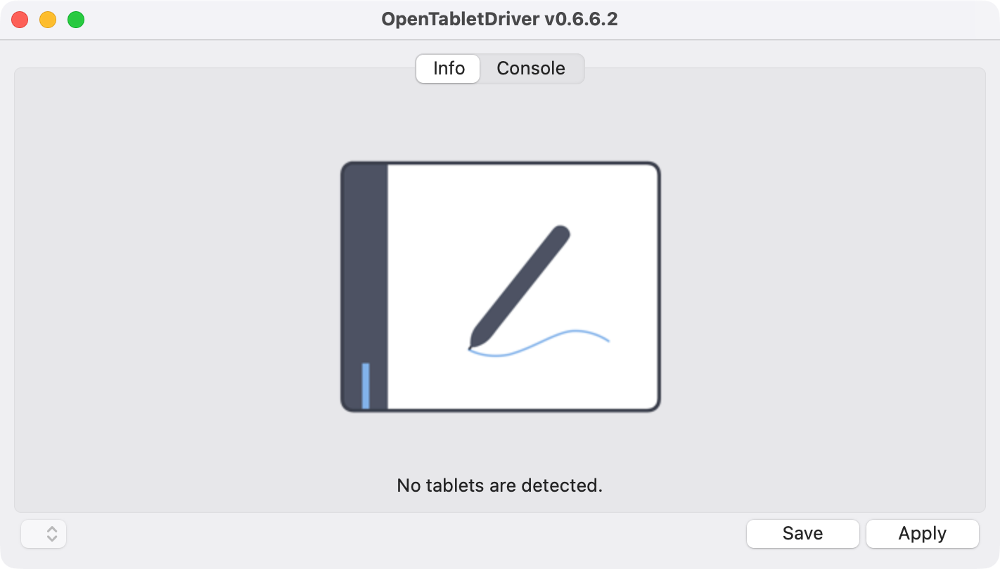<figcaption></figcaption></figure>

When you connect a tablet, the UI changes:


The top blue rectangle in the example picture below is actually TWO monitors stacked on top of each other.


<figure>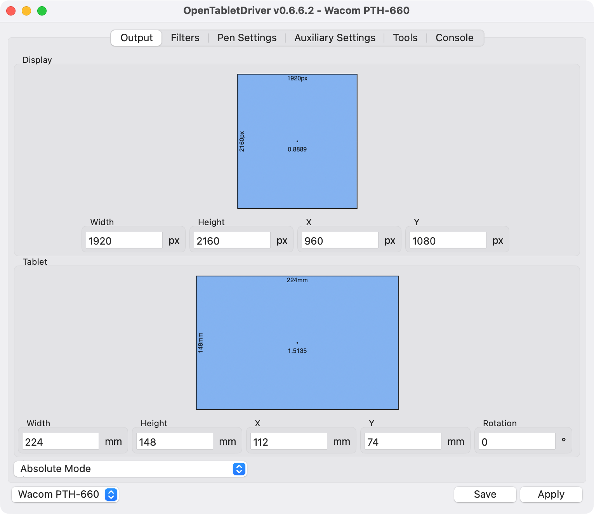<figcaption></figcaption></figure>

At the bottom left, you see:

* The output mode set to **Absolute Mode**.
* The identified tablet. This example shows a Wacom PTH-660, or Wacom Intuos Pro 2017 Medium.
* A vertical virtual desktop shape. It represents two vertically stacked monitors.

### STEP 2.6: Checkpoint

At this point, moving the pen on the tablet should move the mouse pointer.

Do not worry about which monitor the pointer lands on. We will cover that soon.

## PHASE 3: Configuring OTD to work with your tablet

### STEP 3.1: Configure tablet-to-display mapping

Right-click a monitor and select the tablet mapping target.

<figure>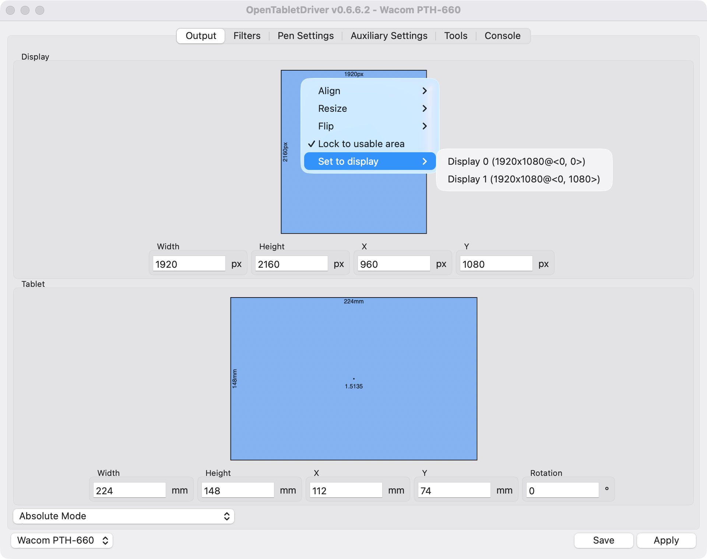<figcaption></figcaption></figure>

The display now looks like this:

<figure>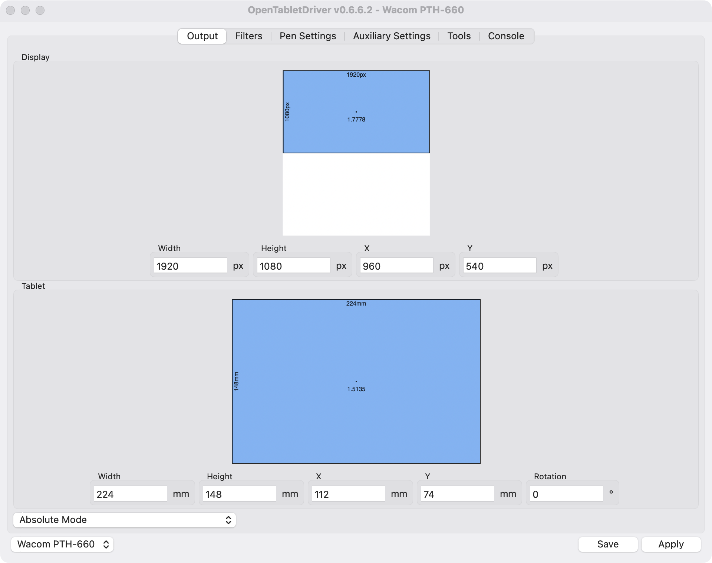<figcaption></figcaption></figure>

Right-click the bottom area and select **Lock Aspect Ratio**.

<figure>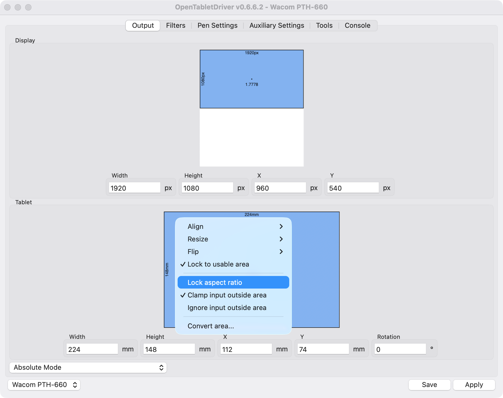<figcaption></figcaption></figure>

The bottom area changes slightly:

<figure>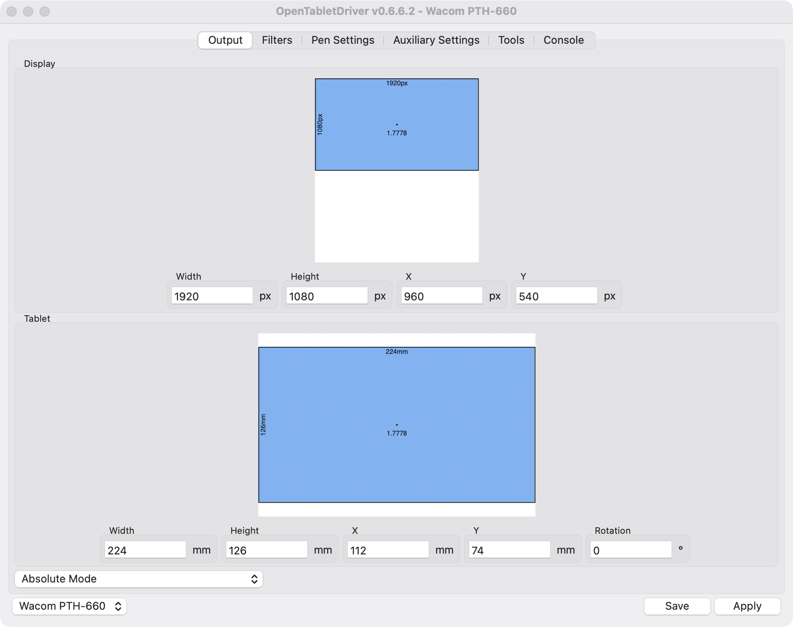<figcaption></figcaption></figure>

This setting prevents stroke distortion.

Click **Apply**, then click **Save**.

### STEP 3.2: Understanding Apply and Save

The previous step asked you to click **Apply** and **Save**. Here is what they do.

You will find both buttons in the bottom-right corner of the OTD window. They stay in the same place no matter which tab you are on.

**Apply**

* **Apply** activates the settings currently shown in the user interface.
* Until you click **Apply**, changes you make in the UI do not take effect.

**Save**

* **Save** stores the current settings, even if you have not clicked **Apply**.
* Those settings load the next time you open OTD.
* You can test this by clicking **Save** without clicking **Apply**, then restarting the OTD app.

To keep things simple for now, always click **Apply** and then **Save** whenever you change something in the OTD app.


**If you close OTD without clicking Save, you lose your changes.**


### STEP 3.3: Configure the pen

Navigate to the **Pen Settings** tab.

By default, the pen will be configured as shown below. Notice that the tip settings, eraser settings, and buttons use `Adaptive Binding`. For now, leave these unchanged.

<figure>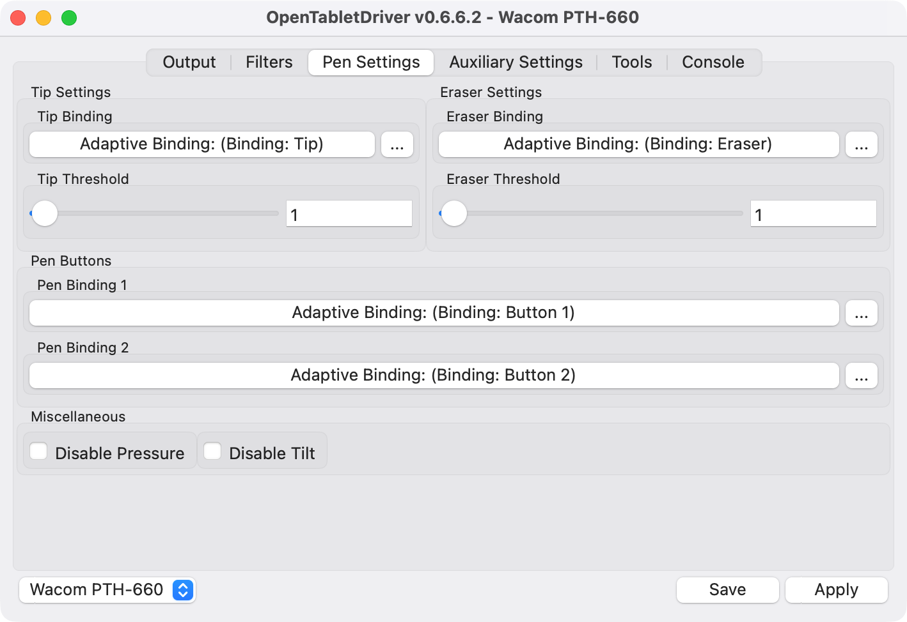<figcaption></figcaption></figure>

Click **Apply**, then click **Save**.


**Note:** Assigning pen buttons to mouse actions, such as left-click, right-click, or middle-click, may cause unstable input.


### STEP 3.4: Configure your drawing application

Unlike Windows, macOS has no separate pen API to enable. There is no Windows Ink equivalent to turn on, and no plugin to install. Once OTD is running and your tablet is detected, pressure and tilt are available to any app that supports a pressure-sensitive tablet.

If pressure does not work in a particular app, check that app's own tablet or pressure settings first.

### STEP 3.5: Checkpoint

At this point, you should be able to draw effectively with OTD, and pressure and tilt should work.

Try some basic drawing in your app of choice and confirm that:

* The pointer stays on the display you mapped the tablet to.
* A circle drawn on the tablet produces a circle on screen, not a stretched oval.
* Pressing harder produces a heavier stroke.

## PHASE 4: Optional customization

**Pressure curves** - By default, OTD does not use a pressure curve to modify how the pressure data is interpreted. However, you can edit the pressure curve by following these instructions: [Pressure curves in OpenTabletDriver](pressure-curves-in-otd.md)

**Smoothing** - [Smoothing with OpenTabletDriver](otd-smoothing.md)

**Tablet buttons** - [Configure tablet buttons with OpenTabletDriver](otd-tablet-buttons.md)

### Start OpenTabletDriver when you log in

Because OTD must stay running, you may want it to start automatically.

* Open **System Settings**.
* Go to **General** > **Login Items & Extensions**.
* Under **Open at Login**, click the **+** button.
* Select **OpenTabletDriver** from **Applications**, then click **Open**.

OTD now starts each time you log in.

### Uninstall OpenTabletDriver

There is no uninstaller. To remove OTD:

* Quit the OpenTabletDriver app.
* Drag `OpenTabletDriver` from **Applications** to the Trash.
* Remove its settings folder at `~/Library/Application Support/OpenTabletDriver`.
* Remove its cache folder at `~/Library/Caches/OpenTabletDriver`.
* In **System Settings** > **Privacy & Security**, remove the OpenTabletDriver entries from **Input Monitoring** and **Accessibility**.

If you want your manufacturer driver back, install it after removing OTD, then restart your Mac.

## Related topics

* [OpenTabletDriver](./)
* [Notes on OpenTabletDriver](otd-notes.md)
* [Install OpenTabletDriver on Windows](otd-windows-install.md)
* [Pressure curves in OpenTabletDriver](pressure-curves-in-otd.md)
* [Smoothing with OpenTabletDriver](otd-smoothing.md)
* [Configure tablet buttons with OpenTabletDriver](otd-tablet-buttons.md)
