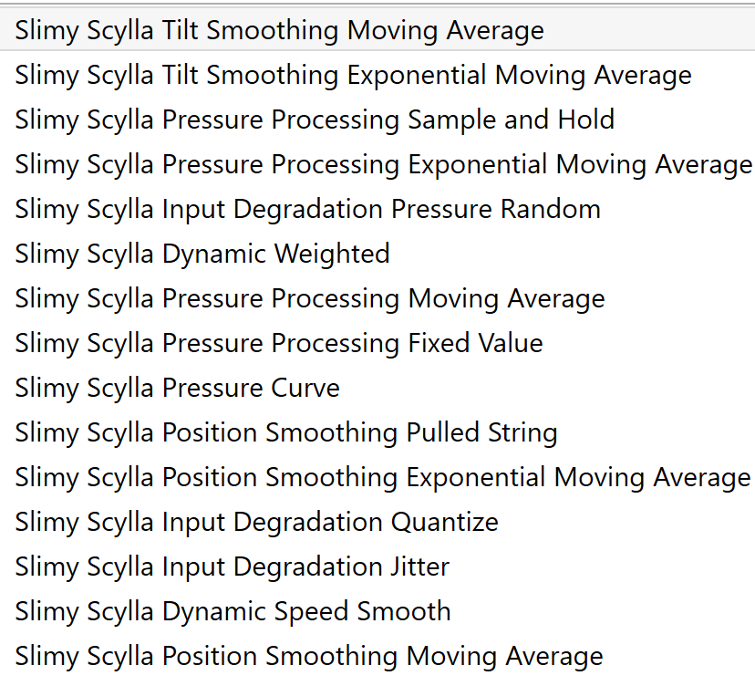
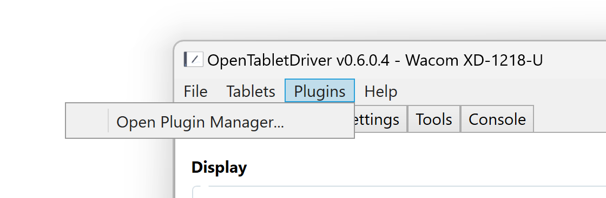
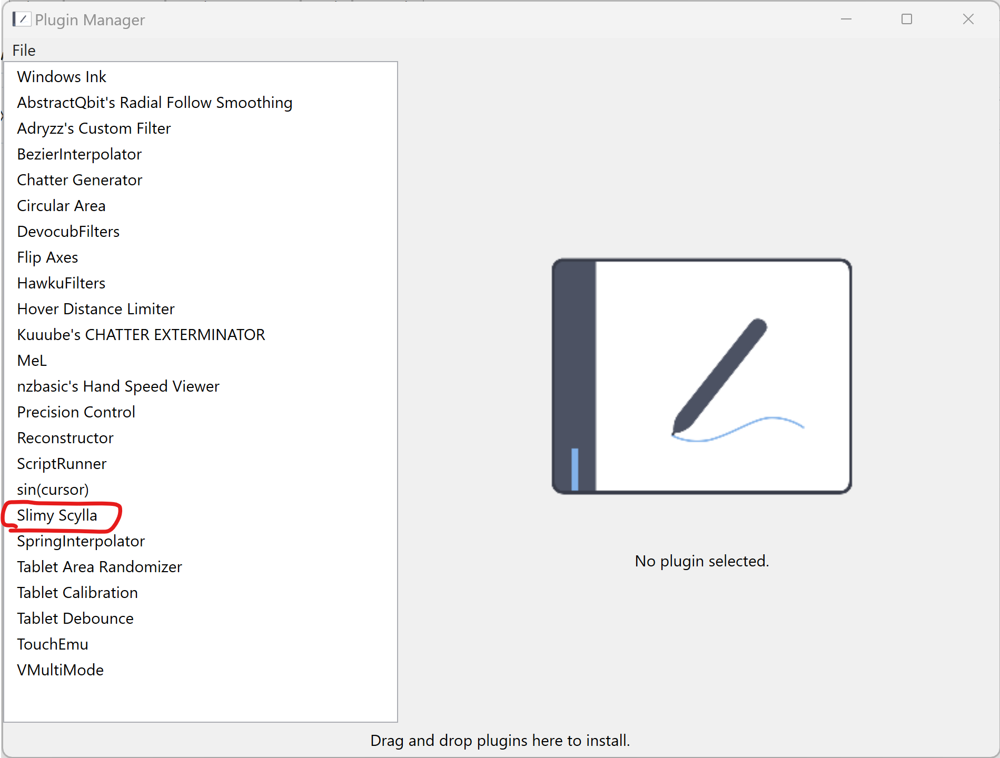
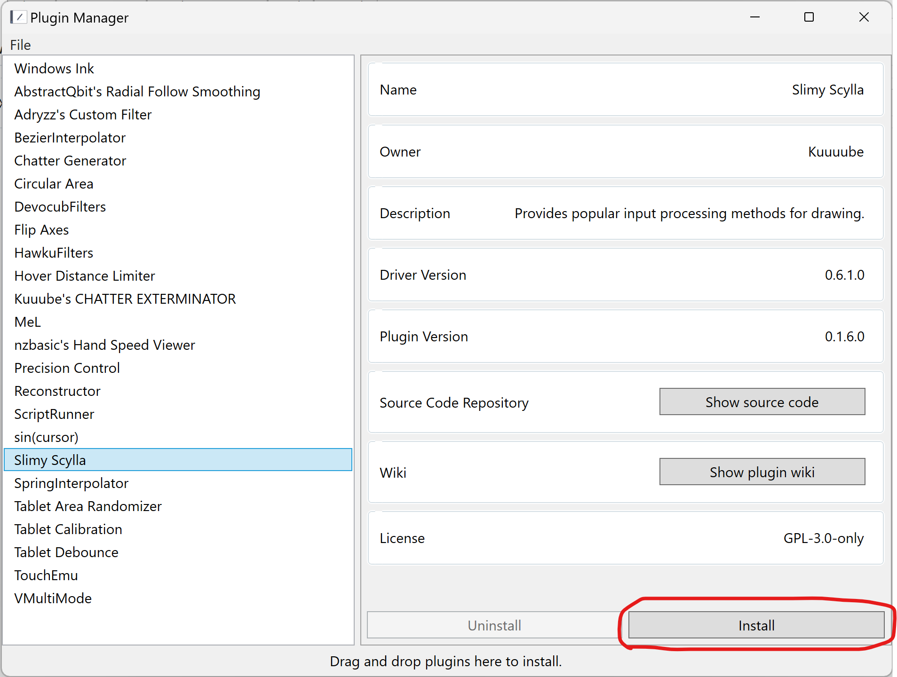
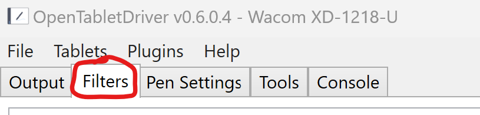
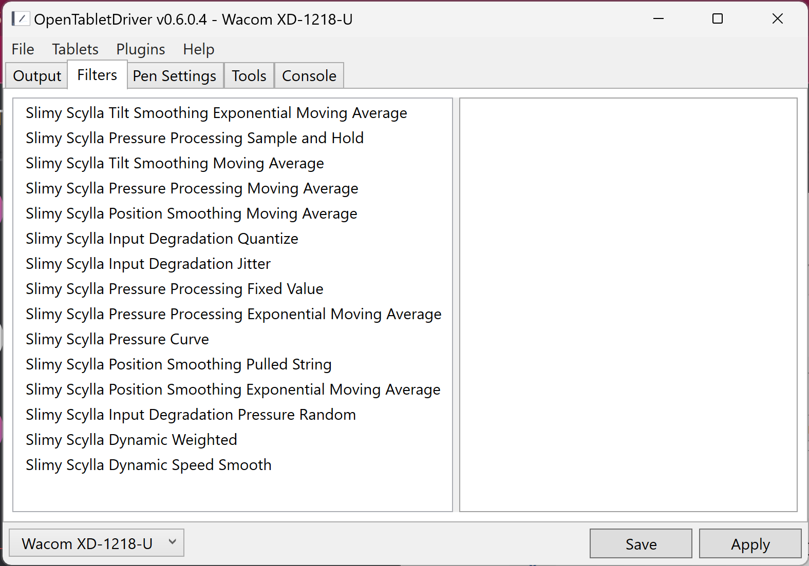
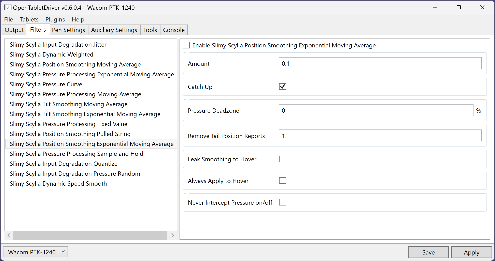

# Slimy Scylla

## Overview

**Slimy Scylla** is created by tablet enthusiast Kuuube.

It is extremely powerful and configurable.

It features many amazing filters:

## Installing Slimy Scylla

Launch the OpenTabletDriver UI.

Navigate to **Plugins** > **Open Plugin Manager**.

The **Plugin Manager** will look like this.

Click **Slimy Scylla** in the list on the left.

Then click **Install**.

Close the **Plugin Manager**.

In the OpenTabletDriver app, click **Filters**.

If Slimy Scylla is installed, you will see many filters whose names begin with **Slimy Scylla**.

To use a filter, enable it, then click **Save**.

## Position smoothing

There are several filters that involve smoothing the position of the pen.

* Position Smoothing Moving Average
* Position Smoothing Pulled String
* Position Smoothing Exponential Moving Average

The one I recommend using is **Position Smoothing Exponential Moving Average**.

## Configuring Position Smoothing Exponential Moving Average

This is what the configuration looks like:

<figure><figcaption></figcaption></figure>

To enable the filter, click **Enable Slimy Scylla ...** at the top, then click **Apply**.

**Amount** = how much smoothing to apply, from 0.0 to 1.0. Start with 0.1.

**Always Apply to Hover** = Leave this unchecked.

Slimy Scylla documentation is available at [https://github.com/Kuuuube/Slimy\_Scylla/tree/main/docs](https://github.com/Kuuuube/Slimy_Scylla/tree/main/docs).
