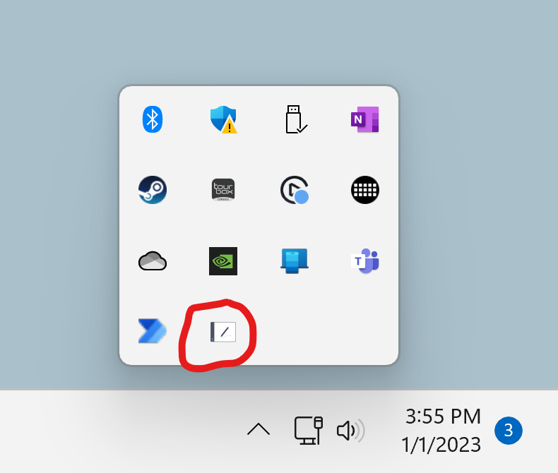
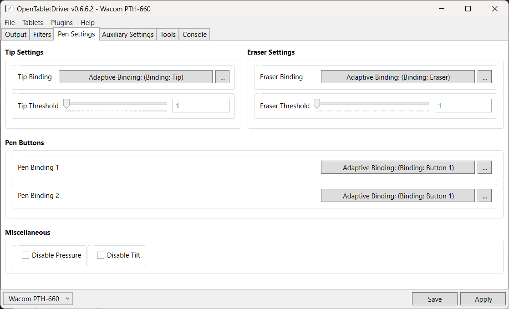
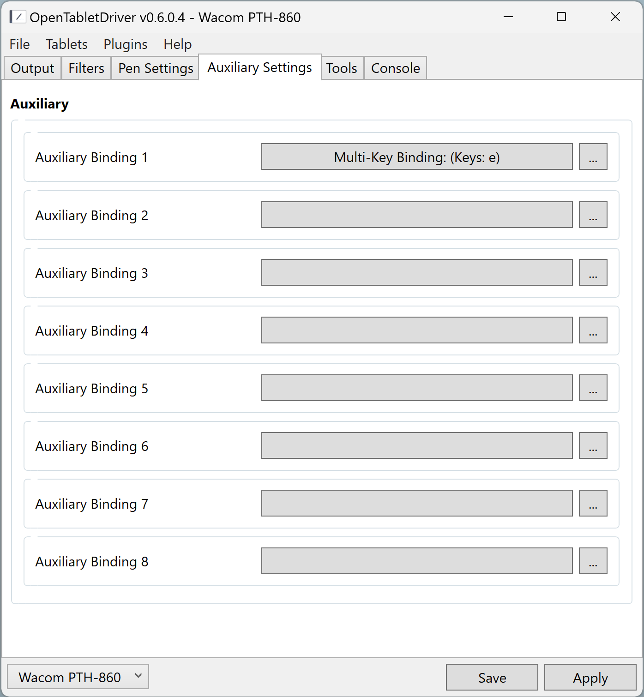
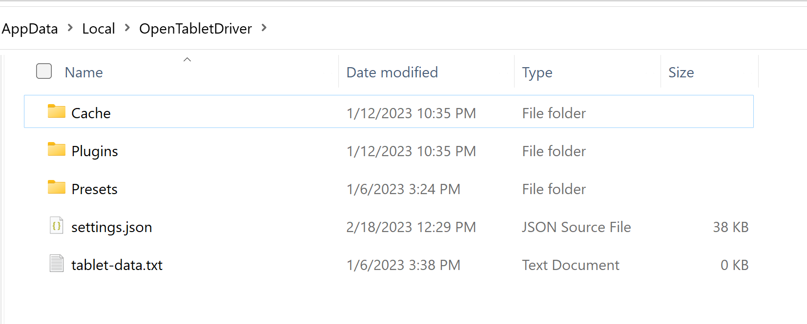
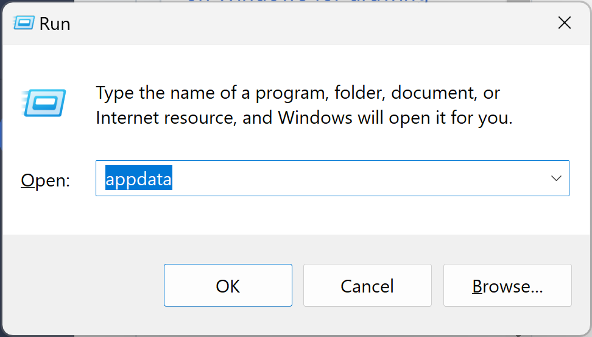

# Install OpenTabletDriver on Windows

## Overview

This document is for creatives who want to use OpenTabletDriver on Windows and need features such as pressure sensitivity and tilt.


If you do not know about OpenTabletDriver, or why you might want to use it, read [OpenTabletDriver](./).

Familiarize yourself with [Notes on OpenTabletDriver](otd-notes.md).

To uninstall it on Windows, see [Uninstall OpenTabletDriver on Windows](otd-windows-uninstall.md).



What follows are the detailed steps I personally use to install OTD on Windows. This document **does not** replace the official OTD documentation: [https://opentabletdriver.net/Wiki](https://opentabletdriver.net/Wiki)


### Some expertise is required

Using OTD for artwork is an advanced setup. Try this only if you are confident in your technical skills or can get someone to help you.

### Supported tablets

* OTD supports 300+ tablets from different brands, as of November 2025.
* See the complete list of supported tablets: [https://opentabletdriver.net/Tablets](https://opentabletdriver.net/Tablets)
* In that list, your tablet may be marked as needing `Zadig WinUSB`. There are special requirements for that case. These instructions do **not** cover them.

### Version information

#### OTD version

* These instructions cover this version of OTD: `v0.6.6.2`

#### Windows versions

* These instructions are for Windows x64 systems only.
* OTD does not support 32-bit versions of Windows.
* OTD does **not** support Windows on ARM.
* I tested these instructions on Windows 11, version `10.0.26200`, build `26200`, on `2025-11-20`.

## PHASE 1: Preparation

### STEP 1.1: Verify that OTD supports your tablet

* Find your tablet here: [https://opentabletdriver.net/Tablets](https://opentabletdriver.net/Tablets)
  * Some tablets are listed by name, and some are listed by model number.
  * To find your tablet's model number, see [Finding the model number of your drawing tablet](../../general/finding-tablet-model-number.md).


If your tablet is marked as `Zadig WinUSB`, there are special installation requirements that are **not** covered in this document. Consult the OTD documentation for help.


### STEP 1.2: Uninstall existing tablet drivers


<mark style="color:red;">You</mark> <mark style="color:red;">**MUST**</mark> <mark style="color:red;">uninstall any existing tablet drivers on your computer. If you leave them installed, they will interfere with OTD.</mark>


* Follow these instructions: [Uninstalling tablet drivers](../uninstalling-tablet-drivers.md)
* To ensure nothing remains, run the [Tablet Driver Cleanup tool](../tablet-driver-cleanup-tool.md).

### STEP 1.3: Create a folder for OTD

* Create a folder somewhere on your computer called `OpenTabletDriver`.
* I prefer to use `C:\OpenTabletDriver`.
* All instructions in this document use `C:\OpenTabletDriver`.

### STEP 1.4: Download the VMulti driver


<mark style="color:red;">You must install the</mark> <mark style="color:red;">**VMulti driver**</mark> <mark style="color:red;">if you want pressure sensitivity and tilt to work with your tablet on Windows.</mark>


* Download `Multi.Driver.zip` from this location:
  * [https://github.com/X9VoiD/vmulti-bin/releases/download/v1.0/VMulti.Driver.zip](https://github.com/X9VoiD/vmulti-bin/releases/download/v1.0/VMulti.Driver.zip)
* Place the zip file inside `C:\OpenTabletDriver`.
* Right-click the zip file, then select **Extract All**.
  * This creates a `C:\OpenTabletDriver\VMulti.Driver` folder.

### STEP 1.5: Install the VMulti driver


<mark style="color:red;">The next step may restart your computer without warning. Close any applications before you install VMulti.</mark>


* Close all applications.
* In the `C:\OpenTabletDriver\VMulti.Driver` folder, right-click `install_hiddriver.bat`, then select **Run as Administrator**.

### STEP 1.6: Install the .NET Runtime


OTD requires a specific version of the .NET Runtime to be installed on your computer. It will not work otherwise.


* Click on this link [https://opentabletdriver.net/Framework](https://opentabletdriver.net/Framework)
  * It opens a page that lists different versions of the .NET framework for OTD to use.
* Under "Windows" click on the link labelled "x64".
  * A download will start for `windowsdesktop-runtime-8.0.22-win-x64.exe`.
* Once the exe file is downloaded, run it to install the .NET Runtime.

### STEP 1.7: Download OpenTabletDriver

* Open a browser to this location:
  * [https://github.com/OpenTabletDriver/OpenTabletDriver/releases/latest](https://github.com/OpenTabletDriver/OpenTabletDriver/releases/latest)
* Scroll down to the section labeled "Assets".
* Look for a file with a name like `OpenTabletDriver-0.6.6.2_win-x64.zip`.
* Download that zip file.
* Move the zip file into the `C:\OpenTabletDriver` folder.
* Right-click on the zip file, then select **Extract All**.
  * This creates a folder with a name like `C:\OpenTabletDriver\OpenTabletDriver-0.6.6.2_win-x64`.

## PHASE 2: OTD Basics and connecting to a tablet

### STEP 2.1: Launch the OpenTabletDriver app for the first time


Do **not** launch the OTD app with **Run as Administrator**. This will cause problems with OTD.


* In the `C:\OpenTabletDriver\OpenTabletDriver-n.n.n.n_win-x64` folder, launch `OpenTabletDriver.UX.Wpf.exe`.
  * This launches the OTD app. (Do not launch it as Administrator)
* If you see a message that ".NET X Desktop Runtime X64 is not installed", then follow its instructions to install that runtime. Then launch `OpenTabletDriver.UX.Wpf.exe` again.
  * This message should not appear because you installed the .NET Runtime in a previous step.
* The **OpenTabletDriver Guide** will automatically start.
* Click the X in the upper-right corner to close the guide.
* You can get back to this guide at any time in OTD by navigating to **Help** > **Show guide**.

### STEP 2.2: Minimizing the OTD app


This is an important thing to learn, because you will be doing it a lot.


* You can keep the OTD app running without leaving it visible on the desktop by minimizing it.
* Once it is minimized, you can find it in the taskbar.
* Click the OTD icon in the taskbar to open the OTD app.

<figure><figcaption></figcaption></figure>

### STEP 2.3: Understanding the OTD app on Windows

For you to use OTD on Windows, the OTD app MUST always be running.

Although it must always be running, you do not have to keep it visible on your screen. You can minimize the app and find it later in the taskbar.

### STEP 2.4: Detect your tablet with OTD

* When the OTD app starts, it will automatically try to detect your tablet.
* The tablet will be shown in the window title at the top and at the bottom left of the application window.
* If needed, you can force detection by clicking **Tablets** > **Detect tablet**.

### STEP 2.5: Checkpoint

At this point, moving the pen on the tablet should move the mouse pointer.

Do not worry about which monitor the mouse is on. We will cover that soon.

Pressure and tilt will not work right now. We will cover that soon.

## PHASE 3: Configuring OTD to work with your tablet

### STEP 3.1: Configure tablet to display mapping

* In the OTD app, go to **Output** > **Tablet**.
* In **Output** > **Display**, right-click anywhere and pick **Set to Display** \<displayname>, where \<displayname> is the specific display you want to use with the tablet.
* In **Output** > **Tablet**, right-click anywhere, then select **Lock Aspect Ratio**.
* 
* At this point, moving the pen will move the pointer on exactly one display.
* There will also be no stroke distortion. For example, a circle on the tablet will make a circle on the monitor with no distortion or stretching.
* Press **APPLY**, then press **SAVE**.

### STEP 3.2: Understanding APPLY and SAVE

The instructions have already asked you to press **APPLY** and **SAVE**. Here is what they do.

**SAVE**

* **SAVE** stores the current settings, even if you have not clicked **APPLY**.
* Those settings will load the next time you open OTD.
* You can test this by clicking **SAVE** without clicking **APPLY**, then starting the OTD app again.

**APPLY**

* **APPLY** activates the current settings shown in the user interface.
* Until you click **APPLY**, changes made in the UI will not take effect.

To keep things simple for now, I suggest that you always click **APPLY** and then **SAVE** whenever you make a change in the OTD app.

### STEP 3.3: Install the Windows Ink plugin

* In the OTD app, navigate to **Plugins** > **Open Plugin Manager**.
* Click the **Windows Ink** plugin, then click **Install**.
* The Windows Ink plugin will appear at the top of the plugin list.
* Close the **Plugin Manager** window.

### STEP 3.4: Configure Windows Ink mapping mode

* In the OTD app, on the bottom, change the **mode** dropdown:
  * from **Absolute Mode**
  * to **Windows Ink Absolute Mode**
  * Click **APPLY**, then click **SAVE**.


NOTE: You will only see **Windows Ink Absolute Mode** listed if you previously enabled the Windows Ink plugin.


### STEP 3.5: Configure the pen

Navigate to the **Pen Settings** tab.

By default, the pen will be configured as shown below.

<figure><figcaption></figcaption></figure>

What to notice here: the tip settings, eraser settings, and the buttons are configured with `Adaptive Binding`. For now, leave these alone.

Click **APPLY** and then **SAVE**.

NOTE: Assigning pen buttons to take mouse actions such as left-click, right-click, or middle-click may cause unstable input. Doing so requires switching from the Windows Ink cursor to the mouse cursor, syncing the position, and sending the mouse button.

### STEP 3.6: Configure your drawing application to use Windows Ink

* The specific instructions vary per app.
* Instructions for specific apps: [Configure Windows Ink for apps](../../platforms/windows/winink/winink-config-apps.md)

### STEP 3.7: Checkpoint

At this point, you should be able to draw effectively with OTD. Pressure and tilt should work.

I suggest that you install Krita and configure it to use Windows Ink.

Try some basic drawing and see if everything is working.

## PHASE 4: Optional customization

### STEP 4.1: Start OpenTabletDriver when Windows starts

* Right-click `OpenTabletDriver.UX.Wpf.exe`.
* Select **Create Shortcut**.
* Right-click the shortcut, then select **Properties**.
* Under **Run**, select **Minimized**.
* Click **OK**.
* Press WINDOWS+R to open the **Run** window.
* In **Open**, type `shell:startup`.
* This will open a new Explorer window pointing to a folder called **Startup**.
* Move the shortcut to the **Startup** folder in that Explorer window.

### STEP 4.2: Pressure curves

By default, OTD does not use a pressure curve to modify how the pressure data is interpreted. However, you can edit the pressure curve by following these instructions: [Pressure curves in OpenTabletDriver](pressure-curves-in-otd.md)

### STEP 4.3: Smoothing

By default, OTD performs no smoothing on the pen data. This is desirable because:

* it gives you a very responsive drawing experience
* it gives you complete control over smoothing

There are two ways to introduce smoothing:

* **Application-level smoothing** - To add smoothing back to your drawing, the first and easiest option is to use the smoothing features in your drawing application. Learn more here: [Configure smoothing in applications](../../drawing/configure-smoothing-in-apps.md)
* **Driver-level smoothing in OTD** - This is a little more complex. Learn more here: [Smoothing with OpenTabletDriver](otd-smoothing.md)

### STEP 4.4: Configure tablet buttons

* Open the **Auxiliary Settings** tab.
* Each button shows up as an **Auxiliary Binding**.
* In the screenshot above, one of the buttons is set to match the `e` key.

<figure><figcaption></figcaption></figure>

### STEP 4.5: Display toggle

To allow rapid switching between monitors you have two options:

* the **Monitor toggle** plug-in - I have never used this plug-in, so I do not have instructions for it.
* switching presets - a hotkey can be used to switch between presets.

## Other topics

### Uninstalling OTD

See [Uninstall OpenTabletDriver on Windows](otd-windows-uninstall.md).

### OTD application data directory

No matter where OpenTabletDriver is installed, when it is running, it will put its data into a user-specific application data folder on Windows.

The location of the folder is here:

`%localappdata%\OpenTabletDriver`

This expands to a path that should look like:

`C:\Users\username\AppData\Local\OpenTabletDriver`

This is what my folder looks like:

<figure><figcaption></figcaption></figure>

Pro tip: Quickly get to the AppData folder by pressing WINDOWS+R and typing `appdata`. This opens a window directly to that folder.

