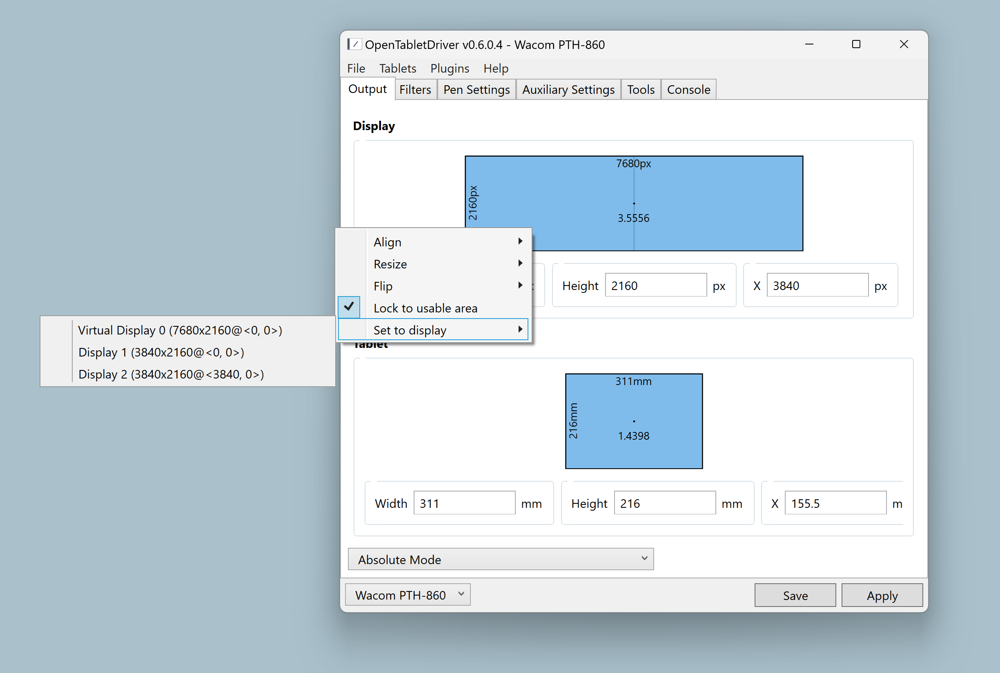

# Install OpenTabletDriver on Windows

## Overview

This document is for creatives who want to use OpenTabletDriver on Windows and need features such as pressure sensitivity and tilt.


If you do not know about OpenTabletDriver or why you might use it, read [OpenTabletDriver](./).

Familiarize yourself with [Notes on OpenTabletDriver](otd-notes.md).

To uninstall it on Windows, see [Uninstall OpenTabletDriver on Windows](otd-windows-uninstall.md).



What follows are the detailed steps I personally use to install OTD on Windows. This document **does not** replace the official OTD documentation: [https://opentabletdriver.net/Wiki](https://opentabletdriver.net/Wiki).


### Some expertise is required

Using OTD for artwork is an advanced setup. Try this only if you are confident in your technical skills or can get someone to help you.

### Supported tablets

* OTD supports 300+ tablets from different brands as of November 2025.
* See the complete list of supported tablets at [https://opentabletdriver.net/Tablets](https://opentabletdriver.net/Tablets).
* In that list, your tablet may be marked as needing `Zadig WinUSB`. There are special requirements for that case. These instructions do **not** cover them.

### Version information

#### OTD version

* These instructions cover OTD version `v0.6.6.2`.

#### Windows versions

* These instructions are for Windows x64 systems only.
* OTD does not support 32-bit versions of Windows.
* OTD does **not** support Windows on ARM.

## PHASE 1: Preparation

### STEP 1.1: Verify that OTD supports your tablet

* Find your tablet at [https://opentabletdriver.net/Tablets](https://opentabletdriver.net/Tablets).
  * Some tablets are listed by name, and some are listed by model number.
  * To find your tablet's model number, see [Finding the model number of your drawing tablet](../../general/finding-tablet-model-number.md).


If your tablet is marked as `Zadig WinUSB`, there are special installation requirements that are **not** covered in this document. Consult the OTD documentation for help.


### STEP 1.2: Uninstall existing tablet drivers


<mark style="color:red;">You</mark> <mark style="color:red;">**MUST**</mark> <mark style="color:red;">uninstall any existing tablet drivers on your computer. If you leave them installed, they will interfere with OTD.</mark>


* Follow [these instructions](../uninstalling-tablet-drivers.md) to uninstall tablet drivers.
* To ensure nothing remains, run the [Tablet Driver Cleanup tool](../tablet-driver-cleanup-tool.md).

### STEP 1.3: Create a folder for OTD

* Create a folder somewhere on your computer called `OpenTabletDriver`.
* I prefer to use `C:\OpenTabletDriver`.
* All instructions in this document use `C:\OpenTabletDriver`.

### STEP 1.4: Download the VMulti driver


<mark style="color:red;">You must install the</mark> <mark style="color:red;">**VMulti driver**</mark> <mark style="color:red;">if you want pressure sensitivity and tilt to work with your tablet on Windows.</mark>


* Download `Multi.Driver.zip` from this location:
  * [https://github.com/X9VoiD/vmulti-bin/releases/download/v1.0/VMulti.Driver.zip](https://github.com/X9VoiD/vmulti-bin/releases/download/v1.0/VMulti.Driver.zip)
* Place the zip file inside `C:\OpenTabletDriver`.
* Right-click the zip file, then select **Extract All**.
  * This creates a `C:\OpenTabletDriver\VMulti.Driver` folder.

### STEP 1.5: Install the VMulti driver


<mark style="color:red;">The next step may restart your computer without warning. Close any applications before you install VMulti.</mark>


* Close all applications.
* In the `C:\OpenTabletDriver\VMulti.Driver` folder, right-click `install_hiddriver.bat`, then select **Run as Administrator**.

### STEP 1.6: Install the .NET Runtime


OTD requires a specific version of the .NET Runtime to be installed on your computer. It will not work otherwise.


* Open [https://opentabletdriver.net/Framework](https://opentabletdriver.net/Framework).
  * It opens a page that lists different versions of the .NET framework for OTD to use.
* Under **Windows**, click the link labeled **x64**.
  * A download will start for `windowsdesktop-runtime-8.0.22-win-x64.exe`.
* Once the `.exe` file downloads, run it to install the .NET Runtime.

### STEP 1.7: Download OpenTabletDriver

* Open a browser and go to:
  * [https://github.com/OpenTabletDriver/OpenTabletDriver/releases/latest](https://github.com/OpenTabletDriver/OpenTabletDriver/releases/latest)
* Scroll down to the **Assets** section.
* Look for a file with a name like `OpenTabletDriver-0.6.6.2_win-x64.zip`.
* Download that zip file.
* Move the zip file into the `C:\OpenTabletDriver` folder.
* Right-click the zip file, then select **Extract All**.
  * This creates a folder with a name like `C:\OpenTabletDriver\OpenTabletDriver-0.6.6.2_win-x64`.

## PHASE 2: OTD basics and connecting to a tablet

### STEP 2.1: Launch the OpenTabletDriver app for the first time


Do **not** launch the OTD app with **Run as Administrator**. This will cause problems with OTD.


* In the `C:\OpenTabletDriver\OpenTabletDriver-n.n.n.n_win-x64` folder, launch `OpenTabletDriver.UX.Wpf.exe`.
  * This launches the OTD app. (Do not launch it as Administrator)
* If you see a message that ".NET X Desktop Runtime X64 is not installed," follow its instructions. Then relaunch `OpenTabletDriver.UX.Wpf.exe`.
  * This message should not appear because you installed the .NET Runtime in a previous step.
* The **OpenTabletDriver Guide** will automatically start.
* Click the X in the upper-right corner to close the guide.
* You can get back to this guide at any time in OTD by navigating to **Help** > **Show guide**.

### STEP 2.2: Understanding the OTD app on Windows

For you to use OTD on Windows, the OTD app MUST always be running.

Although it must always be running, you do not have to keep it visible on your screen. The next step shows you how to get it out of the way.

### STEP 2.3: Minimizing the OTD app


This is an important thing to learn, because you will be doing it a lot.


* You can keep the OTD app running without leaving it visible on the desktop by minimizing it.
* Once it is minimized, you can find its icon in the system tray, at the right end of the taskbar.
* You may need to click the **^** arrow to show hidden tray icons.
* Click the OTD icon to open the OTD app again.

<figure><figcaption></figcaption></figure>

### STEP 2.4: Detect your tablet with OTD

* When the OTD app starts, it will automatically try to detect your tablet.
* The tablet will appear in the window title and the application window's lower-left corner.
* If needed, you can force detection by clicking **Tablets** > **Detect tablet**.

### STEP 2.5: Checkpoint

At this point, moving the pen on the tablet should move the mouse pointer.

Do not worry about which monitor the mouse is on. We will cover that soon.

Pressure and tilt will not work right now. We will cover that soon.

## PHASE 3: Configuring OTD to work with your tablet

### STEP 3.1: Configure tablet-to-display mapping

* In the OTD app, go to the **Output** tab.
* In the **Display** area, right-click anywhere, then select **Set to Display** \<displayname>, where \<displayname> is the display you want to use with the tablet.

<figure><figcaption></figcaption></figure>

* In the **Tablet** area, right-click anywhere, then select **Lock Aspect Ratio**.
* At this point, moving the pen will move the pointer on exactly one display.
* There will also be no stroke distortion. For example, a circle on the tablet will produce a circle on the monitor without stretching.
* Click **Apply**, then click **Save**.

### STEP 3.2: Understanding Apply and Save

The instructions have already asked you to click **Apply** and **Save**. Here is what they do.

You will find both buttons in the bottom-right corner of the OTD window. They stay in the same place no matter which tab you are on.

**Apply**

* **Apply** activates the current settings shown in the user interface.
* Until you click **Apply**, changes made in the UI will not take effect.

**Save**

* **Save** stores the current settings, even if you have not clicked **Apply**.
* Those settings will load the next time you open OTD.
* You can test this by clicking **Save** without clicking **Apply**, then restarting the OTD app.

To keep things simple for now, I suggest that you always click **Apply** and then **Save** whenever you make a change in the OTD app.


**If you close OTD without clicking Save, you lose your changes.**


### STEP 3.3: Install the Windows Ink plugin

* In the OTD app, navigate to **Plugins** > **Open Plugin Manager**.
* Click the **Windows Ink** plugin, then click **Install**.
* The Windows Ink plugin will appear at the top of the plugin list.
* Close the **Plugin Manager** window.

### STEP 3.4: Configure Windows Ink mapping mode

* At the bottom of the OTD app, change the **Mode** dropdown from **Absolute Mode** to **Windows Ink Absolute Mode**.
* Click **Apply**, then click **Save**.


**Note:** You will only see **Windows Ink Absolute Mode** if you previously enabled the Windows Ink plugin.


### STEP 3.5: Configure the pen

Navigate to the **Pen Settings** tab.

By default, the pen will be configured as shown below.

<figure><figcaption></figcaption></figure>

Notice that the tip settings, eraser settings, and buttons use `Adaptive Binding`. For now, leave these unchanged.

Click **Apply**, then click **Save**.

**Note:** Assigning pen buttons to mouse actions, such as left-click, right-click, or middle-click, may cause unstable input. Doing so requires switching from the Windows Ink cursor to the mouse cursor, synchronizing the position, and sending the mouse button.

### STEP 3.6: Configure your drawing application to use Windows Ink

* The specific instructions vary by app.
* See [Configure Windows Ink for apps](../../platforms/windows/winink/winink-config-apps.md).

### STEP 3.7: Checkpoint

At this point, you should be able to draw effectively with OTD. Pressure and tilt should work.

I suggest that you install Krita and configure it to use Windows Ink.

Try some basic drawing and see if everything is working.

## PHASE 4: Optional customization

**Pressure curves** - By default, OTD does not use a pressure curve to modify how the pressure data is interpreted. However, you can edit the pressure curve by following these instructions: [Pressure curves in OpenTabletDriver](pressure-curves-in-otd.md)

**Smoothing** - [Smoothing with OpenTabletDriver](otd-smoothing.md)

**Tablet buttons** - [Configure tablet buttons with OpenTabletDriver](otd-tablet-buttons.md)

### Start OpenTabletDriver when Windows starts

Because OTD must stay running, you may want it to start on its own when you sign in.

See [Start OpenTabletDriver automatically](otd-start-automatically.md).

### Display toggle

To switch rapidly between monitors, you have two options:

* The **Monitor toggle** plug-in — I have never used this plug-in, so I do not have instructions for it.
* Switching presets — a hotkey can switch between presets.

## Related topics

* [Uninstall OpenTabletDriver on Windows](otd-windows-uninstall.md)
* [Start OpenTabletDriver automatically](otd-start-automatically.md)
* [OpenTabletDriver application data directory](otd-app-data-directory.md)
