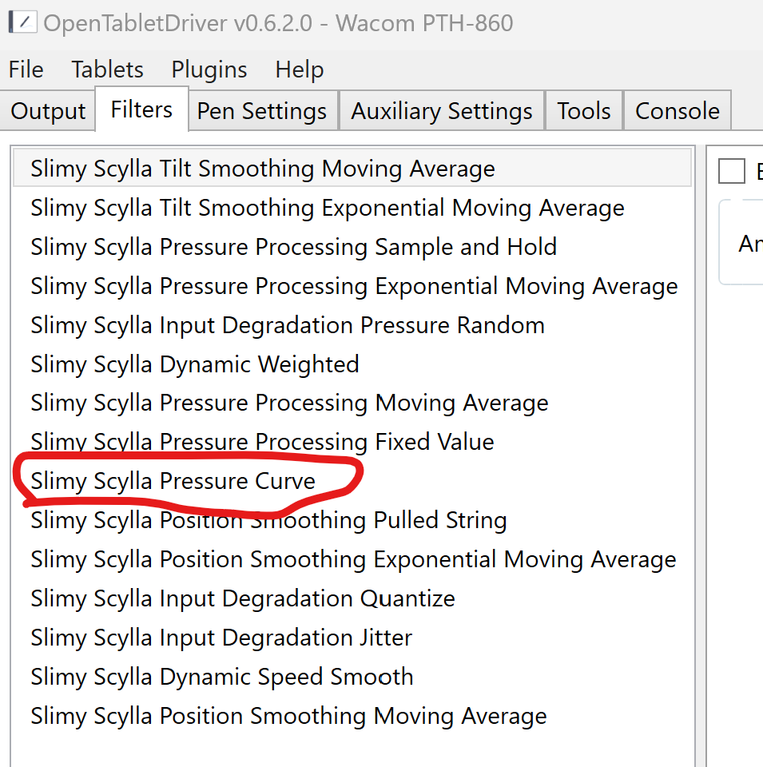
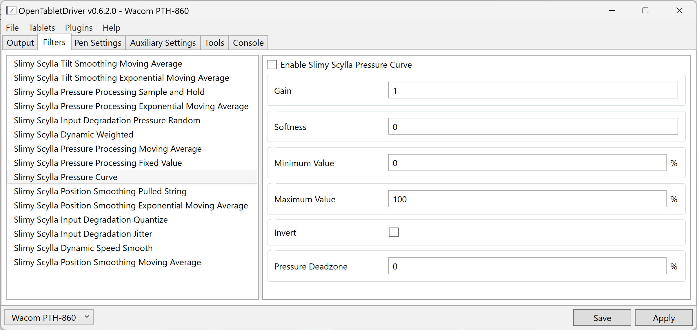
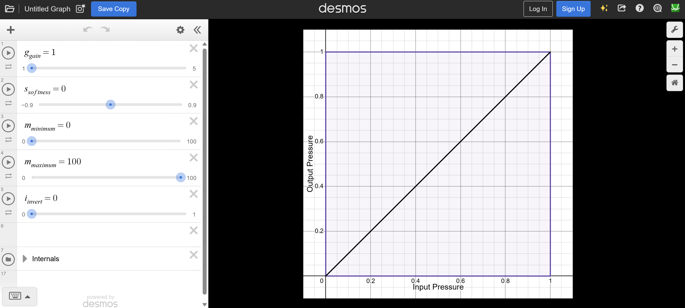

# Pressure curves in OpenTabletDriver

## Overview

OpenTabletDriver lets you configure the pressure curve via plug-ins.

## Installing the Slimy Scylla plug-in

Instructions for installing Slimy Scylla are here: [Slimy Scylla](otd-plugin-slimyscylla.md)

## Configuring the pressure curve

In the **Filters** tab, enable **Slimy Scylla Pressure Curve**

<figure><figcaption></figcaption></figure>

This is what the configuration looks like:

<figure><figcaption></figcaption></figure>

To enable the filter, click **Enable Slimy Scylla** and click **Apply**.

The settings here will let you configure the pressure curve. Unfortunately, there is no interactive view of the pressure curve inside the OTD UX. However, you can use the demos tool to play with the settings interactively and see the pressure curve [https://www.desmos.com/calculator/97s6f0yhlb](https://www.desmos.com/calculator/97s6f0yhlb)

<figure><figcaption></figcaption></figure>

Remember once you make changes to the settings, always click **Apply** in OTD

## Slimy Scylla documentation

[https://github.com/Kuuuube/Slimy\_Scylla/tree/main/docs](https://github.com/Kuuuube/Slimy_Scylla/tree/main/docs)

[https://github.com/Kuuuube/Slimy\_Scylla/blob/main/docs/pressure\_curve/pressure\_curve.md](https://github.com/Kuuuube/Slimy_Scylla/blob/main/docs/pressure_curve/pressure_curve.md)

*
