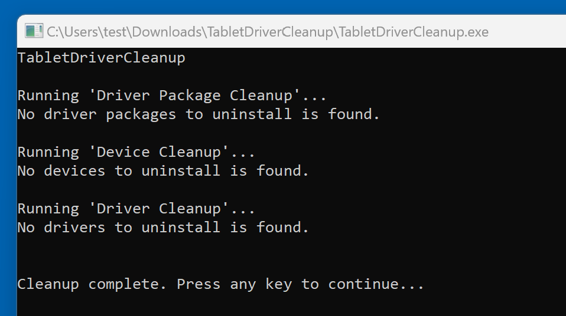

# Tablet Driver Cleanup tool

## Overview

On **Windows**, uninstalling a manufacturer tablet driver is not always enough. Occasionally, drivers leave bits of themselves behind. The **TabletDriverCleanup** tool, created by [**X9VoiD**](https://github.com/X9VoiD) and maintained by the [**OpenTabletDriver Team**](https://github.com/OpenTabletDriver), can help remove those leftovers.

If you want to see the source code and understand exactly what it does, go here: [https://github.com/OpenTabletDriver/TabletDriverCleanup](https://github.com/OpenTabletDriver/TabletDriverCleanup)

Unfortunately, I do not know of an equivalent tool for MacOS. On the other hand, I have not seen a need for one on MacOS.

## Step 1: Follow the normal uninstall procedures

* Navigate to **Add/Remove programs** and uninstall your existing tablet drivers.
* Note that you may be required to restart your computer.

## Step 2: Restart if needed

If Step 1 did not require a restart of your computer, then restart your computer now.

## Step 3: Run the TabletDriverCleanup tool

* Download [TabletDriverCleanup.zip](https://github.com/OpenTabletDriver/TabletDriverCleanup/releases/latest)
* Extract all contents of the zip file to any location
* Right-click on `TabletDriverCleanup.exe` and click **Run as administrator**
* The cleanup tool will open a terminal window and show the results of its cleaning. In the example below it did not find any leftover driver components to uninstall.
  * 
