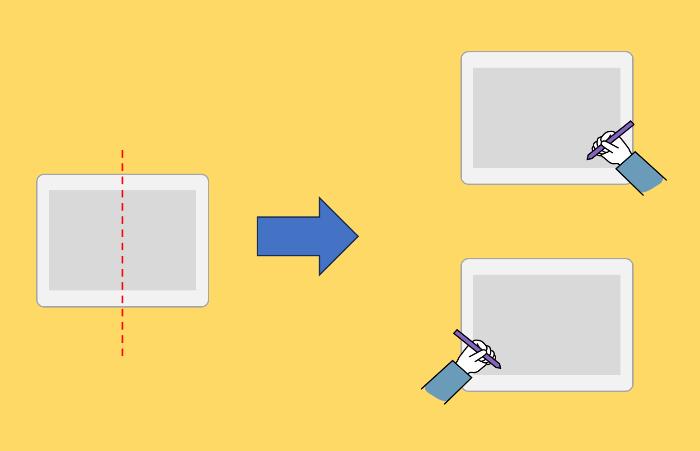
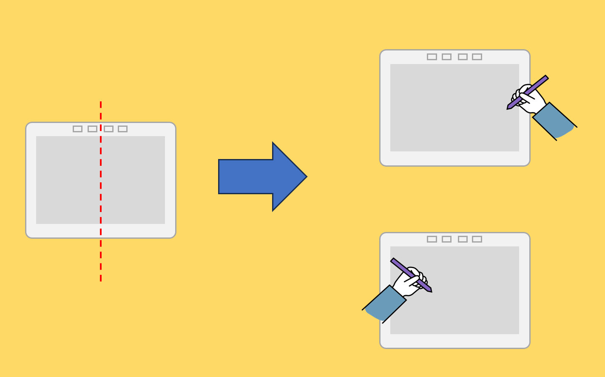
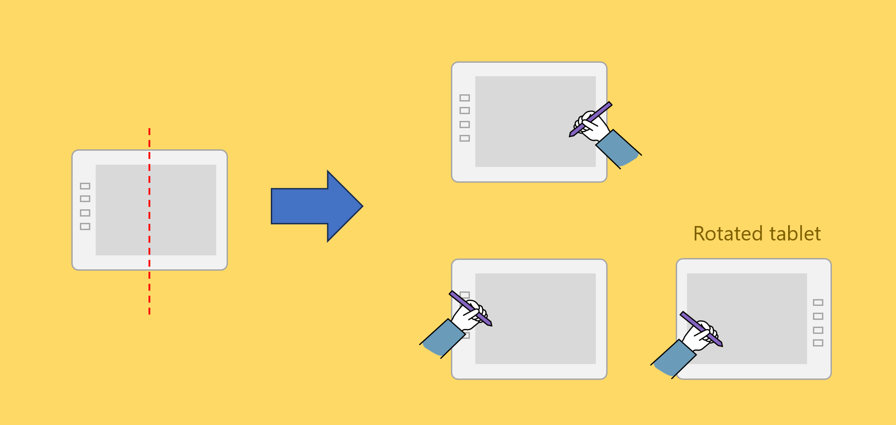

# Handedness of drawing tablets

## Overview

You likely prefer to use a pen with your right hand or your left hand.

The good news is that drawing tablets are designed to work equally well for both cases. Sometimes, you do not even need to do anything at all - it will "just work."

## Case 1: A tablet with NO buttons

A tablet with NO buttons is symmetric across its vertical axis. In other words, the left side and the right side are no different. Out of the box, these tablets work for left-handed or right-handed people.

<figure><figcaption></figcaption></figure>

## Case 2: A tablet with Buttons that are symmetric from left to right

If the buttons are symmetric from left-to-right - for example if the buttons are on top, then also this kind of tablet automatically works for left-handed and right-handed people.

<figure><figcaption></figcaption></figure>

## Case 3: A tablet with buttons that are on one side

If a tablet has buttons on one side, it is almost always the left side. This means a right-handed person can use the tablet easily. But a left-handed person must [rotate the drawing tablet](rotating-drawtab.md) if they want to avoid accidentally hitting the buttons. Alternatively, they could disable the buttons in the driver so that the buttons are inactive.

<figure><figcaption></figcaption></figure>

